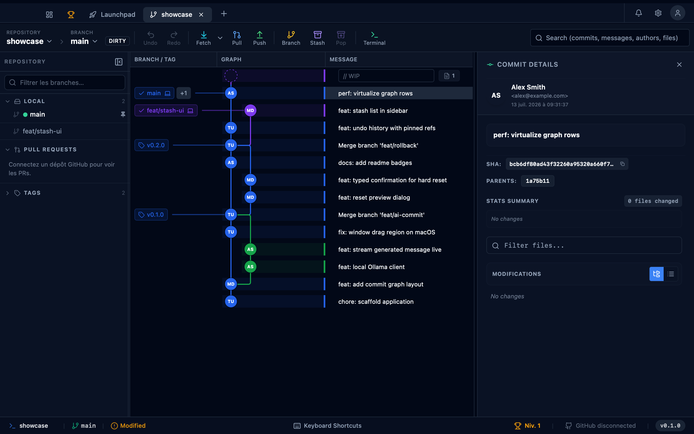

<div align="center">


# Git Manager

**Git, finally made beautiful. A modern desktop Git client built with Tauri, React and Rust.**

[](LICENSE)
[](https://www.typescriptlang.org/)
[](https://www.rust-lang.org/)
[](https://tauri.app/)
[](https://github.com/Tlahey/git-manager)

_100% local — no telemetry, no cloud, no data leaves your machine._

**[✨ Visit the landing page](https://tlahey.github.io/git-manager/)**


<sub>Real screenshots, captured automatically from the app by the e2e harness — see <a href="#screenshots">Screenshots</a>.</sub>

</div>

---

## Overview

**git-manager** is a macOS desktop application that gives you a powerful, opinionated interface for everyday Git workflows. Instead of memorizing flags or juggling terminal windows, you get:

- **Visual Git graph** — interactive commit history with branches, tags and diffs
- **AI commit generation** — conventional commit messages from your diff via a local Ollama LLM, streamed live, with message history
- **Working tree** — stage, unstage, commit (including a WIP batch-commit mode with per-group AI messages), push and pull
- **Rollback** — safe revert and reset (soft / mixed / hard) with preview and typed confirmation for hard reset
- **Fixup & Autosquash** — guided `--fixup` + `rebase --autosquash` workflow
- **Stash** — push, pop, apply, drop
- **Branch management** — create, delete, checkout branches (rename not implemented yet)
- **Undo/redo** — safe undo history across git-mutating actions, with pinned refs so undone objects aren't garbage-collected
- **GitHub integration** — device-flow OAuth login, pull request views
- **SSH key management** — generate and manage keys for remote auth
- **Submodules** — list and inspect
- **i18n** — English and French interface

> Interactive rebase (drag-and-drop) and worktree management are planned but not yet implemented — see the [roadmap status at a glance](docs/ROADMAP.md#status-at-a-glance).

---

## Screenshots

| Commit graph | Commit details |
| --- | --- |
|  |  |

These images are **generated from the real app**, not mocked: the `@screenshots`-tagged
e2e scenarios ([apps/e2e/features/marketing-screenshots.feature](apps/e2e/features/marketing-screenshots.feature))
launch the compiled Tauri binary against the scripted `showcase` fixture repository
([tools/git-fixtures/scenarios/showcase.sh](tools/git-fixtures/scenarios/showcase.sh)) and export
PNGs into [docs/screenshots/](docs/screenshots/). Refresh them anytime with:

```bash
pnpm --filter @git-manager/desktop build:e2e   # build the e2e app binary once
pnpm --filter @git-manager/e2e screenshots     # re-capture docs/screenshots/*.png
```

---

## Tech stack

| Layer                | Technology                                                                                                                                                                                             |
| -------------------- | ------------------------------------------------------------------------------------------------------------------------------------------------------------------------------------------------------ |
| Desktop runtime      | [Tauri v2](https://tauri.app/)                                                                                                                                                                         |
| Frontend             | React 18 + Vite + TypeScript (strict)                                                                                                                                                                  |
| UI components        | shadcn/ui + Tailwind CSS (dark mode)                                                                                                                                                                   |
| Git backend          | Rust + [`git2`](https://crates.io/crates/git2) (libgit2 bindings)                                                                                                                                      |
| State management     | [Zustand](https://zustand-demo.pmnd.rs/) (UI/app state) + [SWR](https://swr.vercel.app/) (new data-fetching hooks) + [TanStack Query](https://tanstack.com/query) (older hooks, being migrated to SWR) |
| Internationalisation | [react-i18next](https://react.i18next.com/) (EN / FR)                                                                                                                                                  |
| LLM (commit AI)      | [Ollama](https://ollama.ai) (local — no API key required)                                                                                                                                              |
| Remote auth          | SSH (system agent) + HTTPS (token)                                                                                                                                                                     |
| Monorepo             | pnpm workspaces + [Turborepo](https://turbo.build/)                                                                                                                                                    |

---

## Project structure

The full annotated monorepo tree lives in [docs/README.md](docs/README.md#monorepo-structure).
In short: `apps/desktop` (Tauri app: Rust backend in `src-tauri/`, React frontend in `src/`),
`apps/landing-page`, `apps/e2e`, and shared `packages/` (`git-types`, `mascot`, `i18n`, `ui`,
`components`, `code-view`, `config`).

---

## Prerequisites

| Requirement | Version       | Install                          |
| ----------- | ------------- | -------------------------------- |
| macOS       | 13+ (Ventura) | —                                |
| Xcode CLT   | latest        | `xcode-select --install`         |
| Node.js     | 20+           | [nodejs.org](https://nodejs.org) |
| pnpm        | 9+            | `npm i -g pnpm`                  |
| Rust        | 1.77+         | see below                        |
| Tauri CLI   | v2            | `cargo install tauri-cli`        |
| Ollama      | latest        | [ollama.ai](https://ollama.ai)   |

### 1. Xcode Command Line Tools

Required on macOS for the C compiler and linker used by Cargo:

```bash
xcode-select --install
```

### 2. Install Rust via rustup

```bash
curl --proto '=https' --tlsv1.2 -sSf https://sh.rustup.rs | sh
```

Select **option 1** (default install). Once complete, reload your shell environment:

```bash
source "$HOME/.cargo/env"
```

> **Permanent fix:** add the following line to your `~/.zshrc` (or `~/.zshprofile`) so `cargo` is always in your PATH:
>
> ```bash
> export PATH="$HOME/.cargo/bin:$PATH"
> ```

Verify the installation:

```bash
cargo --version   # e.g. cargo 1.81.0
rustc --version   # e.g. rustc 1.81.0
```

Add the macOS targets (required for universal builds):

```bash
rustup target add aarch64-apple-darwin x86_64-apple-darwin
```

### 3. macOS system dependencies (via Homebrew)

```bash
# Required for libgit2 / OpenSSL
brew install pkg-config openssl libssh2
```

---

## Getting started

```bash
# 1. Clone the repository
git clone https://github.com/Tlahey/git-manager.git
cd git-manager

# 2. Install Node.js dependencies
pnpm install

# 3. Start Ollama (for AI commit generation)
ollama serve
ollama pull llama3.2         # recommended general model
# or: ollama pull qwen2.5-coder:7b  (smaller, faster for code diffs)

# 4. Run in development mode (launches the Tauri desktop app)
pnpm dev

# 5. Build for production desktop binary
pnpm build
```

> [!IMPORTANT]
> Since this is a Tauri desktop application that interacts with a Rust backend, it cannot be run or opened in a web browser. Running `pnpm dev` starts the native desktop client window.

---

## Development scripts

All scripts are run from the **repository root**.

| Command          | Description                                            |
| ---------------- | ------------------------------------------------------ |
| `pnpm dev`       | Start Tauri dev server (hot reload React + Rust watch) |
| `pnpm build`     | Build production app bundle                            |
| `pnpm typecheck` | TypeScript check across all packages                   |
| `pnpm lint`      | ESLint across all packages                             |
| `pnpm format`    | Prettier formatting                                    |
| `pnpm clean`     | Remove all build artifacts                             |

### Per-package

```bash
# Typecheck a specific package
pnpm --filter @git-manager/desktop typecheck
pnpm --filter @git-manager/git-types typecheck

# Lint the desktop app
pnpm --filter @git-manager/desktop lint
```

---

## Tauri IPC architecture

The frontend calls Rust commands via `invoke()`, layered through `lib/tauri.ts` → `api/*.api.ts` → `hooks/` → components. All commands return `Result<T, String>` where errors are JSON-encoded `AppError` objects:

```json
{ "code": "REPO_NOT_FOUND", "message": "...", "detail": "..." }
```

> For the full architecture — IPC boundary conventions, the frontend layering rules, and the R1/R2 rules enforced across the codebase — see [CLAUDE.md](CLAUDE.md). It's kept in sync with the actual code and is also the source of truth used by AI coding agents working in this repo.

Long-running operations (currently: Ollama generation) stream progress via Tauri events:

| Event              | Payload  | Description          |
| ------------------ | -------- | -------------------- |
| `ollama:token`     | `string` | Next generated token |
| `ollama:done`      | `void`   | Generation complete  |
| `ollama:error`     | `string` | Error message        |
| `ollama:cancelled` | `void`   | Cancelled by user    |

---

## Ollama setup

The app connects to Ollama at `http://localhost:11434` (configurable in Settings → LLM).

```bash
# Install Ollama (macOS)
brew install ollama

# Start the server
ollama serve

# Pull a model (choose one)
ollama pull llama3.2               # ~2GB — good general model
ollama pull qwen2.5-coder:7b       # ~4.7GB — better for code diffs
ollama pull phi3.5                 # ~2.2GB — fast and lightweight
```

The model is configurable per-project. Temperature and timeout are also adjustable in Settings.

---

## Documentation & roadmap

Everything project-state and design related lives in [docs/](docs/):

- **[docs/ROADMAP.md](docs/ROADMAP.md)** — milestone plan (M0–M7) with a status-at-a-glance summary, detailed tasks, and the "not yet wired up" backlog of commands whose frontend scaffolding already exists
- **[docs/README.md](docs/README.md)** — documentation index, including the full table of feature specs (`docs/specs/00`–`12`)
- **[docs/architecture/](docs/architecture/)** — architecture refactor plan (13) and its living execution tracking (14)
- **[CLAUDE.md](CLAUDE.md)** — the authoritative IPC/layering conventions, kept in sync with the code (also used by AI coding agents)

---

## Package overview

| Package              | Name                        | Description                                                                                     |
| -------------------- | --------------------------- | ----------------------------------------------------------------------------------------------- |
| `apps/desktop`       | `@git-manager/desktop`      | Main Tauri + React application                                                                  |
| `apps/landing-page`  | `@git-manager/landing-page` | The [public landing page](https://tlahey.github.io/git-manager/), deployed to GitHub Pages      |
| `apps/e2e`           | `@git-manager/e2e`          | WebdriverIO + Cucumber e2e suite driving the real Tauri app (incl. the `screenshots` capture)   |
| `packages/git-types` | `@git-manager/git-types`    | Shared TypeScript DTOs (mirrors Rust models)                                                    |
| `packages/mascot`    | `@git-manager/mascot`       | The octopus mascot as a shared `<git-mascot>` web component (landing page today, app tomorrow)  |
| `packages/i18n`      | `@git-manager/i18n`         | i18next setup + EN/FR locale files                                                              |
| `packages/ui`        | `@git-manager/ui`           | shadcn/ui base components                                                                       |
| `packages/config`    | `@git-manager/config`       | Shared ESLint, Tailwind, tsconfig                                                               |

---

## Security

- **No telemetry** — zero analytics, no network calls except Ollama (localhost)
- **Credentials stay in Rust** — SSH keys and HTTPS tokens never reach the JavaScript layer
- **Tauri ACL** — strict capability permissions via Tauri v2's permission system
- **Protected branches** — configurable list of branches that block destructive operations
- **Confirmation gates** — hard reset requires typing `RESET`, force-push requires explicit opt-in

---

## Contributing

This project is not currently open to external contributions — see [CONTRIBUTING.md](CONTRIBUTING.md).

---

## License

MIT — see [LICENSE](LICENSE)
