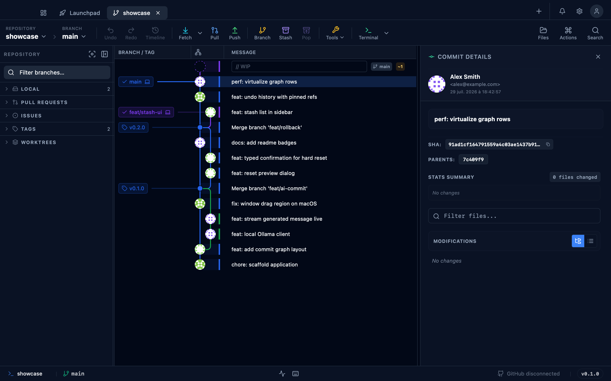
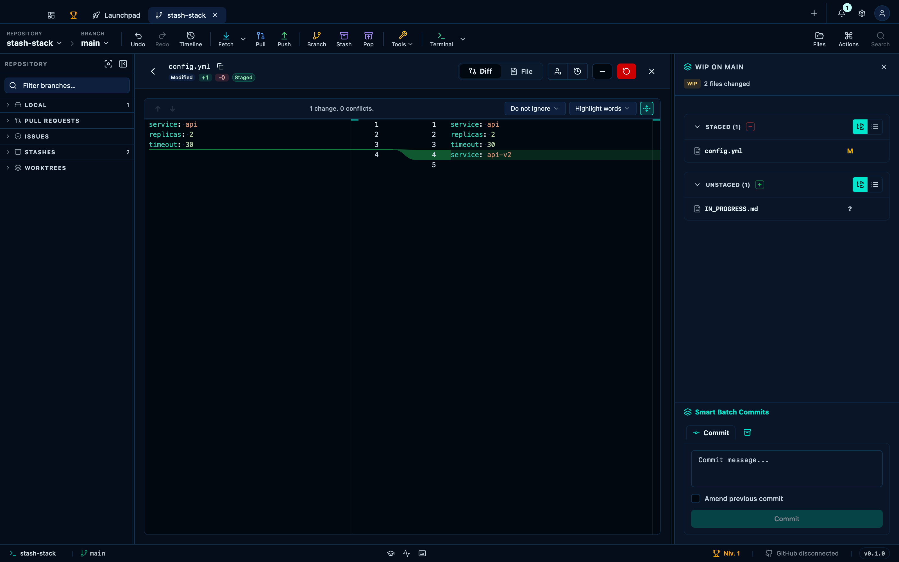
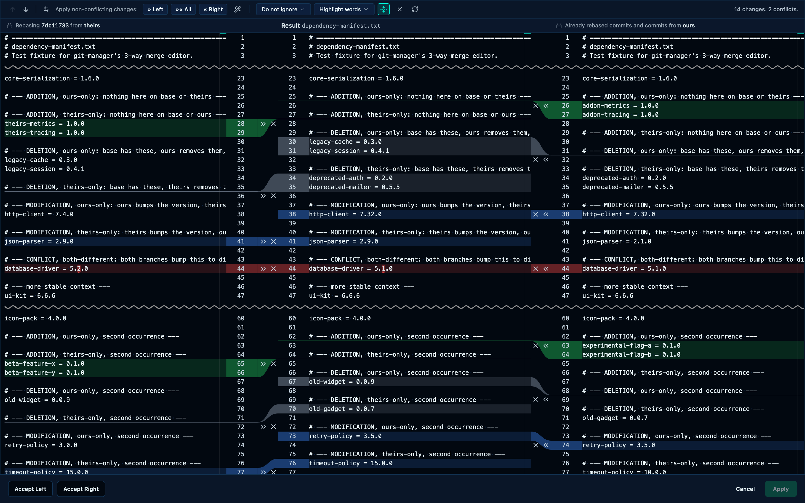
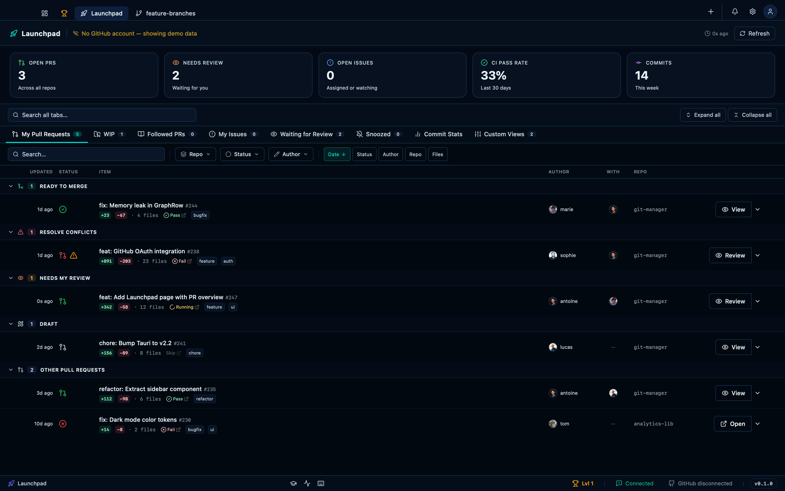
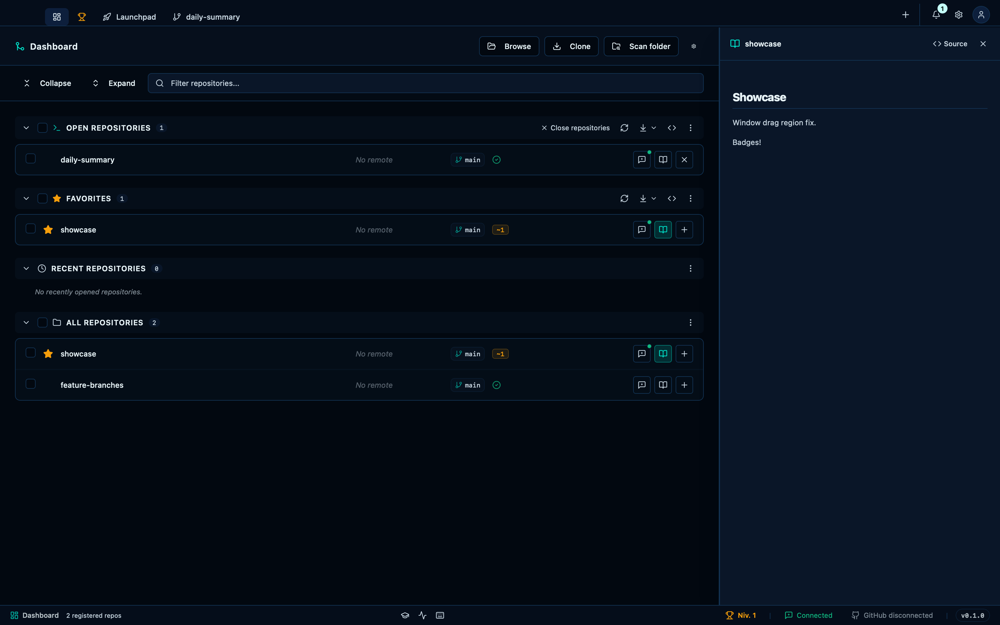

<div align="center">


# Git Manager

**Git, finally made beautiful. A modern desktop Git client built with Tauri, React and Rust.**

[](LICENSE)
[](https://www.typescriptlang.org/)
[](https://www.rust-lang.org/)
[](https://tauri.app/)
[](https://github.com/Tlahey/git-manager)
[](#theme-accessibility--consistency)
[](https://github.com/sponsors/Tlahey)

_100% local — no telemetry, no cloud, no data leaves your machine._

**[✨ Visit the landing page](https://tlahey.github.io/git-manager/)** · **[📖 Read the documentation](https://tlahey.github.io/git-manager/docs/)** · **[💜 Sponsor this project](https://github.com/sponsors/Tlahey)**



<sub>Real screenshots, captured automatically from the app by the e2e harness — see <a href="#screenshots">Screenshots</a>.</sub>

</div>

---

## Overview

**git-manager** is a macOS desktop application that gives you a powerful, opinionated interface for everyday Git workflows. Instead of memorizing flags or juggling terminal windows, you get:

- **Visual Git graph** — interactive commit history with branches, tags, filters and diffs, plus blame and file history
- **Working tree** — stage, unstage, commit, amend, discard, push and pull (including a batch-commit mode that splits your changes into several reviewable commits)
- **AI features** — a local Ollama model (or any OpenAI-compatible server you point it at) writes commit messages and PR descriptions, explains a diff/commit/branch, reviews changes, answers questions about your history, and summarises your day — see [docs/ai/](docs/ai/README.md)
- **Rollback** — safe revert and reset (soft / mixed / hard) with preview and typed confirmation for hard reset
- **Rebase** — interactive rebase (reorder, `reword` / `squash` / `fixup` / `drop`), the guided `--fixup` + `--autosquash` workflow, and conflict resolution in a three-pane Monaco merge editor
- **Cherry-pick, bisect, patches** — pick commits onto a branch, run a bisect session, create and apply patch files
- **Branches, stashes, worktrees** — create / delete / checkout / merge branches, a full stash stack, and worktree add / remove / prune (branch _rename_ is still not implemented)
- **Undo/redo** — safe undo history across git-mutating actions, with pinned refs so undone objects aren't garbage-collected
- **Launchpad** — cross-repo pull requests and issues from GitHub (device-flow OAuth), with saved views, snoozing and contribution stats
- **Dashboard & tabs** — multi-repo dashboard, repository scan, clone/init, Chrome-style tab bar
- **Tools** — integrated terminal (real PTY), command palette, package health check, native macOS notifications, activity log and an Action Journal that explains, in plain English, the git commands each action ran
- **SSH key management** — generate and manage keys for remote auth
- **Submodules** — list and inspect
- **Achievements & rewards** — an optional gamified layer that tracks what you've done in the app
- **i18n** — English and French interface

> Every feature has a user-facing page on the
> [documentation site](https://tlahey.github.io/git-manager/docs/), generated from the e2e scenarios
> that test it — which is what keeps that inventory from drifting away from the code. What is still
> open lives in the [issue tracker](https://github.com/Tlahey/git-manager/issues).

> **GitLab and Bitbucket are built, but not offered before v1.** Their commands, settings panels and
> token / OAuth flows all ship in the binary with their tests — only `AVAILABLE_PROVIDERS` in
> [`IntegrationSection.tsx`](apps/desktop/src/app/settings/components/IntegrationSection.tsx) lists
> GitHub alone, on purpose: GitLab's device flow still needs an OAuth application registered on
> gitlab.com, and nothing in the app reads either account yet. Nothing about them is on screen, so
> they are deliberately absent from the documentation site rather than missing from it. Adding an id
> back to that list is the whole of re-enabling one.

---

## Screenshots

| Working tree & file diff                                                                      | Three-pane merge editor                                                                           |
| --------------------------------------------------------------------------------------------- | ------------------------------------------------------------------------------------------------- |
|              |                 |
| **Launchpad — pull requests across repos**                                                    | **Multi-repo dashboard**                                                                          |
|  |  |

These images are **generated from the real app**, not mocked — they are the very same PNGs the
[documentation site](https://tlahey.github.io/git-manager/docs/) illustrates its feature pages with.
Each one is exported by a `@doc @screenshots` scenario in
[apps/e2e/features/](apps/e2e/features/) (the shots above come from `working-tree`,
`merge-editor`, `launchpad-prs` and `dashboard`) that launches the compiled Tauri binary against a
scripted fixture repository ([tools/git-fixtures/scenarios/](tools/git-fixtures/scenarios/)) and
saves a full-window capture into [docs/screenshots/](docs/screenshots/). Refresh them anytime with:

```bash
pnpm --filter @git-manager/desktop build:e2e   # build the e2e app binary once
pnpm --filter @git-manager/e2e screenshots     # re-capture docs/screenshots/*.png
```

---

## Tech stack

| Layer                | Technology                                                                                                                                                                                             |
| -------------------- | ------------------------------------------------------------------------------------------------------------------------------------------------------------------------------------------------------ |
| Desktop runtime      | [Tauri v2](https://tauri.app/)                                                                                                                                                                         |
| Frontend             | React 18 + Vite + TypeScript (strict)                                                                                                                                                                  |
| UI components        | shadcn/ui + Tailwind CSS + [Monaco](https://microsoft.github.io/monaco-editor/) (diff, merge and file viewers)                                                                                         |
| Git backend          | Rust + [`git2`](https://crates.io/crates/git2) (libgit2 bindings)                                                                                                                                      |
| State management     | [Zustand](https://zustand-demo.pmnd.rs/) (UI/app state) + [SWR](https://swr.vercel.app/) (new data-fetching hooks) + [TanStack Query](https://tanstack.com/query) (older hooks, being migrated to SWR) |
| Internationalisation | [react-i18next](https://react.i18next.com/) (EN / FR)                                                                                                                                                  |
| LLM                  | [Ollama](https://ollama.ai) by default, or any OpenAI-compatible server (your URL, your key)                                                                                                           |
| Remote auth          | SSH via the system agent (fetch / pull / push)                                                                                                                                                         |
| Monorepo             | pnpm workspaces + [Turborepo](https://turbo.build/)                                                                                                                                                    |

---

## Project structure

The full annotated monorepo tree lives in [docs/README.md](docs/README.md#monorepo-structure).
In short: `apps/desktop` (Tauri app: Rust backend in `src-tauri/`, React frontend in `src/`),
`apps/landing-page`, `apps/docs` (the generated documentation site), `apps/e2e`, and shared
`packages/` (`ai`, `git-types`, `mascot`, `i18n`, `ui`, `components`, `editor`, `theme`,
`storybook-a11y`, `config`).

---

## Prerequisites

| Requirement | Version       | Install                                           |
| ----------- | ------------- | ------------------------------------------------- |
| macOS       | 13+ (Ventura) | —                                                 |
| Xcode CLT   | latest        | `xcode-select --install`                          |
| Node.js     | 24.18.0       | [nodejs.org](https://nodejs.org)                  |
| pnpm        | 11+           | `npm i -g pnpm@11`                                |
| Rust        | 1.77+         | see below                                         |
| Ollama      | optional      | [ollama.ai](https://ollama.ai) — AI features only |

Node and pnpm versions are pinned in the root `package.json` (`engines` + `packageManager`); the
Tauri CLI comes from `@tauri-apps/cli` in the workspace, so there is nothing to install globally.
Ollama is only needed if you want the AI features — everything else works without it.

### 1. Xcode Command Line Tools

Required on macOS for the C compiler and linker used by Cargo:

```bash
xcode-select --install
```

### 2. Install Rust via rustup

```bash
curl --proto '=https' --tlsv1.2 -sSf https://sh.rustup.rs | sh
```

Select **option 1** (default install). Once complete, reload your shell environment:

```bash
source "$HOME/.cargo/env"
```

> **Permanent fix:** add the following line to your `~/.zshrc` (or `~/.zshprofile`) so `cargo` is always in your PATH:
>
> ```bash
> export PATH="$HOME/.cargo/bin:$PATH"
> ```

Verify the installation:

```bash
cargo --version   # e.g. cargo 1.81.0
rustc --version   # e.g. rustc 1.81.0
```

Add the macOS targets (required for universal builds):

```bash
rustup target add aarch64-apple-darwin x86_64-apple-darwin
```

### 3. macOS system dependencies (via Homebrew)

```bash
# Required for libgit2 / OpenSSL
brew install pkg-config openssl libssh2
```

---

## Getting started

```bash
# 1. Clone the repository
git clone https://github.com/Tlahey/git-manager.git
cd git-manager

# 2. Install Node.js dependencies
pnpm install

# 3. (Optional) Start Ollama, for the AI features
#    Pick a model that honors structured output — see "Choosing a model" below
ollama serve
ollama pull <model>

# 4. Run in development mode (launches the Tauri desktop app)
pnpm dev

# 5. Build for production desktop binary
pnpm build
```

> [!IMPORTANT]
> Since this is a Tauri desktop application that interacts with a Rust backend, it cannot be run or opened in a web browser. Running `pnpm dev` starts the native desktop client window.

---

## Development scripts

All scripts are run from the **repository root**.

| Command                | Description                                                             |
| ---------------------- | ----------------------------------------------------------------------- |
| `pnpm dev`             | Start Tauri dev server (hot reload React + Rust watch)                  |
| `pnpm build`           | Build production app bundle                                             |
| `pnpm typecheck`       | TypeScript check across all packages                                    |
| `pnpm lint`            | Oxlint across all packages + the EN/FR translation parity check         |
| `pnpm test`            | Unit tests (Vitest) across all packages                                 |
| `pnpm test:a11y`       | Theme accessibility & consistency checks (see below)                    |
| `pnpm test:e2e`        | Build the e2e binary, then run the WebdriverIO + Cucumber suite         |
| `pnpm dev:import-repo` | Rebuild the scripted fixture repos and launch the app with them as tabs |
| `pnpm format`          | Prettier formatting                                                     |
| `pnpm clean`           | Remove all build artifacts                                              |

### Theme accessibility & consistency

`pnpm test:a11y` runs a focused subset of the test suite that validates every built-in theme in `packages/theme/src/themes/*.css` (and, at runtime, user themes loaded from `~/.git-manager/themes/`):

- **WCAG AA contrast** — every foreground/surface token pair (`primary`/`primary-foreground`, `destructive`, `success`, `muted-foreground`, …) meets the AA ratio, so no theme ships e.g. white text on a bright button. All 15 themes currently pass.
- **APCA contrast** — component labels are also graded with APCA (the WCAG 3 draft algorithm), which catches text that clears the AA ratio but still reads poorly, plus a graphical check so no badge fill blends into its surface.
- **Token consistency** — each theme declares the same complete token set, as HSL triplets only (no stray hex that would bypass the color system).
- **Picker parity** — the Settings theme picker's swatch previews match their real CSS tokens, and the picker list stays in sync with the CSS.

Every one of those checks is a ratchet against a baseline that is currently empty: adding a theme, or editing a token without updating the picker/other themes, fails the check. Re-run after any change under [`packages/theme/src/`](packages/theme/src/) (themes, tokens or the picker registry).

### Per-package

```bash
# Typecheck a specific package
pnpm --filter @git-manager/desktop typecheck
pnpm --filter @git-manager/git-types typecheck

# Lint the desktop app
pnpm --filter @git-manager/desktop lint
```

---

## Tauri IPC architecture

The frontend calls Rust commands via `invoke()`, layered through `lib/tauri.ts` → `api/*.api.ts` → `hooks/` → components. All commands return `Result<T, String>` where errors are JSON-encoded `AppError` objects:

```json
{ "code": "REPO_NOT_FOUND", "message": "...", "detail": "..." }
```

> For the full architecture — IPC boundary conventions, the frontend layering rules, and the R1/R2 rules enforced across the codebase — see [CLAUDE.md](CLAUDE.md). It's kept in sync with the actual code and is also the source of truth used by AI coding agents working in this repo.

Long-running operations (currently: AI generation) stream progress via Tauri events. Every payload
carries the `requestId` minted by the caller, so two generations running at once never feed each
other's panel:

| Event          | Payload                                | Description          |
| -------------- | -------------------------------------- | -------------------- |
| `ai:token`     | `{ requestId: string, token: string }` | Next generated token |
| `ai:done`      | `{ requestId: string }`                | Generation complete  |
| `ai:cancelled` | `{ requestId: string }`                | Cancelled by user    |

There is deliberately no `ai:error` event: a failure rejects the `invoke` promise of that request
instead, so there is one channel per condition rather than two that race.

---

## AI provider setup

Settings ships exactly two presets: **Ollama** (`http://localhost:11434` by default) and a generic
**OpenAI-compatible** entry whose URL and API key you own — LM Studio, MLX, vLLM or any server
speaking that protocol. Both are configured in **Settings → AI provider**.

```bash
# Install Ollama (macOS)
brew install ollama

# Start the server
ollama serve

# Pull a model — see "Choosing a model" below before picking one
ollama pull <model>
```

The model, the request timeout and the declared context window are adjustable in Settings.
(Temperature is not: each feature owns the one it needs — see
[docs/ai/README.md](docs/ai/README.md).)

### Choosing a model — this matters more than it looks

**Pick a model that honors structured output** (`response_format: json_schema`). Half the AI features
ask for a JSON object constrained by a schema: the commit message, the commit plan, the daily
briefing, every per-file summary, every per-commit verdict in the history search. A model that
ignores the schema and replies in prose doesn't give worse answers — it gives none, and the app
reports the work as unread.

Size is not the criterion; obedience is — measured on this repository, the _bigger_ `gemma4:26b`
does worse than `gemma4:12b`, because neither honors the schema and the larger one fails on the one
commit that mattered. `Qwen3.6-27B` and `Qwen3.6-35B-A3B` (via an OpenAI-compatible server) honor it
and answer the history search correctly. The tested models, with numbers, are listed in
[docs/ai/README.md § Which models actually work](docs/ai/README.md#which-models-actually-work).

You don't have to find this out the hard way: **Settings → AI provider → Test the model** sends a tiny
schema-constrained request and warns when the model answers but ignores the format. Symptoms if you
skip it: a wall of "commits left unread" in the history search, model deliberation appearing in the
commit message box, or an empty answer where one was expected.

An optional **fast model** can be set beside the main one. It is used only for the per-file summaries
— the highest-volume, least demanding call, run once per changed file — while everything involving
judgement stays on the main model. Same provider, same key; it only swaps the model name.

---

## Documentation

Everything project-state and design related lives in [docs/](docs/):

- **[The documentation site](https://tlahey.github.io/git-manager/docs/)** — the user-facing manual, one page per feature, generated from the `@doc` e2e scenarios (source: [apps/docs](apps/docs/README.md))
- **[docs/README.md](docs/README.md)** — documentation index
- **[The issue tracker](https://github.com/Tlahey/git-manager/issues)** — the remaining work. There is deliberately no roadmap file: a hand-maintained inventory of what shipped drifts from the code within weeks, whereas the generated doc site cannot
- **[docs/ai/](docs/ai/README.md)** — the AI system: the shared feature runtime, one page per feature, and the checklist for adding one
- **[docs/architecture/](docs/architecture/README.md)** — the five architecture refactors of July 2026, their execution records and what each one decided
- **[CLAUDE.md](CLAUDE.md)** — the authoritative IPC/layering conventions, kept in sync with the code (also used by AI coding agents)

---

## Package overview

| Package                   | Name                          | Description                                                                                                                  |
| ------------------------- | ----------------------------- | ---------------------------------------------------------------------------------------------------------------------------- |
| `apps/desktop`            | `@git-manager/desktop`        | Main Tauri + React application                                                                                               |
| `apps/landing-page`       | `@git-manager/landing-page`   | The [public landing page](https://tlahey.github.io/git-manager/), deployed to GitHub Pages                                   |
| `apps/docs`               | `@git-manager/docs`           | The [documentation site](https://tlahey.github.io/git-manager/docs/) (VitePress), one page generated per `@doc` e2e scenario |
| `apps/e2e`                | `@git-manager/e2e`            | WebdriverIO + Cucumber e2e suite driving the real Tauri app (incl. the `screenshots` capture)                                |
| `packages/git-types`      | `@git-manager/git-types`      | Shared TypeScript DTOs (mirrors Rust models)                                                                                 |
| `packages/ai`             | `@git-manager/ai`             | The AI brain: provider presets and one descriptor per AI feature (instructions, temperature, prompts)                        |
| `packages/mascot`         | `@git-manager/mascot`         | The octopus mascot as a shared `<git-mascot>` web component (landing page today, app tomorrow)                               |
| `packages/i18n`           | `@git-manager/i18n`           | i18next setup + EN/FR locale files                                                                                           |
| `packages/ui`             | `@git-manager/ui`             | shadcn/ui base components                                                                                                    |
| `packages/components`     | `@git-manager/components`     | Composed, domain-agnostic presentational building blocks one level up from `ui`                                              |
| `packages/editor`         | `@git-manager/editor`         | All Monaco integration: diff, three-pane merge and single-pane editors                                                       |
| `packages/theme`          | `@git-manager/theme`          | Design tokens, the theme CSS and the WCAG/APCA contrast gates                                                                |
| `packages/storybook-a11y` | `@git-manager/storybook-a11y` | Shared Storybook accessibility setup                                                                                         |
| `packages/config`         | `@git-manager/config`         | Shared Oxlint, Tailwind, tsconfig                                                                                            |

---

## Security

- **No telemetry** — zero analytics. The only outbound traffic is what you ask for: your git remotes, the AI provider you configured (localhost by default), GitHub when you connect an account, and the update check against this repository's releases
- **Git credentials stay in Rust** — fetch / pull / push authenticate through the system SSH agent inside the Rust layer; no key material is passed to JavaScript. (Provider _API_ tokens — the GitHub OAuth token, GitLab/Bitbucket personal access tokens — are held in the frontend settings store, since they're only used for those providers' HTTP APIs.)
- **Tauri ACL** — strict capability permissions via Tauri v2's permission system
- **Protected branches** — configurable list of branches that block destructive operations
- **Confirmation gates** — hard reset requires typing `RESET`, force-push requires explicit opt-in

---

## Support

git-manager is free, open source and 100% local. If it's useful to you, consider
[sponsoring its development on GitHub Sponsors](https://github.com/sponsors/Tlahey) — 100% of
individual sponsorships go directly to the project, GitHub takes no cut. You can also sponsor
from within the app itself, via **Settings → Support**.

---

## Contributing

This project is not currently open to external contributions — see [CONTRIBUTING.md](CONTRIBUTING.md).

---

## License

MIT — see [LICENSE](LICENSE)
