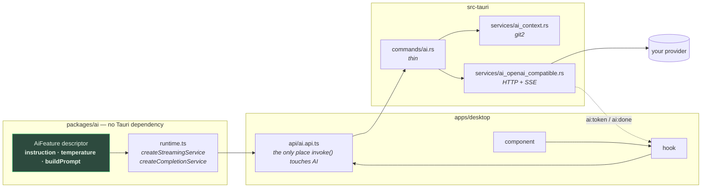
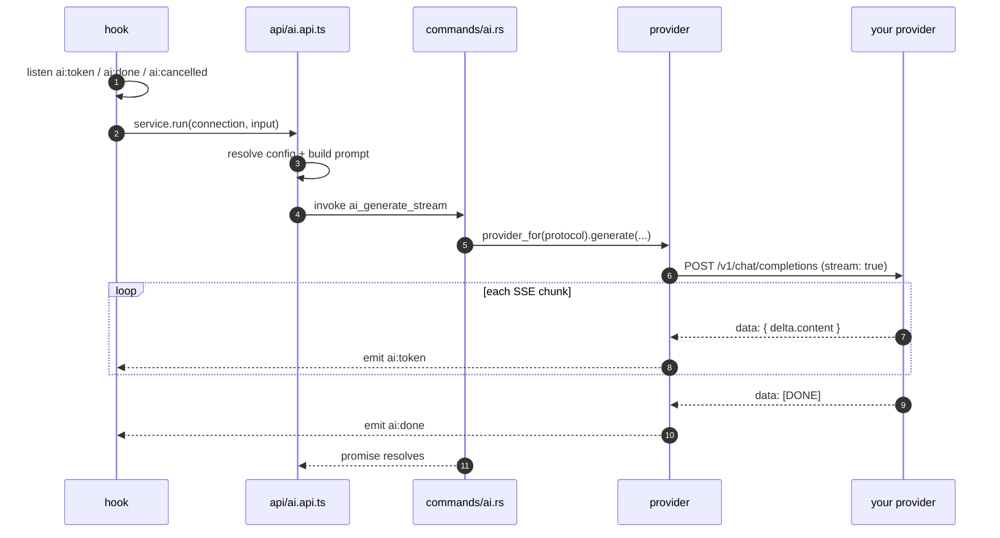

# The AI system

Everything the app does with a language model, and how it does it.

git-manager is local-first: the only outbound calls it ever makes are to the AI provider **you**
configure (a local Ollama by default) and to GitHub. No prompt, diff, or commit message leaves your
machine unless you point the app at a remote provider yourself.

This page covers the machinery every feature shares. Each feature then has its own page for what is
specific to it — its prompt, its inputs, its UI, its limits.

---

## The features

| Feature | What it does | Kind | Where you trigger it |
| ------- | ------------ | ---- | -------------------- |
| [Commit message](./commit-message.md) | Writes the message for the staged changes | streaming | ✨ in the WIP staging panel |
| [File grouping](./file-grouping.md) | Splits all working changes into a plan of atomic commits | completion + JSON schema | "AI commits" in the WIP panel |
| [PR description](./pr-description.md) | Writes the body of a pull request from a branch's range diff | streaming | ✨ in the PR composer / create form |
| [Branch explanation](./branch-explanation.md) | Explains what a whole branch changes, in a right panel, remembered per branch | streaming | right-click a commit or a branch → *Explain branch changes (LLM)* |
| [Commit explanation](./commit-explanation.md) | Explains what one commit actually does, beyond its message | streaming | right-click a commit → *Explain this commit (LLM)* |
| [Change explanation](./change-explanation.md) | Explains one file's pending diff, read against the file itself | streaming | *Explain* above the diff, on a working-copy file |
| [Working explanation](./working-explanation.md) | Summarizes everything uncommitted — what you are in the middle of | streaming | right-click the WIP row → *Explain working changes (LLM)* |
| [Daily summary](./daily-summary.md) | A "yesterday / today" briefing per repository | completion + JSON schema | ✨ on a dashboard project, and automatically each morning |

Not built yet: "recompose a commit with AI" (its i18n keys exist, nothing behind them). See the
roadmap section at the bottom.

---

## The one-paragraph version

A **feature descriptor** in `packages/ai` owns an instruction, a temperature and a function that
turns typed input into a prompt. The **api layer** pairs it with a Tauri-backed transport to produce
a typed service. The **Rust backend** gathers git data and relays the finished prompt to the
provider; it holds no prompt text and does not know which feature it is serving. Tokens come back as
Tauri events.



The invariants that shape hold, and why they are worth protecting:

| Invariant | Why |
| --------- | --- |
| The Rust provider is a **dumb transport** — it relays a prebuilt system/user pair | Changing a prompt never means recompiling Rust or shipping a release |
| `packages/ai` imports **no** `@tauri-apps/api` | Prompt logic stays unit-testable in plain Node, with no IPC to fake |
| Only `api/*.api.ts` calls `invoke()` | Repo-wide hard rule; bypassing it silently drops undo/event-bus behaviour elsewhere |
| Settings hold **connection data only** | Instruction and temperature belong to the feature; a wrong temperature degrades output nobody can debug |

---

## Settings: connection only

`AiConnectionConfig` ([config.ts](../../packages/ai/src/config.ts)) is all that is persisted:

```ts
{ preset, url, model, apiKey?, timeoutSeconds, enabled? }
```

Two presets ship, both speaking the `openai-compatible` protocol: **Ollama** (default,
`http://localhost:11434`) and a generic **OpenAI-compatible** entry you point anywhere — LM Studio,
vLLM, MLX, OpenAI itself. `anthropic-messages` has a registry entry but its provider is a stub that errors — no preset points at it.

`resolveGenerateConfig(connection, feature.temperature)` resolves the preset to its **protocol** and
splices in the temperature the *feature* chose. That is the whole negotiation.

`enabled: false` (the master switch) hides every AI affordance in the app — no buttons, no footer
pill, no automatic daily summary. Users who don't want AI never see AI chrome.

**Base URL handling** deserves a note, because it caused real support churn: a bare origin
(`http://localhost:11434`) gets `/v1` appended, but a URL that already carries a path is obeyed
verbatim, so typing the base URL an OpenAI SDK expects doesn't produce `/v1/v1/models`.

---

## Git context

Prompts are built in TypeScript, but the git data behind them comes from `git2` in Rust, via
`get_ai_context` ([ai_context.rs](../../apps/desktop/src-tauri/src/services/ai_context.rs)). One
command, three scopes:

| Scope | Diff | Used by |
| ----- | ---- | ------- |
| `staged` | index vs HEAD — what a plain commit would capture | commit message |
| `working` | worktree vs HEAD, untracked included | file grouping |
| `range` | `merge-base(base, head)..head` | PR description, branch explanation |

`range` takes the **merge base**, not the base tip — diffing `main..feat` naively reports main's own
commits as deletions the branch never made. `head` defaults to `HEAD`; passing it explicitly is what
lets the branch explanation read a branch that isn't checked out.

Every context also carries the repo's **commit convention** (a commitlint config, a `commitlint` key
in package.json, or a git `commit.template`) and the subjects of recent non-merge commits, so
message-writing features can match the project's actual style — which may be free-form, not
Conventional Commits. See [commit message](./commit-message.md) for how that is used.

The daily summary uses a different command, `get_ai_activity`, which looks *backwards* over a time
window instead of at a diff.

---

## The transport

Two commands, both feature-agnostic:

- `ai_generate_stream` — streams tokens back as Tauri events. **The promise resolves when the
  generation finishes**: the command awaits the provider's whole SSE loop rather than detaching it.
- `ai_complete` — one awaited response, optionally constrained to a JSON Schema via the provider's
  `response_format: json_schema` surface, then parsed by the feature.



### Event contract

| Event | Emitted by | Meaning |
| ----- | ---------- | ------- |
| `ai:token` | provider, per delta | one chunk of text |
| `ai:done` | provider, on `[DONE]`/EOF | generation complete |
| `ai:cancelled` | provider, when the cancel flag flips | stopped on request |
| `ai:error` | **nothing** | see below |

> ⚠️ **`ai:error` is never emitted.** A provider failure makes the command return `Err`, which
> rejects the `invoke` promise, so errors surface through the caller's `catch`. The listeners exist
> because the event is part of the documented `AiProvider` contract — don't treat it as the error
> path when debugging.

### Timeouts

The configured `timeoutSeconds` means something different per call kind, and the difference matters:

| Call | Timeout applied | Meaning |
| ---- | --------------- | ------- |
| `ai_complete` (one-shot) | total request | longest the whole answer may take |
| `ai_generate_stream` | **per read**, plus a 10s connect timeout | longest *silence* tolerated mid-stream |

reqwest's `Client::timeout` bounds the whole request **including reading the body**, so on a streamed
response it caps the entire generation. With the 30s default that aborted any answer taking longer
than half a minute — surfacing mid-stream as the thoroughly unhelpful *"error decoding response
body"*. Streaming therefore uses `read_timeout` instead: a provider that goes silent still fails,
but a slow local model can take as long as it needs.

If a cold model takes more than `timeoutSeconds` to emit its *first* token, raise the setting — that
first wait is a silence like any other.

### Cancellation

`cancel_generation` flips a `Mutex<bool>` in `AppState`; the provider checks it **between chunks**,
emits `ai:cancelled` and returns. Cancellation is therefore cooperative: it lands within one chunk,
it does not abort the HTTP request, and a model that has gone quiet won't notice until it emits
again or the request times out.

### "The model is working"

Every feature funnels through `runStream`/`runComplete`, so that is where a run is bracketed:
`trackedTransport(featureId)` wraps the call in
[`withAiActivity`](../../apps/desktop/src/stores/aiActivity.store.ts) for exactly as long as the
promise is pending, and the footer's AI pill becomes a spinner naming the task. Instrumenting the
transport rather than each hook means a new feature is covered for free, and the `finally` is
impossible to forget — a rejected call that left the footer spinning forever would be worse than no
spinner.

### Errors

Rust serializes `AppError` to `{ code, message, detail }` JSON, which arrives as the rejection's
message. Four stable sentinels have localized copy in the `errors` namespace:

| Sentinel | Cause |
| -------- | ----- |
| `AI_PROVIDER_NOT_RUNNING` | connection refused |
| `AI_MODEL_NOT_FOUND` | HTTP 404 from the completions endpoint |
| `AI_EMPTY_RESPONSE` | HTTP 200 with an empty body (raised by the model probe) |
| `AI_NO_BRANCH_CHANGES` | frontend-side: the branch is level with its base |
| `AI_NO_COMMIT_CHANGES` | frontend-side: the commit touches no text |
| `AI_NO_WORKING_CHANGES` | frontend-side: the working tree is clean |

[`aiErrorMessage(raw, t)`](../../apps/desktop/src/lib/aiErrorMessage.ts) resolves a sentinel to
localized copy, else falls back to the payload's `message` (+ `detail`), else the raw string — never
to a generic "an error occurred", which would throw away the only clue there is.

---

## Adding a feature

1. One file in `packages/ai/src/features/` exporting an `AiFeature` — instruction, temperature,
   `buildPrompt`, plus a `schema` + `parse` if it needs structured output. Export it from
   `features/index.ts` and `src/index.ts`.
2. One line in `api/ai.api.ts`: `createStreamingService(feature, trackedTransport(feature.id))`.
3. A hook (streaming features can build on
   [`useAiStream`](../../apps/desktop/src/hooks/useAiStream.ts)) and a component.
4. A label in the footer's `FEATURE_LABEL_KEYS` so the spinner names it.
5. If the result is expensive and worth keeping, a persisted store for it — see
   `aiExplanation.store` (per repo + kind + ref) and `dailySummary.store` (per repo).

**No Rust change, no new command, no new Settings knob** — unless the feature needs git data the
backend doesn't gather yet. That exception has been used once: the branch explanation needed a range
ending somewhere other than `HEAD`, which added one optional parameter to `get_ai_context`.

Write the doc page alongside it, and add it to the table at the top.

---

## Known limitations

Shared by every feature; the per-feature pages list their own on top of these.

| # | Limitation | Impact | Fix sketch |
| - | ---------- | ------ | ---------- |
| 1 | **One global generation slot.** `ai:token` carries no request id and `cancel_generation` flips one shared flag. Two features running at once would receive each other's tokens, and cancelling either stops both. | Rare but real; nothing in the UI prevents it | Give `ai_generate_stream` a request id, echo it in the event payload, key listeners and the cancel flag on it |
| 2 | **`ai:error` is dead.** No Rust path emits it. | None today — the reject path covers it — but it misleads readers | Emit it from the `Err` arm, or drop the listeners and document the reject path |
| 3 | **Truncation is blind.** Diffs are cut mid-file at a fixed character budget; lockfile noise can eat the whole allowance. | Large changesets get shallower output | Budget per file, or drop generated/lock files before truncating |
| 4 | **Two hooks still duplicate the streaming plumbing.** `useAiGeneration` and `usePrDescriptionGeneration` predate `useAiStream` and carry its two bugs (listeners leaking past unmount, stacking across runs). | Maintenance | Migrate them with a callback-forwarding option |
| 5 | **No end-to-end test against a real model.** | "The right bytes reached the transport" is covered; "the model wrote something good" is not | Inherent — a provider is the one dependency CI cannot assume |

---

## Roadmap

| Item | State |
| ---- | ----- |
| **Recompose a commit with AI** (single, or N children of a commit) | i18n keys `gitTree.contextMenu.recomposeOne` / `recomposeMany` exist, referenced nowhere. Generating the text is easy; applying it means reword-via-interactive-rebase, i.e. history rewriting |
| **LLM explanation in the session journal** | ROADMAP 8.14 — blocked on the whole unstarted M8 pedagogy block |

---

## File map

| Concern | File |
| ------- | ---- |
| Feature descriptors | [packages/ai/src/features/](../../packages/ai/src/features/) |
| Runtime (descriptor → service) | [packages/ai/src/runtime.ts](../../packages/ai/src/runtime.ts) |
| Presets, protocols | [packages/ai/src/presets.ts](../../packages/ai/src/presets.ts) |
| Connection + context types | [packages/ai/src/config.ts](../../packages/ai/src/config.ts) |
| Service assembly, transport, activity tracking | [apps/desktop/src/api/ai.api.ts](../../apps/desktop/src/api/ai.api.ts) |
| Shared streaming hook | [apps/desktop/src/hooks/useAiStream.ts](../../apps/desktop/src/hooks/useAiStream.ts) |
| Error decoding | [apps/desktop/src/lib/aiErrorMessage.ts](../../apps/desktop/src/lib/aiErrorMessage.ts) |
| Footer activity state | [apps/desktop/src/stores/aiActivity.store.ts](../../apps/desktop/src/stores/aiActivity.store.ts) |
| Remembered explanations | [apps/desktop/src/stores/aiExplanation.store.ts](../../apps/desktop/src/stores/aiExplanation.store.ts) |
| Commands | [src-tauri/src/commands/ai.rs](../../apps/desktop/src-tauri/src/commands/ai.rs) |
| Git context (git2) | [src-tauri/src/services/ai_context.rs](../../apps/desktop/src-tauri/src/services/ai_context.rs) · [ai_activity.rs](../../apps/desktop/src-tauri/src/services/ai_activity.rs) · [ai_convention.rs](../../apps/desktop/src-tauri/src/services/ai_convention.rs) |
| Providers | [ai_provider.rs](../../apps/desktop/src-tauri/src/services/ai_provider.rs) · [ai_openai_compatible.rs](../../apps/desktop/src-tauri/src/services/ai_openai_compatible.rs) · [ai_anthropic.rs](../../apps/desktop/src-tauri/src/services/ai_anthropic.rs) · [ai_registry.rs](../../apps/desktop/src-tauri/src/services/ai_registry.rs) |

For the architecture rules all of this is built on, read [CLAUDE.md](../../CLAUDE.md) — it is
authoritative and is what a PR is checked against.
