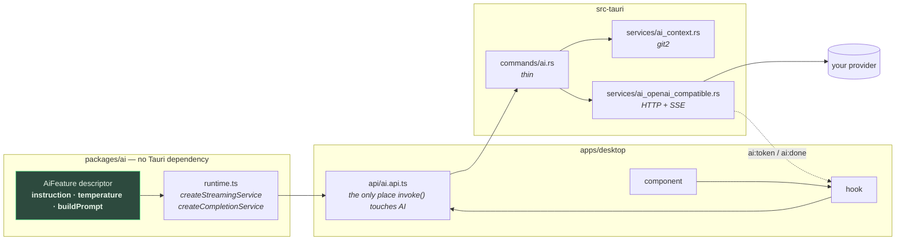
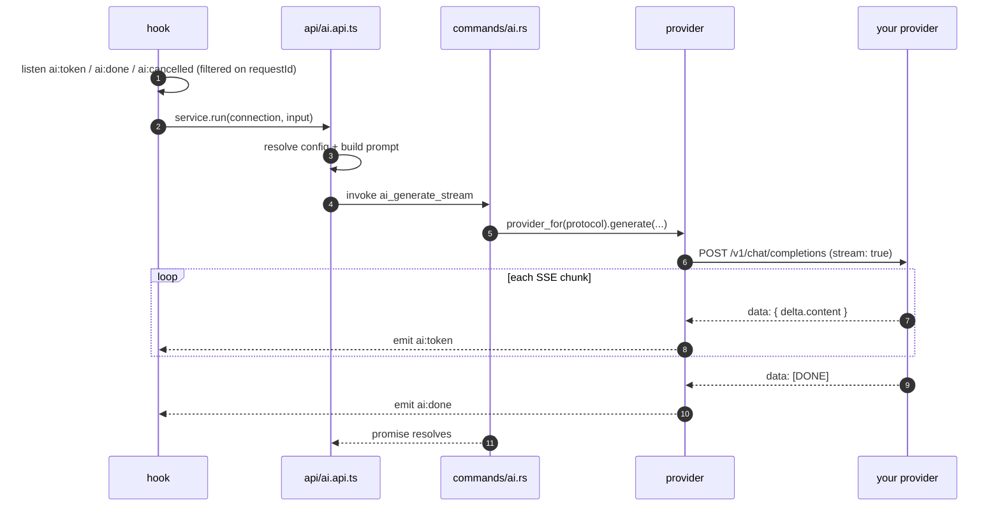

# The AI system

Everything the app does with a language model, and how it does it.

git-manager is local-first: the only outbound calls it ever makes are to the AI provider **you**
configure (a local Ollama by default) and to GitHub. No prompt, diff, or commit message leaves your
machine unless you point the app at a remote provider yourself.

This page covers the machinery every feature shares. Each feature then has its own page for what is
specific to it — its prompt, its inputs, its UI, its limits.

---

## The features

| Feature                                         | What it does                                                                                                         | Kind                                                | Where you trigger it                                                                                 |
| ----------------------------------------------- | -------------------------------------------------------------------------------------------------------------------- | --------------------------------------------------- | ---------------------------------------------------------------------------------------------------- |
| [Commit message](./commit-message.md)           | Writes the message for the staged changes                                                                            | completion + schema                                 | ✨ in the WIP staging panel                                                                          |
| [File grouping](./file-grouping.md)             | Splits all working changes into a plan of atomic commits                                                             | completion + JSON schema                            | "AI commits" in the WIP panel                                                                        |
| [PR description](./pr-description.md)           | Writes the body of a pull request from a branch's range diff                                                         | streaming                                           | ✨ in the PR composer / create form                                                                  |
| [Branch explanation](./branch-explanation.md)   | Explains what a whole branch changes, in a right panel, remembered per branch                                        | streaming                                           | right-click a commit or a branch → _Explain branch changes (LLM)_                                    |
| [Commit explanation](./commit-explanation.md)   | Explains what one commit actually does, beyond its message                                                           | streaming                                           | right-click a commit → _Explain this commit (LLM)_                                                   |
| [Change explanation](./change-explanation.md)   | Explains one file's pending diff, read against the file itself                                                       | streaming                                           | _Explain_ above the diff, on a working-copy file                                                     |
| [Working explanation](./working-explanation.md) | Summarizes everything uncommitted — what you are in the middle of                                                    | streaming                                           | right-click the WIP row → _Explain working changes (LLM)_                                            |
| [Code review](./code-review.md)                 | Reviews a diff and flags what deserves a second look — the one feature allowed an opinion                            | streaming                                           | right-click the WIP row → _Review changes (LLM)_, or a commit/branch → _Review branch changes (LLM)_ |
| [Daily summary](./daily-summary.md)             | A "yesterday / today" briefing per repository, read file by file off the main branch and archived as markdown        | completion + JSON schema                            | ✨ on a dashboard project, and automatically each morning                                            |
| [Summary search](./summary-search.md)           | Answers a question about the archived briefings, citing the days it rests on                                         | completion + JSON schema                            | the question box on the Summaries tab                                                                |
| [Commit search](./commit-search.md)             | Answers a question about recent history by reading every commit in a window, one at a time                           | completion + JSON schema per commit, then streaming | the AI menu → _Search history_, or ⇧⌘F                                                               |
| [Recompose a commit](./commit-recompose.md)     | Rewrites the message of a commit that already exists, reviewed before it is applied                                  | completion                                          | right-click a commit → _Rewrite this commit's message (LLM)_                                         |
| [Action explanation](./action-explanation.md)   | Explains the git commands the app ran behind an action you performed — the one feature aimed at needing the app less | streaming                                           | the 🎓 button in the footer → pick an action → _Explain_                                             |

Every feature listed here is built. See the roadmap section at the bottom for what is not.

---

## The one-paragraph version

A **feature descriptor** in `packages/ai` owns an instruction, a temperature and a function that
turns typed input into a prompt. The **api layer** pairs it with a Tauri-backed transport to produce
a typed service. The **Rust backend** gathers git data and relays the finished prompt to the
provider; it holds no prompt text and does not know which feature it is serving. Tokens come back as
Tauri events.



The [code review](./code-review.md) was built entirely within that shape: one descriptor, one line in
the api layer, a hook and a panel. **No Rust change, no new command, no new setting.**

[Recompose a commit](./commit-recompose.md) tested the claim harder and it still held — a feature
that **rewrites git history** needed no backend change either, because the reword path already
existed (`run_interactive_rebase`) and `apiGetCommitDiff` already yields a commit's patch. The
investigation that established this is the work; a parallel git2 rewrite engine was drafted and
deleted rather than shipped beside a tested one.

The invariants that shape hold, and why they are worth protecting:

| Invariant                                                                         | Why                                                                                                     |
| --------------------------------------------------------------------------------- | ------------------------------------------------------------------------------------------------------- |
| The Rust provider is a **dumb transport** — it relays a prebuilt system/user pair | Changing a prompt never means recompiling Rust or shipping a release                                    |
| `packages/ai` imports **no** `@tauri-apps/api`                                    | Prompt logic stays unit-testable in plain Node, with no IPC to fake                                     |
| Only `api/*.api.ts` calls `invoke()`                                              | Repo-wide hard rule; bypassing it silently drops undo/event-bus behaviour elsewhere                     |
| Settings hold **connection data only**                                            | Instruction and temperature belong to the feature; a wrong temperature degrades output nobody can debug |

---

## Settings: connection only

`AiConnectionConfig` ([config.ts](../../packages/ai/src/config.ts)) is all that is persisted:

```ts
{ preset, url, model, apiKey?, timeoutSeconds, contextTokens?, concurrency?, fastModel?, extraBody?, enabled? }
```

Two presets ship, both speaking the `openai-compatible` protocol: **Ollama** (default,
`http://localhost:11434`) and a generic **OpenAI-compatible** entry you point anywhere — LM Studio,
vLLM, MLX, OpenAI itself. `anthropic-messages` has a registry entry but its provider is a stub that errors — no preset points at it.

`resolveGenerateConfig(connection, feature.temperature)` resolves the preset to its **protocol** and
splices in the temperature the _feature_ chose. That is the whole negotiation.

`enabled: false` (the master switch) hides every AI affordance in the app — no buttons, no footer
pill, no automatic daily summary. Users who don't want AI never see AI chrome.

**Base URL handling** deserves a note, because it caused real support churn: a bare origin
(`http://localhost:11434`) gets `/v1` appended, but a URL that already carries a path is obeyed
verbatim, so typing the base URL an OpenAI SDK expects doesn't produce `/v1/v1/models`.

### The four clocks

A generation has four different waits, and one number cannot bound them all — trying to was the bug
behind a history search that lost six of ten commits.

| Wait                                         | Bounded by                                  | Why it is separate                                                                                                                                              |
| -------------------------------------------- | ------------------------------------------- | --------------------------------------------------------------------------------------------------------------------------------------------------------------- |
| Reaching the server                          | `CONNECT_TIMEOUT_SECONDS` (10 s, fixed)     | An unreachable provider must fail in seconds however long the user will wait for tokens — on both the streaming and the one-shot client                         |
| Prompt processing, up to the **first** token | `timeoutSeconds` (the user's setting)       | The long part on a local model reading a whole diff. This is what the setting is _for_                                                                          |
| Silence **between** tokens                   | `STREAM_IDLE_TIMEOUT_SECONDS` (30 s, fixed) | Inter-token gaps are milliseconds, so a long one means a dead stream, not a slow model. Not configurable: its natural range is narrow                           |
| Generation length                            | `max_tokens`, sent on every request         | A clock is the wrong tool for a runaway model. Every feature declares its own room (`reservedOutputTokens`) and the cap is what makes the prompt's reserve true |

A **one-shot** completion has no first-token wait — the body arrives whole — so there `timeoutSeconds`
caps the entire generation. That is why its default is 120 s rather than the 30 s that was fine back
when the budget only ever measured a stream's silence.

**`timeoutSeconds: 0` removes that clock entirely**, and only that one. The other three stay: an
unreachable provider still fails in ten seconds, a dead stream is still cut after thirty, and output
is still capped by `max_tokens`. What is gone is the clock on a model that is _working_ — which is
the one that cannot be set correctly in advance, because the wait it bounds varies by more than an
order of magnitude with the model, the diff and how many calls are in flight. And it fails in the
worst possible direction: a budget guessed low does not degrade an answer, it **deletes commits from
it**. One real search lost eight of ten that way, each at exactly the configured mark.

Removing a clock cannot be allowed to remove cancellation with it, so an unbounded first-token wait
is served in one-second slices (`CANCEL_POLL_SECONDS`) that come back around to the cancellation
check, rather than one long await during which Stop would do nothing.

### Reading several at once

Every map phase — `summarizeFiles` over a changeset's files, `scanCommits` over history's commits —
runs one call at a time by default, and the _Calls in flight_ setting (`concurrency`) widens it. Both
share one bounded pool, [`mapConcurrently`](../../packages/ai/src/features/mapConcurrently.ts).

The default is **1**, and it is not a placeholder. Whether concurrency helps at all is decided by the
provider's scheduler, not by this code:

| Server                                                          | What N concurrent requests do                                                                                             |
| --------------------------------------------------------------- | ------------------------------------------------------------------------------------------------------------------------- |
| Ollama, out of the box                                          | Queue. It serves one generation per model unless `OLLAMA_NUM_PARALLEL` says otherwise, so the surplus waits at the socket |
| A server doing **continuous batching** (vLLM, some MLX servers) | Enter the same forward pass. Real throughput gain                                                                         |

The code used to assert the first case for everyone — _"the provider is normally a local model with
one copy resident, so concurrent requests queue behind the same weights"_. Measured against an MLX
server with 8-way admission, 8 requests carrying one commit's diff each:

| In flight | Total  | Per request | Slowest |
| --------- | ------ | ----------- | ------- |
| 1         | 15.8 s | 2.0 s       | 2.5 s   |
| 2         | 14.2 s | 3.5 s       | 4.1 s   |
| 4         | 8.9 s  | 4.4 s       | 6.2 s   |
| 8         | 7.8 s  | 7.6 s       | 7.8 s   |

So the assertion was wrong for that server and right for the default one, which is exactly why this
is a setting rather than a change.

**The shape of that table is the thing to understand before raising it: the total falls because each
request gets slower, not faster.** Batching trades latency for throughput. A 3x tail on a scan whose
calls already take twenty seconds is the difference between a budget that fits and a wall of
timeouts — which is why this setting and `timeoutSeconds` have to move together. Returns also flatten
early: 4 in flight bought 88% of what 8 did.

Two things get worse, and neither is fixable here:

- **Cancellation gets coarser.** `shouldCancel` is polled before _dispatching_, never during a call,
  because the completion transport takes no request id. At 1 in flight, stopping wastes one call. At
  8 it wastes 8.
- **The KV cache is shared.** Concurrent requests compete for it, and a server that shrinks the
  effective window under pressure can undo the gain without reporting anything.

Progress stays honest either way: `completed` counts items actually decided, not requests dispatched.
Above 1 in flight the scan stops naming the commit it is on, because there is no longer one to name.
Results are returned and published **in input order**, never completion order — `onSettled` carries
the index for exactly that reason, so a changeset's files and a repository's history keep their
meaning while the run fills in.

### Reasoning models, and getting them to stop

A reasoning model narrates before it answers. Where that narration _goes_ is the provider's business,
and it has exactly one good outcome and two bad ones:

|                                                    | What the user sees                                                                             |
| -------------------------------------------------- | ---------------------------------------------------------------------------------------------- |
| The provider separates it into `reasoning_content` | Nothing. The app reads `delta.content` only, which is why most features never had this problem |
| The provider gives up separating it                | "Thinking Process: 1. Analyze the request…" above the answer                                   |
| It is asked not to think at all                    | Nothing, and faster                                                                            |

The middle row is the one that bites, and its usual cause is not the model — it is **truncation**. A
provider only separates deliberation from answer once the generation _completes_; cut it off
mid-thought with `max_tokens` and the server folds the partial reasoning into the content it streams.
So a token budget too small does not merely shorten an answer, it is what puts the narration on
screen. That is why the answer features reserve generously, and it is the first thing to check.

The app defends on both sides:

- **`stripReasoning`** ([reasoning.ts](../../packages/ai/src/features/reasoning.ts)) removes tagged
  blocks and a leading narration marker from streamed answers. It is a backstop, not a solution, and
  it is fragile by nature — it matched only markers on their own line until a real answer leaked past
  it with `Thinking Process: 1. …` all on one.
- **`extraBody`** in Settings sends whatever switch the user's server understands, because there is
  no standard one:

| Spelling                                               | Where it works                                          |
| ------------------------------------------------------ | ------------------------------------------------------- |
| `{"reasoning_effort": "none"}`                         | In the OpenAI spec; Ollama maps it onto its own `think` |
| `{"chat_template_kwargs": {"enable_thinking": false}}` | vLLM, SGLang — what Qwen's model card documents         |
| `{"think": false}`                                     | Ollama's **native** API, not its `/v1` surface          |

The app cannot send all of them: an unknown field is an HTTP 400 on a strict server, and that would
break working setups. It cannot pick one either. So the user names theirs, and the field is empty by
default.

**Some servers accept none of them.** oMLX, for one, exposes the toggle in its own UI and ignores
`chat_template_kwargs` on the API entirely ([oMLX #1378](https://github.com/jundot/omlx/issues/1378),
closed without a fix). There the answer is to turn thinking off **in the server**, or run a model
that does not reason — which is a fact about the setup, not something the app can route around.

### Which models actually work

The app is provider-agnostic and model-agnostic by design, but that is not the same as every model
being usable. **The dividing line is not size — it is whether the model honors structured output.**

Half the features ask for a JSON object constrained by a schema (`response_format: json_schema`): the
commit message, the commit plan, the daily summary, every per-file summary, every per-commit verdict.
A model that ignores the schema and answers in prose does not produce worse results — it produces
_none_, and every one of those calls is recorded as a failure. Measured on this repository:

| Model                      | Provider                 | Structured output              | Commit search on the button question                                     | Verdict          |
| -------------------------- | ------------------------ | ------------------------------ | ------------------------------------------------------------------------ | ---------------- |
| `Qwen3.6-27B-MXFP8-MTP`    | omlx (OpenAI-compatible) | honored                        | 3/3 on the labelled spot check — finds the real hit, rejects both decoys | **recommended**  |
| `Qwen3.6-35B-A3B-MLX-8bit` | omlx (OpenAI-compatible) | honored                        | 3/3 on the same spot check                                               | **recommended**  |
| `gemma4:12b-mlx`           | Ollama                   | **ignored** — answers in prose | over 25 commits: 1 hit, 0 false positives, 6 unreadable                  | usable, degraded |
| `gemma4:26b-mlx-bf16`      | Ollama                   | **ignored** — answers in prose | 2/3 — rejects both decoys but **misses the real hit** (unreadable)       | not recommended  |

Note the last two rows: the **bigger** model of the same family does _worse_. It rejects the decoys
and then fails to produce a readable verdict on the one commit that mattered — a miss that would
have read as a confident "no, the button never changed". Twice the parameters buy nothing here
because the constraint is the output contract, not the reasoning.

The prose fallback in
[`parseCommitRelevance`](../../packages/ai/src/features/commitRelevance.ts) is what makes the second
row "degraded" instead of "unusable": before it, that model failed **25 of 25** commits. It is a
salvage path, not a substitute — a model that honors the schema is worth more than any prompt work.

If a run reports a wall of unread commits, or the commit box fills with reasoning, the model is the
thing to change first. That is also why the relevance verdict's field order matters: see
[commit search](./commit-search.md#the-order-is-the-feature) for the failure a weaker model exhibits
even when its output _is_ well-formed.

> These numbers come from one repository, one question and four models. Treat the table as a starting
> point rather than a compatibility matrix, and add rows as models are actually tried.

### The probe answers this at configuration time

**Test the model** in Settings → AI no longer sends the word `ping`: it sends a tiny
schema-constrained request and reports **two independent things**.

| Field        | Means                                               | When it is false                                 |
| ------------ | --------------------------------------------------- | ------------------------------------------------ |
| `ok`         | anything non-empty came back — the whole path works | wrong URL, model not pulled, auth, provider down |
| `structured` | the reply was the JSON object the schema asked for  | the model ignores `response_format`              |

`ok: true, structured: false` is the state the probe exists for: everything _looks_ configured, the
page is green, and every schema-driven feature will fail on every call. Nothing else in the app says
so until a feature runs — and for the commit search, that is half an hour of scanning that comes back
unreadable.

An earlier version deliberately sent **no** schema, on the grounds that a schema failure would be
reported as a connection failure. That reasoning is kept: the two are separate fields, so a model
that ignores the format still proves the round-trip and still reads as reachable.

### A second, faster model

`fastModel` is optional and empty by default. When set, it is used **only** by features that declare
`tier: 'fast'` — today exactly one: `fileSummaryFeature`.

That call is the app's highest-volume one (seven features run it once per changed file) and its least
demanding (describe one file in two clauses), so on a thirty-file changeset it moves thirty of the
thirty-one calls off the main model.

The tier is declared by the **feature**, next to its instruction and temperature, and never assigned
by the user — for the same reason those are not settings. "Repetitive" is not the criterion: the
commit search's per-commit verdict is the same shape of loop and is precisely where a weaker model
invents matches about your own history, so it stays on the main model. `resolveGenerateConfig` swaps
the model name and nothing else, so the fast model must be served by the same provider — and Settings
probes it with the same button, because a second slot is a second way to be misconfigured.

### Checking the context window

`contextTokens` is the one setting the whole AI stack takes on faith — every feature sizes its prompt
from it, so declaring more than the provider serves rebuilds the silent truncation the setting exists
to prevent, and worse than before, because the app then builds an oversized prompt _deliberately_.

The **Check against the model** button ([ai_model_info.rs](../../apps/desktop/src-tauri/src/services/ai_model_info.rs))
asks the provider what it can. Two of the three sources are Ollama's native endpoints; the third is
not, and it is the only thing a non-Ollama provider gives us.

| Source                                | Reports                                         | Authority                                                                                                                                                                    |
| ------------------------------------- | ----------------------------------------------- | ---------------------------------------------------------------------------------------------------------------------------------------------------------------------------- |
| `/api/show` → `<arch>.context_length` | The model's architectural ceiling               | Can only prove a value **wrong**. A server can serve far less than the model supports                                                                                        |
| `/api/show` → `parameters` `num_ctx`  | What the Modelfile pins                         | Reported, never a verdict — the running server overrides it routinely                                                                                                        |
| `/api/ps` → `context_length`          | The window the server **actually allocated**    | Decides, in both directions — but only exists while the model is loaded                                                                                                      |
| `GET /v1/models` → `max_model_len`    | What an OpenAI-compatible server says it serves | Same authority as the architectural ceiling — declared, not allocated. Non-standard, so usually absent; **omlx reports it**, and it is the only window signal outside Ollama |

`/api/ps` is what closes the old gap. A server-side `OLLAMA_CONTEXT_LENGTH` used to be invisible from
here, so the best the check could say was "plausible"; now, with the model loaded, a declared value
can be genuinely verified — or caught being above what the server will serve, which is the failure
that matters and was previously undetectable. Below it is reported too, without alarm: that one only
costs coverage the model would have given for free.

`max_model_len` closes a second, quieter gap — the one nobody reports as a bug because nothing breaks.
The default `contextTokens` is 4096; a user on omlx serving 128000 has every feature reading a
fraction of every diff, forever, with only the coverage notice hinting at it. When the check finds a
better number than the one declared it offers a one-click **Use N tokens** button
(`suggestedContextWindow`), preferring what the server _allocated_ over what it says it _could_
serve. It offers rather than applies: silently rewriting a value the user typed is not advice.

Reading `/v1/models` needs the configured **API key** — omlx rejects it unauthenticated — which is why
the check forwards one.

> ⚠️ **`context_length` on `/api/ps` is undocumented.** Ollama's published `/api/ps` example omits
> it; a live 0.32.3 returns it. It is parsed defensively — absent, renamed or retyped degrades to
> "unknown", never to an error. "We could not find out" has always been an allowed answer here.

Ollama's own default is **not** a flat 4096 either: it sizes from available memory (~4k below 24 GiB,
32k up to 48 GiB, 256k above). `DEFAULT_CONTEXT_TOKENS = 4096` remains the right pessimistic floor
for a user who has declared nothing — being wrong low costs coverage, being wrong high costs the
instruction.

---

## Git context

Prompts are built in TypeScript, but the git data behind them comes from `git2` in Rust, via
`get_ai_context` ([ai_context.rs](../../apps/desktop/src-tauri/src/services/ai_context.rs)). One
command, three scopes:

| Scope     | Diff                                              | Used by                                            |
| --------- | ------------------------------------------------- | -------------------------------------------------- |
| `staged`  | index vs HEAD — what a plain commit would capture | commit message                                     |
| `working` | worktree vs HEAD, untracked included              | file grouping, working explanation, working review |
| `range`   | `merge-base(base, head)..head`                    | PR description, branch explanation, branch review  |

`range` takes the **merge base**, not the base tip — diffing `main..feat` naively reports main's own
commits as deletions the branch never made. `head` defaults to `HEAD`; passing it explicitly is what
lets the branch explanation read a branch that isn't checked out.

Every context also carries the repo's **commit convention** (a commitlint config, a `commitlint` key
in package.json, or a git `commit.template`) and the subjects of recent non-merge commits, so
message-writing features can match the project's actual style — which may be free-form, not
Conventional Commits. See [commit message](./commit-message.md) for how that is used.

The daily summary uses a different command, `get_ai_activity`, which looks _backwards_ over a time
window instead of at a diff.

The [commit search](./commit-search.md) uses a third, `get_ai_commit_scan`
([ai_commit_scan.rs](../../apps/desktop/src-tauri/src/services/ai_commit_scan.rs)) — the one feature
so far that needed a new command. It also looks backwards, but over a much longer window, and returns
each commit's **full** oid and touched paths rather than its volume: the frontend then fetches one
commit's patch at a time through the existing `get_commit_diff`, so a month of history never sits in
memory or in a prompt at once.

---

## The transport

Two commands, both feature-agnostic:

- `ai_generate_stream` — streams tokens back as Tauri events. **The promise resolves when the
  generation finishes**: the command awaits the provider's whole SSE loop rather than detaching it.
- `ai_complete` — one awaited response, optionally constrained to a JSON Schema via the provider's
  `response_format: json_schema` surface, then parsed by the feature.



### Event contract

Every event carries the same payload, the Rust `AiStreamEvent`:

```jsonc
{ "requestId": "ai-9f3c…", "token": "…" } // `token` only on ai:token
```

| Event          | Emitted by                                      | Meaning             |
| -------------- | ----------------------------------------------- | ------------------- |
| `ai:token`     | provider, per delta                             | one chunk of text   |
| `ai:done`      | provider, on `[DONE]`/EOF                       | generation complete |
| `ai:cancelled` | provider, when this request's cancel flag flips | stopped on request  |

> ⚠️ **These events are a broadcast, not a channel.** One Rust backend emits them to every listener
> in every window, so `requestId` is what separates one generation from another — **a listener must
> ignore any event whose id is not its own**. Before it existed, a commit message being written while
> an explanation panel streamed interleaved both answers into both surfaces, and whichever finished
> first ended the other. The id is minted frontend-side
> ([`aiRequestId.ts`](../../apps/desktop/src/lib/aiRequestId.ts)) because the _listener_ has to know
> it before the request starts; it is passed to `ai_generate_stream`, and providers emit through
> [`StreamHandle`](../../apps/desktop/src-tauri/src/services/ai_provider.rs) so they cannot forget to
> attach it.

> ⚠️ **There is no `ai:error` event.** A provider failure makes the command return `Err`, which
> rejects the `invoke` promise — already a per-request channel that already carries the message — so
> errors surface through the caller's `catch`. An earlier contract promised such an event, nothing
> ever emitted it, and three hooks listened for it for months; the listeners have been removed rather
> than given a second source of truth to race with.

### Timeouts

The configured `timeoutSeconds` means something different per call kind, and the difference matters:

| Call                     | Timeout applied                          | Meaning                                |
| ------------------------ | ---------------------------------------- | -------------------------------------- |
| `ai_complete` (one-shot) | total request                            | longest the whole answer may take      |
| `ai_generate_stream`     | **per read**, plus a 10s connect timeout | longest _silence_ tolerated mid-stream |

reqwest's `Client::timeout` bounds the whole request **including reading the body**, so on a streamed
response it caps the entire generation. With the 30s default that aborted any answer taking longer
than half a minute — surfacing mid-stream as the thoroughly unhelpful _"error decoding response
body"_. Streaming therefore uses `read_timeout` instead: a provider that goes silent still fails,
but a slow local model can take as long as it needs.

If a cold model takes more than `timeoutSeconds` to emit its _first_ token, raise the setting — that
first wait is a silence like any other.

### The output reserve

Every prompt is sized to leave room for the answer: `variableCharBudget` subtracts
`RESERVED_OUTPUT_TOKENS` (600) before handing what's left to the diff. That reserve used to be a
_hope_ — nothing obliged the model to stay inside it, and an answer that ran past it overflowed the
very window the prompt had been sized against, dropping tokens from the **start**, where the
instruction lives.

`resolveGenerateConfig` now sends the same number as `max_tokens`, threaded through
`AiGenerateConfig` → `commands/ai.rs` → `ChatCompletionsRequest`. **The reserve and the cap are one
arithmetic**: the prompt is built assuming the answer fits in N tokens, and sending the cap is what
makes the assumption true. A larger cap overflows; a smaller one truncates answers to buy room
nobody spends.

Two callers deliberately use a different N:

| Caller                              | Cap                    | Why                                                                                                                                                                                                                                                    |
| ----------------------------------- | ---------------------- | ------------------------------------------------------------------------------------------------------------------------------------------------------------------------------------------------------------------------------------------------------ |
| Every prose feature                 | 600                    | A review is capped at 300 words; prose answers don't scale with the input                                                                                                                                                                              |
| [File grouping](./file-grouping.md) | `max(600, files × 24)` | Its JSON must name **every** changed file verbatim, so the answer's length is a property of the question. A flat cap truncates a 40-file plan mid-array — and because the output is _parsed_, that is `parseCommitPlan` throwing, not a shorter answer |
| The model probe                     | 16                     | The expected answer is the word "OK". A reasoning model handed 600 tokens spends them deliberating about `ping` while the user watches a button                                                                                                        |

A feature declares a non-default reserve twice — once as `AiFeature.reservedOutputTokens(input)` (the
cap) and once as its sizing's `reservedOutputTokens` (the room). They must be the same expression;
that pairing is the one thing to check when adding such a feature.

### Cancellation

`cancel_generation(requestId)` flips that request's flag in `AppState`'s
[`GenerationRegistry`](../../apps/desktop/src-tauri/src/state.rs); the provider checks it **between
chunks** through `StreamHandle::is_cancelled`, emits `ai:cancelled` and returns. Cancellation is
therefore cooperative: it lands within one chunk, it does not abort the HTTP request, and a model
that has gone quiet won't notice until it emits again or the request times out.

One flag **per request id**, not one for the app: the flag used to be a single `Mutex<bool>`, so a
stop button anywhere stopped every stream. An id that has already finished is a no-op rather than an
error — hitting stop as the last token lands is a normal race — and the command clears its entry on
every exit path, so a re-run cannot inherit a stale cancellation.

### "The model is working"

Every feature funnels through `runStream`/`runComplete`, so that is where a run is bracketed:
`trackedTransport(featureId)` wraps the call in
[`withAiActivity`](../../apps/desktop/src/stores/aiActivity.store.ts) for exactly as long as the
promise is pending, and the footer's AI pill becomes a spinner naming the task. Instrumenting the
transport rather than each hook means a new feature is covered for free, and the `finally` is
impossible to forget — a rejected call that left the footer spinning forever would be worse than no
spinner.

The pill says **what state the provider is in and what it is doing** — never which model is
configured. It used to print the model name, and that stopped working the day a setup could name
two: neither the main model nor the fast one alone answers "what is configured", the pair does not
fit a footer, and the pill's actual job — is it up, is it busy — never needed the name. Both now
live in the tooltip, which is where a question you ask occasionally belongs.

**The step count is the exception**, because it is not a label but evidence. A map phase is one call
per file or per commit, so `7/42` is what separates "working through it" from "stuck on the first
one" — and it survives the label folding away on a narrow footer, since a spinner alone says only
that something is happening. It comes from `trackAiProgress(featureId, setProgress)`, which mirrors
the panel's own progress into the activity store. The count is **tagged with the feature it belongs
to** and rendered only while that feature is the one running: a map phase publishes its count
_between_ calls, when nothing is in flight, so it cannot be attached to a run — and an untagged
leftover would show a finished scan's `42/42` against the next, unrelated generation.

### Errors

Rust serializes `AppError` to `{ code, message, detail }` JSON, which arrives as the rejection's
message. Four stable sentinels have localized copy in the `errors` namespace:

| Sentinel                  | Cause                                                   |
| ------------------------- | ------------------------------------------------------- |
| `AI_PROVIDER_NOT_RUNNING` | connection refused                                      |
| `AI_MODEL_NOT_FOUND`      | HTTP 404 from the completions endpoint                  |
| `AI_EMPTY_RESPONSE`       | HTTP 200 with an empty body (raised by the model probe) |
| `AI_NO_BRANCH_CHANGES`    | frontend-side: the branch is level with its base        |
| `AI_NO_COMMIT_CHANGES`    | frontend-side: the commit touches no text               |
| `AI_NO_WORKING_CHANGES`   | frontend-side: the working tree is clean                |

[`aiErrorMessage(raw, t)`](../../apps/desktop/src/lib/aiErrorMessage.ts) resolves a sentinel to
localized copy, else falls back to the payload's `message` (+ `detail`), else the raw string — never
to a generic "an error occurred", which would throw away the only clue there is.

---

## Debugging: the transcript log

Every AI call writes its **full prompts and the model's answer** to
`~/.git-manager/ai-logs/ai-YYYY-MM-DD.jsonl` — one JSON object per line, a file per day, pruned after
a week. The "AI transcripts" button in the Activity Logs view reveals the folder.

This is deliberately _not_ the activity log. That one records IPC arguments truncated to 200
characters and never sees a return value, so for an AI call it can tell you one happened and how long
it took, and nothing about the two things a bug turns on: the prompt that came out wrong, and the
answer that dropped half the files.

Written from `trackedTransport` in [`ai.api.ts`](../../apps/desktop/src/api/ai.api.ts), the single
funnel every feature passes through — so a new feature is instrumented for free.

| Field                               | Note                                                                                                                                                                   |
| ----------------------------------- | ---------------------------------------------------------------------------------------------------------------------------------------------------------------------- |
| `systemPrompt`, `userPrompt`        | Verbatim, untruncated                                                                                                                                                  |
| `response`                          | The full answer for a **completion** feature. Absent for a **streaming** one by nature: its tokens arrive as Tauri events and the transport call resolves with nothing |
| `model`, `temperature`, `maxTokens` | What sizing bugs turn on — `maxTokens` is the answer reserve the prompt held back                                                                                      |
| `status`, `error`, `durationMs`     | A failed call is recorded before the error is rethrown                                                                                                                 |

**No `apiKey` and no provider URL.** The entry is built field by field from the config rather than
spread, so a field added to `AiGenerateConfig` later cannot ride along onto disk.

Writes are best-effort and never batched: one file per call as it completes, because an AI call is
the thing most likely to precede a hang, and a queue would be lost with it.

---

## Adding a feature

1. One file in `packages/ai/src/features/` exporting an `AiFeature` — instruction, temperature,
   `buildPrompt`, plus a `schema` + `parse` if it needs structured output. Export it from
   `features/index.ts` and `src/index.ts`. If its answer is not prose — structured output whose
   length scales with the input — declare `reservedOutputTokens(input)` and pass the _same_
   expression as the sizing's `reservedOutputTokens`; see [The output reserve](#the-output-reserve).
2. One line in `api/ai.api.ts`: `createStreamingService(feature, trackedTransport(feature.id))`.
3. A hook (streaming features can build on
   [`useAiStream`](../../apps/desktop/src/hooks/useAiStream.ts)) and a component.
4. A label in the footer's `FEATURE_LABEL_KEYS` so the spinner names it.
5. If the result is expensive and worth keeping, a persisted store for it — see
   `aiExplanation.store` (per repo + kind + ref) and `dailySummary.store` (per repo).

**No Rust change, no new command, no new Settings knob** — unless the feature needs data the backend
doesn't hand over yet. That exception has been used three times, and only one of them was about git:

| Feature                                       | What it added                              | Why the shape didn't cover it                                                                                                                                |
| --------------------------------------------- | ------------------------------------------ | ------------------------------------------------------------------------------------------------------------------------------------------------------------ |
| [Branch explanation](./branch-explanation.md) | one optional parameter on `get_ai_context` | it needed a range ending somewhere other than `HEAD`                                                                                                         |
| [Commit search](./commit-search.md)           | `get_ai_commit_scan`                       | a month of history's oids and paths, so the frontend can fetch one patch at a time                                                                           |
| [Action explanation](./action-explanation.md) | `read_activity_log`                        | not git data at all: its window is a separate `WebviewWindow`, so the in-memory activity buffer is in another JS context and disk is the only shared surface |

Write the doc page alongside it, and add it to the table at the top.

---

## Known limitations

Shared by every feature; the per-feature pages list their own on top of these.

| #   | Limitation                                                                                                                                                                                                                                                                                                                                                                                                                                                                                                                                                                                                                                                                                        | Impact                                                                                             | Fix sketch                                                                                                                                                                               |
| --- | ------------------------------------------------------------------------------------------------------------------------------------------------------------------------------------------------------------------------------------------------------------------------------------------------------------------------------------------------------------------------------------------------------------------------------------------------------------------------------------------------------------------------------------------------------------------------------------------------------------------------------------------------------------------------------------------------- | -------------------------------------------------------------------------------------------------- | ---------------------------------------------------------------------------------------------------------------------------------------------------------------------------------------- |
| 1   | ~~**One global generation slot.**~~ **Resolved.** Every generation is minted a request id ([`aiRequestId.ts`](../../apps/desktop/src/lib/aiRequestId.ts)) that tags each `ai:*` event (Rust `AiStreamEvent`, emitted through [`StreamHandle`](../../apps/desktop/src-tauri/src/services/ai_provider.rs) so a provider cannot forget it) and keys the per-request cancel flags in [`GenerationRegistry`](../../apps/desktop/src-tauri/src/state.rs). Listeners ignore events that are not theirs; `cancel_generation` names one id.                                                                                                                                                                | —                                                                                                  | —                                                                                                                                                                                        |
| 2   | ~~**`ai:error` is dead.**~~ **Resolved by removal.** Nothing ever emitted it and three hooks listened for it. The `invoke` promise is already this request's own error channel and already carries the message, so a parallel event would be a second source of truth for one condition — and the two would race. The listeners are gone and the reject path is documented on `AiProvider::generate` and `useAiStream`.                                                                                                                                                                                                                                                                           | —                                                                                                  | —                                                                                                                                                                                        |
| 3   | ~~**Truncation is blind.**~~ **Resolved.** Every diff-carrying feature budgets per file through [`budgetDiff`](../../packages/ai/src/features/diffBudget.ts) + [`diffCoverage`](../../packages/ai/src/features/diffCoverage.ts): source before tests before docs, a share per file, omitted paths named in the prompt, coverage reported to the UI. The remaining judgement call — a generated file that genuinely matters — now has an escape hatch: `classifyDiffPath`/`budgetDiff` take a `DiffTierOverrides` map, carried on `DiffPromptSizing` so a feature's prompt and its coverage report cannot disagree about the order. The code review exposes it as `CodeReviewInput.tierOverrides`. | —                                                                                                  | —                                                                                                                                                                                        |
| 4   | ~~**Two hooks still duplicate the streaming plumbing.**~~ **Resolved.** `useAiGeneration` and `usePrDescriptionGeneration` now run on [`useAiStream`](../../apps/desktop/src/hooks/useAiStream.ts), which grew the `onToken` / `trackText` options they were missing — they stream into an input the caller owns, which is why they had forked in the first place. Both inherit the two fixes their copies never got: listeners are dropped on unmount, and a second run no longer stacks a listener set on the previous one.                                                                                                                                                                     | —                                                                                                  | —                                                                                                                                                                                        |
| 5   | **The context window cannot be negotiated — only declared and verified.** `max_tokens` _is_ sent now, so the output reserve is enforced rather than hoped for (see [The output reserve](#the-output-reserve)). The context length still cannot be: Ollama's OpenAI-compatible endpoint has no `num_ctx` and no `options`, and [its own docs say so](https://github.com/ollama/ollama/blob/main/docs/api/openai-compatibility.mdx) — the documented workarounds are a `Modelfile` or `OLLAMA_CONTEXT_LENGTH`, both out-of-band. So `contextTokens` stays declared. What changed is that it can now be _checked_ against what the server actually allocated, not just against the model's ceiling.  | A window declared higher than the server serves still truncates — but the check button now says so | Detection, not negotiation. Sending `num_ctx` would mean a native `/api/chat` path, i.e. a provider per vendor rather than per protocol — a trade this architecture deliberately refuses |
| 6   | **No end-to-end test against a real model.**                                                                                                                                                                                                                                                                                                                                                                                                                                                                                                                                                                                                                                                      | "The right bytes reached the transport" is covered; "the model wrote something good" is not        | Inherent — a provider is the one dependency CI cannot assume                                                                                                                             |

---

## Roadmap

| Item                                           | State                                                                                                                                                                                                                                                                                                  |
| ---------------------------------------------- | ------------------------------------------------------------------------------------------------------------------------------------------------------------------------------------------------------------------------------------------------------------------------------------------------------ |
| ~~**Recompose a commit with AI**~~             | **Built** — see [commit recompose](./commit-recompose.md). Applying reuses the existing `run_interactive_rebase` (its todo renderer already implements `reword`), so it needed no Rust change; the risk is handled by a review dialog, a protected-branch gate and an explicit history-rewrite warning |
| ~~**LLM explanation in the session journal**~~ | **Built** — see [action explanation](./action-explanation.md). It needed none of the pedagogy machinery it was once thought to be blocked on: the commands were already recorded as they ran, and `lib/gitCommandCatalog.ts` renders each backend operation back into the `git` line it stands for     |

---

## File map

| Concern                                                             | File                                                                                                                                                                                                                                                                                                                                             |
| ------------------------------------------------------------------- | ------------------------------------------------------------------------------------------------------------------------------------------------------------------------------------------------------------------------------------------------------------------------------------------------------------------------------------------------ |
| Feature descriptors                                                 | [packages/ai/src/features/](../../packages/ai/src/features/)                                                                                                                                                                                                                                                                                     |
| History rewriting (reword todo + runner)                            | [git_interactive_rebase.rs](../../apps/desktop/src-tauri/src/services/git_interactive_rebase.rs) · [commands/interactive_rebase.rs](../../apps/desktop/src-tauri/src/commands/interactive_rebase.rs)                                                                                                                                             |
| Runtime (descriptor → service)                                      | [packages/ai/src/runtime.ts](../../packages/ai/src/runtime.ts)                                                                                                                                                                                                                                                                                   |
| Presets, protocols                                                  | [packages/ai/src/presets.ts](../../packages/ai/src/presets.ts)                                                                                                                                                                                                                                                                                   |
| Connection + context types                                          | [packages/ai/src/config.ts](../../packages/ai/src/config.ts)                                                                                                                                                                                                                                                                                     |
| Service assembly, transport, activity tracking                      | [apps/desktop/src/api/ai.api.ts](../../apps/desktop/src/api/ai.api.ts)                                                                                                                                                                                                                                                                           |
| Shared streaming hook                                               | [apps/desktop/src/hooks/useAiStream.ts](../../apps/desktop/src/hooks/useAiStream.ts)                                                                                                                                                                                                                                                             |
| Request id minting (one per generation)                             | [apps/desktop/src/lib/aiRequestId.ts](../../apps/desktop/src/lib/aiRequestId.ts)                                                                                                                                                                                                                                                                 |
| Per-request cancel flags                                            | [src-tauri/src/state.rs](../../apps/desktop/src-tauri/src/state.rs) (`GenerationRegistry`)                                                                                                                                                                                                                                                       |
| Error decoding                                                      | [apps/desktop/src/lib/aiErrorMessage.ts](../../apps/desktop/src/lib/aiErrorMessage.ts)                                                                                                                                                                                                                                                           |
| Prompt sizing (budget from the context window)                      | [packages/ai/src/promptSize.ts](../../packages/ai/src/promptSize.ts)                                                                                                                                                                                                                                                                             |
| Bounded pool shared by both map phases                              | [packages/ai/src/features/mapConcurrently.ts](../../packages/ai/src/features/mapConcurrently.ts)                                                                                                                                                                                                                                                 |
| Per-file diff budgeting (tiers, shares, omitted list)               | [packages/ai/src/features/diffBudget.ts](../../packages/ai/src/features/diffBudget.ts)                                                                                                                                                                                                                                                           |
| Diff budget + coverage report, shared by every feature              | [packages/ai/src/features/diffCoverage.ts](../../packages/ai/src/features/diffCoverage.ts)                                                                                                                                                                                                                                                       |
| Coverage line in the UI                                             | [apps/desktop/src/components/git-graph/components/CoverageNotice.tsx](../../apps/desktop/src/components/git-graph/components/CoverageNotice.tsx)                                                                                                                                                                                                 |
| Model context-window lookup (Ollama `/api/show` + `/api/ps`)        | [src-tauri/src/services/ai_model_info.rs](../../apps/desktop/src-tauri/src/services/ai_model_info.rs)                                                                                                                                                                                                                                            |
| Verdict on the declared window (which of the three numbers decides) | [apps/desktop/src/app/settings/components/aiContextWindowVerdict.ts](../../apps/desktop/src/app/settings/components/aiContextWindowVerdict.ts)                                                                                                                                                                                                   |
| Footer activity state                                               | [apps/desktop/src/stores/aiActivity.store.ts](../../apps/desktop/src/stores/aiActivity.store.ts)                                                                                                                                                                                                                                                 |
| Remembered explanations                                             | [apps/desktop/src/stores/aiExplanation.store.ts](../../apps/desktop/src/stores/aiExplanation.store.ts)                                                                                                                                                                                                                                           |
| Commands                                                            | [src-tauri/src/commands/ai.rs](../../apps/desktop/src-tauri/src/commands/ai.rs)                                                                                                                                                                                                                                                                  |
| Remembered commit searches (answer + matches)                       | [apps/desktop/src/stores/aiCommitSearch.store.ts](../../apps/desktop/src/stores/aiCommitSearch.store.ts)                                                                                                                                                                                                                                         |
| Git context (git2)                                                  | [src-tauri/src/services/ai_context.rs](../../apps/desktop/src-tauri/src/services/ai_context.rs) · [ai_activity.rs](../../apps/desktop/src-tauri/src/services/ai_activity.rs) · [ai_commit_scan.rs](../../apps/desktop/src-tauri/src/services/ai_commit_scan.rs) · [ai_convention.rs](../../apps/desktop/src-tauri/src/services/ai_convention.rs) |
| Providers                                                           | [ai_provider.rs](../../apps/desktop/src-tauri/src/services/ai_provider.rs) · [ai_openai_compatible.rs](../../apps/desktop/src-tauri/src/services/ai_openai_compatible.rs) · [ai_anthropic.rs](../../apps/desktop/src-tauri/src/services/ai_anthropic.rs) · [ai_registry.rs](../../apps/desktop/src-tauri/src/services/ai_registry.rs)            |

For the architecture rules all of this is built on, read [CLAUDE.md](../../CLAUDE.md) — it is
authoritative and is what a PR is checked against.
