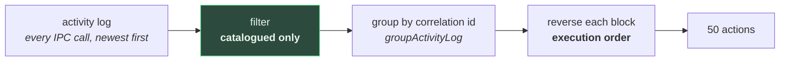
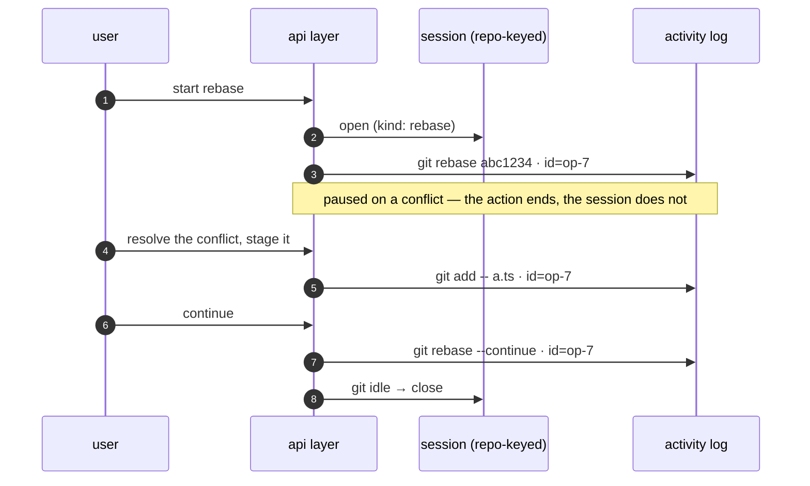

# Action explanation — "Behind the scenes"

Explains the `git` commands the app actually ran behind the button you just pressed.

> Shared plumbing — transport, events, cancellation, errors, settings — lives in the
> [AI system overview](./README.md). This page covers only what is specific to this feature.

|                 |                                                                                                                                                                                                 |
| --------------- | ----------------------------------------------------------------------------------------------------------------------------------------------------------------------------------------------- |
| **Descriptor**  | [`actionExplanationFeature`](../../packages/ai/src/features/actionExplanation.ts)                                                                                                               |
| **Kind**        | streaming markdown                                                                                                                                                                              |
| **Temperature** | 0.2 — the answer is a statement about what documented commands do; two users asking about the same action should read the same thing                                                            |
| **Input**       | the git command lines one action ran, and whether each succeeded. **No git data at all**                                                                                                        |
| **Budgets**     | one window-derived pool over the command list, hard-capped at 12 lines                                                                                                                          |
| **UI**          | its own window ([`ActionJournalWindow`](../../apps/desktop/src/app/action-journal/ActionJournalWindow.tsx)), via [`useActionExplanation`](../../apps/desktop/src/hooks/useActionExplanation.ts) |

---

## Why it exists

Every other AI feature in this app helps you get work done faster. This one is the only one whose
goal is that you **need the app less**: the client is a set of buttons over a tool that has its own
vocabulary, and a user who only ever presses the buttons never learns the vocabulary. So the journal
answers, for each thing you just did, "what did that actually run, and what is it for".

That reframes the audience of an existing view rather than adding a source of data. The
[Activity Logs](../../apps/desktop/src/app/activity-logs/ActivityLogsPage.tsx) takeover already shows
every IPC round-trip — it is a debugging trace, aimed at whoever is chasing a bug. This window reads
the same log for the opposite reader.

---

## What the user sees

A separate window (footer 🎓 button, or the command palette). One row per action, newest first, each
showing the git command(s) it ran:

```
Commit the staged changes                        2 commands
  git add -A
  git commit -m 'feat: explain what the buttons do'
  23:41:02   142ms   git-manager
```

Click a row and the right panel lists those commands in full, with their durations and any failure.
Press **Explain** and a short markdown lesson streams in: one bold sentence about what the action did
to the repository, one bullet per command naming the part of git it touches, and a closing
**Good to know** line — a related command, a common mistake, or how to undo it.

**With no model configured, the commands are still there.** That is the requirement the whole window
is built around, and it is why the command lines live on the row itself rather than behind the click:
the model adds the explanation, it does not reveal the facts. When no provider is reachable the panel
says so and points at Settings, and nothing else changes.

Nothing generates on selection. Unlike the branch and commit explanations — where picking the menu
item _was_ the request — selecting a row here is a request to read the commands, so auto-generating
would fire a model call on every arrow-key press down the list.

---

## The catalog is the feature

The model's usefulness here is bounded entirely by
[`gitCommandCatalog.ts`](../../apps/desktop/src/lib/gitCommandCatalog.ts), which maps each backend
operation to the command line it stands for. `stage_file` teaches nothing; `git add -- src/app.ts` is
the artifact a user can read, copy, look up, and eventually type.

Two rules decide what is in it, and both are about trust:

| Rule                                      | Why                                                                                                                                                                                                                                                                                                                                                              |
| ----------------------------------------- | ---------------------------------------------------------------------------------------------------------------------------------------------------------------------------------------------------------------------------------------------------------------------------------------------------------------------------------------------------------------- |
| **Only operations that change something** | The app reads constantly — status, log, diffs — and those calls outnumber the writes by orders of magnitude. Membership in the catalog _is_ the filter that turns an IPC trace into a list of actions                                                                                                                                                            |
| **Only commands we can render honestly**  | A rendering that is _almost_ right is worse than none in a feature whose point is to teach. The undo/redo plumbing (`snapshot_file`, `restore_file_blob`, `pin_object`) is therefore absent: those are the mechanism by which the app reverses an action, not commands anyone would type — and the operation being undone is already in the pool on its own line |

An operation renders **several** lines when it really is several commands: merging a branch you are
not on runs `git checkout <target>` before `git merge`, and resolving a binary conflict checks out one
side before staging it. Collapsing those into one `&&` line would misrepresent what ran.

Where an argument wasn't recorded, the rendering uses a visible placeholder (`<file>`, `<commit>`)
rather than emitting a command with a hole in it — and the placeholders deliberately skip shell
quoting, since `'<file>'` reads as a filename literally called that.

### Credentials

`scrubUrl` strips `user:password@` from remote URLs before they are rendered. The activity log keeps
those URLs — its own redaction only drops whole arguments for auth-shaped _command names_ — and this
catalog is the one thing the feature sends to a provider. Without the scrub, a token in an `add_remote`
argument would leave the machine.

---

## The pool

[`buildActionPool`](../../apps/desktop/src/lib/actionPool.ts) turns the log into the last
`ACTION_POOL_SIZE` (50) actions. Two steps, and the order of them is load-bearing:



**Filtering happens before grouping.** `groupActivityLog` merges only _consecutive_ entries sharing a
correlation id, and a user action's writes are interleaved with the reads it triggers — a commit
refreshes the status and the log. Grouping first and filtering after splits one commit into two or
three separate actions.

**Each block is then reversed.** The log is newest-first, which is right for a stream you scan and
wrong for a sequence you are trying to understand: "check out `main`, then merge `feat/x`" only teaches
anything in that order.

An action's title comes from its `runActivity` label when it has one (`git.pull` → "Pull from a
remote"), because a label covers several operations and it should not be named after whichever one
happened to be last. An uncorrelated operation is its own action and titles itself.

---

## Operations that are not one action

A rebase is the case that breaks the "one action, one block" model. It starts, **pauses on a
conflict**, waits while the user resolves files and stages them, continues — possibly several times —
and finally lands or is aborted. Those are separate user actions, minutes apart. Shown as five or six
unrelated rows, the one thing a learner needs from them is exactly what is missing: that they were all
the same rebase.

So `activityCorrelation.ts` has a second layer beside `runActivity`: a **session**, an id kept open
across actions and keyed by the repository it belongs to.



A session deliberately **reuses the `correlationId` field** rather than adding a second one. That is
what makes it a small change: its steps simply share a correlation id, and the store, the grouper, the
pool, the journal and the prompt already group on it. The alternative — a third nesting level of
process → action → command — would have had to be taught to all five, to express something the
existing field already expresses.

|                      |                                                                                                                                                                                                                                                                                                                                                           |
| -------------------- | --------------------------------------------------------------------------------------------------------------------------------------------------------------------------------------------------------------------------------------------------------------------------------------------------------------------------------------------------------- |
| **Which operations** | `rebase` (plain, interactive, autosquash) and `bisect`. The test for belonging is that **git keeps state on disk** for it (`.git/rebase-merge`, `refs/bisect/*`), which is what makes it resumable and therefore multi-action. A merge does not qualify — this app aborts a conflicting merge rather than pausing it — and a cherry-pick is a single call |
| **Opened by**        | the api function that starts the operation, and idempotently by each step, so a `continue_rebase` with no session to join (app restarted mid-rebase, or the rebase was started in a terminal) starts a block honestly from there rather than having none                                                                                                  |
| **Closed by**        | `settleRebase`, which already asked git whether the rebase was over to decide the undo entry — so the answer costs no extra call. An abort or a `bisect reset` closes unconditionally, without asking: a session left open by a _failed_ abort is the case that would swallow everything the user does next                                               |

### What joins a session, and what does not

Membership is an **allowlist**, not "everything in that repository", because a paused operation does
not suspend the app. A user waiting on a conflict can still push another branch, and swallowing that
into the rebase's block would be worse than not grouping at all.

What is on the list is the work the pause exists _for_: resolving the conflicted files, and staging
them — which mid-rebase is not an aside but the thing git is waiting on. The lists differ per kind for
the same reason: a bisect involves no staging, so staging during one is unrelated work and keeps its
own identity.

The stamping happens in the `invoke` chokepoint, where the targeted repository is already known, so
none of the joining operations needed a change at their own call sites. And when both layers are live,
**the session wins**: the `git.rebaseInteractive` action that starts a rebase and the `git add` that
settles a conflict three minutes later are the same rebase.

> One consequence worth knowing: this also changes the **Activity Logs** view, which groups on the
> same field. A rebase now reads there as one bracketed block too — the same intent, for its own
> reader.

---

## Why it needed a Rust command

This is the **second** feature to need a backend change, and the reason is the window, not the model.

A separate `WebviewWindow` is a separate JS context, so `useActivityLogStore` — the in-memory ring
buffer `lib/tauri.ts` fills — is permanently empty there. The two windows share exactly one surface:
the rotating on-disk log the buffer already streams to. So `read_activity_log`
([`activity_log.rs`](../../apps/desktop/src-tauri/src/commands/activity_log.rs)) reads it back,
walking day files newest-first and each file's lines bottom-up, stopping as soon as it has what was
asked for. Corrupt lines are skipped rather than failing the read — a log truncated mid-write by a
crash is exactly when this view is worth having.

It buys something the buffer could not give: the journal **survives a restart**, and reaches back a
week rather than a session.

### The read must not be logged

`apiReadActivityLog` goes through `lib/activityLogPersistence.ts`'s **raw** invoke, not the
instrumented wrapper — the same exception the write path has, for the same reason one step further on.
A read of the activity log that goes through the wrapper _writes to the activity log_. The window
polls every 5 seconds, so that self-noise would accumulate at a steady rate and eventually crowd the
real actions out of the fixed `ACTIVITY_READ_BUDGET` lines the pool reads. The log would fill up with
the act of looking at it.

### Why a poll

The actions happen in the _main_ window while the user watches this one. Revalidating on focus alone
would leave a window they are already looking at frozen, and a cross-window push event would be a new
contract for something one small file read settles. Five seconds is also honest about the floor:
entries reach disk on a two-second flush timer.

---

## The instruction

Two failure modes shape it, because each would destroy the only thing the feature has — that every
sentence is checkable against `git help`.

**Inventing commands.** A model asked to explain `git commit` will happily narrate the `git add` it
assumes preceded it, or the `git push` it assumes followed. Here that is not a small error: the user
reads the answer as a record of what the app did to their repository. So the prompt says the list is
complete, and says it twice —

> The command list you were given is COMPLETE. Never mention, imply, or explain a command that is not
> in it — no assumed `git add` before a commit, no assumed `git push` after one.

**Explaining the app instead of git.** Each operation's internal name (`create_fixup_commit`) is in
the prompt because it is what the log recorded and a user chasing a bug needs it. But those names are
not git concepts, and a model that latches onto one teaches the app's implementation instead of the
tool.

Three more rules follow from what the model _does not_ have. It was given the commands, never their
output and never a diff, so it may not say what a command produced or what the repository now
contains. Placeholders are to be referred to generically, never invented. And a command that rewrites
history or discards work must say so plainly in its own bullet — with no warning added to commands
that do not deserve one.

---

## Sizing

The variable part is tiny — a handful of short lines — but it is not _bounded_ by anything on its own,
and that is the one sizing question this feature has. "Stage everything" is a single `git add -A`, but
staging files one at a time in the UI is one operation **per file**, so an action can carry two
hundred near-identical `git add` lines.

So the list is capped twice: by `MAX_LISTED_COMMANDS` (12) and by what the window affords. A window
big enough for all two hundred would spend the answer's 220 words listing them, which teaches the same
lesson twelve examples do. Whatever is cut is named:

> …and 188 more commands of the same action, not shown. Explain the 12 above and say the action
> repeated the same kind of operation 200 times in total. Do not guess what the others were.

Saying so matters more here than in a diff-carrying feature: an unexplained cut leaves the model
believing it has the complete list the instruction just promised it, which is exactly the belief that
produces a confident, wrong account of a fifty-file staging. One command always gets through, however
tight the window — a prompt with no command in it asks the model to explain nothing, and would be
answered anyway.

---

## Memory

Answers are kept in
[`actionExplanation.store`](../../apps/desktop/src/stores/actionExplanation.store.ts),
keyed by the action's id, capped at 200 with the oldest evicted.

That id is the block's **first operation**, not the correlation id it groups on — for two reasons that
both come from sessions. A session id can legitimately appear in _two_ blocks, because
`groupActivityLog` merges only consecutive entries and an unrelated action between two rebase steps
splits them; keying on it would duplicate React keys and make two rows share one answer. And a block's
first operation never changes as later steps are appended, so an explanation stays attached to a rebase
that is still running.

An action is **immutable** — it already happened, and the commands it ran will never change — so unlike
a branch summary the answer stays correct indefinitely. The age is still shown, because a poor
_explanation_ is worth redoing even when its subject is frozen.

It is a separate store rather than a fourth `ExplanationKind` in `aiExplanation.store`: that one keys
on `repoPath::kind::ref` because a branch or a commit only means something inside a repository, while
an action's identity is a globally unique correlation id that may belong to no repository at all (a
clone has none yet). Bending one key shape to cover both meant a fake `repoPath` for half the entries.

---

## Limitations

Beyond the [shared ones](./README.md#known-limitations):

| Limitation                                             | Note                                                                                                                                                                                                                                                                                                                |
| ------------------------------------------------------ | ------------------------------------------------------------------------------------------------------------------------------------------------------------------------------------------------------------------------------------------------------------------------------------------------------------------- |
| **Undo and redo are invisible as such**                | The plumbing they run through is not in the catalog, so pressing ⌘Z shows the underlying operation (a `git reset`, a `git checkout`) with no indication it was an undo. Rendering a guess for `restore_worktree_snapshot` would have been worse than omitting it                                                    |
| **A session's block splits around unrelated work**     | Doing something else between two rebase steps yields two blocks for one rebase, since `groupActivityLog` merges only _consecutive_ entries. The alternative — merging non-consecutive blocks — would have reordered the journal, which is worse for a view whose value is chronology                                |
| **A session can outlive its operation**                | If the app is killed mid-rebase the in-memory session is gone (harmless, the next step opens a new one), but if `settleRebase`'s state read _fails_ the session stays open and later allowlisted work in that repo joins the stale block. Bounded by the allowlist, and self-correcting on the next successful step |
| **`fast_forward_branch` renders one of its two forms** | The app runs `git merge --ff-only` when the target is checked out and `git branch -f` when it is not, and the recorded arguments cannot tell which. The merge form is rendered, being what "fast-forward" means to a learner                                                                                        |
| **Arguments are truncated to 200 characters**          | Inherited from the activity log's redaction. A very long commit message is cut, and only its subject line is rendered anyway                                                                                                                                                                                        |
| **Interleaved actions can cross-attribute**            | Inherited from `activityCorrelation.ts`: the browser has no `AsyncLocalStorage`, so two genuinely concurrent user actions could land in one block                                                                                                                                                                   |
| **At most five seconds stale**                         | The poll interval plus the flush timer. An action performed while the window is open appears shortly, not instantly                                                                                                                                                                                                 |
| **The model never sees a diff**                        | By design — it explains commands, not changes. "What did this commit change" is the [commit explanation](./commit-explanation.md), and the two are complementary rather than overlapping                                                                                                                            |

---

## Tests

| Test                                                                                                            | Covers                                                                                                                                                                                                                                                       |
| --------------------------------------------------------------------------------------------------------------- | ------------------------------------------------------------------------------------------------------------------------------------------------------------------------------------------------------------------------------------------------------------ |
| [`actionExplanation.test.ts`](../../packages/ai/src/features/actionExplanation.test.ts)                         | prompt shape (order, numbering, multi-line operations), failed commands, language, the two caps and the omission note, and that one command always survives a tiny window                                                                                    |
| [`gitCommandCatalog.test.ts`](../../apps/desktop/src/lib/gitCommandCatalog.test.ts)                             | the membership rules (writes in, reads and undo plumbing out), per-family renderings, shell quoting, placeholders, credential scrubbing, redacted arguments                                                                                                  |
| [`actionPool.test.ts`](../../apps/desktop/src/lib/actionPool.test.ts)                                           | filtering before grouping (reads interleaved with a commit's writes), execution order, titling from the label, failure propagation, the cap, a whole rebase gathered into one block, and the block id being unique and stable when a session splits or grows |
| [`activityCorrelation.test.ts`](../../apps/desktop/src/lib/activityCorrelation.test.ts)                         | sessions: one id across steps, idempotent opening, the per-kind allowlists (conflict work joins a rebase, a push does not; staging does not join a bisect), repo scoping, and independence from the per-action layer                                         |
| [`git.api.test.ts`](../../apps/desktop/src/api/git.api.test.ts)                                                 | the session lifecycle: held open across a pause, closed on the continue that lands, closed on a _failed_ abort, opened by a continue with none to join, and a bisect from start to reset                                                                     |
| [`tauri.test.ts`](../../apps/desktop/src/lib/tauri.test.ts)                                                     | the stamping in the `invoke` chokepoint: a step outside any action still joins its operation, the operation wins over the action it nests in, and another repository is untouched                                                                            |
| [`activity_log.rs`](../../apps/desktop/src-tauri/src/services/activity_log.rs) (`#[cfg(test)]`)                 | the tail read: newest-first, capped, and skipping blank or corrupted lines                                                                                                                                                                                   |
| [`activityLogPersistence.test.ts`](../../apps/desktop/src/lib/activityLogPersistence.test.ts)                   | the read goes through the raw invoke, validation drops unrecognisable entries, no-op outside Tauri                                                                                                                                                           |
| [`useActionExplanation.test.ts`](../../apps/desktop/src/hooks/useActionExplanation.test.ts)                     | input assembly, one call and no git fetch, memory per action id, cancelled streams not remembered                                                                                                                                                            |
| [`useActionPool.test.tsx`](../../apps/desktop/src/app/action-journal/useActionPool.test.tsx)                    | the read budget, reads dropped, loading and error states, manual refresh                                                                                                                                                                                     |
| [`ActionRow.test.tsx`](../../apps/desktop/src/app/action-journal/components/ActionRow.test.tsx)                 | commands on the row itself, command count, failure flag, explained marker                                                                                                                                                                                    |
| [`ActionDetailPanel.test.tsx`](../../apps/desktop/src/app/action-journal/components/ActionDetailPanel.test.tsx) | no generation on open, generate/stop/forget, error decoding, copy, cancel on unmount                                                                                                                                                                         |
| [`ActionJournalWindow.test.tsx`](../../apps/desktop/src/app/action-journal/ActionJournalWindow.test.tsx)        | listing, filtering on command text, selection following the pool, and the three AI-availability states                                                                                                                                                       |
| [`actionJournalWindow.test.ts`](../../apps/desktop/src/lib/actionJournalWindow.test.ts)                         | the route `main.tsx` dispatches on, and focusing an already-open window                                                                                                                                                                                      |
