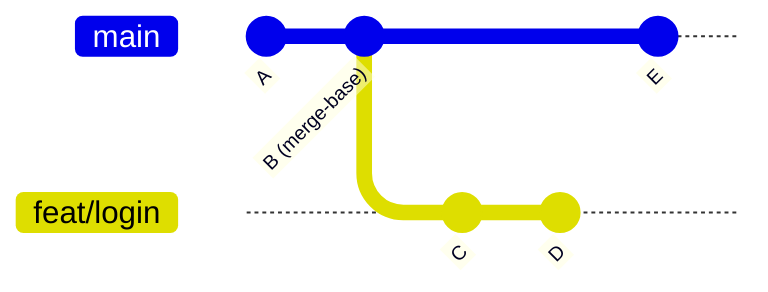

# Branch explanation

Answers "what is this branch even about?" — for a branch you didn't write, without checking it out.

> Shared plumbing — transport, events, cancellation, errors, settings — lives in the
> [AI system overview](./README.md). This page covers only what is specific to this feature.

|                   |                                                                                                                                                                                                                           |
| ----------------- | ------------------------------------------------------------------------------------------------------------------------------------------------------------------------------------------------------------------------- |
| **Descriptor**    | [`summaryExplanationFeature`](../../packages/ai/src/features/summaryExplanation.ts) (`scope: 'branch'`), fed by [`summarizeFiles`](../../packages/ai/src/features/summarizeFiles.ts)                                      |
| **Kind**          | streaming markdown                                                                                                                                                                                                        |
| **Temperature**   | 0.2                                                                                                                                                                                                                       |
| **Context scope** | `range` — `merge-base(base, branch)..branch`                                                                                                                                                                              |
| **Diff budget**   | none at this level: every file is read whole, in its own prompt, by the map phase                                                                                                                                         |
| **UI**            | [`BranchExplanationPanel`](../../apps/desktop/src/features/graph/components/BranchExplanationPanel.tsx) — right panel — via [`useBranchExplanation`](../../apps/desktop/src/features/graph/hooks/useBranchExplanation.ts) |
| **Memory**        | [`aiExplanation.store`](../../apps/desktop/src/features/graph/stores/aiExplanation.store.ts), persisted per repo + branch                                                                                                 |

---

## What the user sees

Right-click a commit **that carries a branch**, or a branch in the sidebar → **Explain branch
changes (LLM)**, right next to _Explain this commit (LLM)_. The **right panel** opens on that branch
and starts generating — unless a summary is already remembered, in which case that one is shown
immediately instead.

The item is **hidden on a commit with no branch label of its own**. The flat menu keys such a commit
to the current branch so that pull/push/merge stay reachable (they are relative to HEAD by nature),
but "explain the branch" under that rule would describe whichever branch happens to be checked out —
not what was clicked. [Commit explanation](./commit-explanation.md) is the item that answers _that_
question, and it sits immediately above.

The answer is markdown: a bold sentence, a `## What changed` section grouped by area, and a
`## Worth knowing` section for breaking changes, migrations or added dependencies (explicitly
_"Nothing out of the ordinary."_ when there are none, rather than padding).

### Why a panel and not a dialog

The content is a structured document the reader wants **next to** what it describes — the graph, the
commits, the diffs it names. A modal takes the app hostage to show it, and closing it to go check
something throws the text away. The panel sits in the same slot as the commit details / conflict /
bisect panels, resizes with them, and stays open while you work.

### The memory

Summaries are **remembered per branch**, persisted across restarts
([`aiExplanation.store`](../../apps/desktop/src/features/graph/stores/aiExplanation.store.ts), keyed
`<repoPath>::branch::<name>`). Reopening a branch you looked at yesterday shows what you read then,
instantly — these cost tens of seconds of local model time to produce and nothing to keep.

So generation on open is conditional: it starts immediately when there is nothing remembered, and is
skipped when there is — spending a minute of local model time to replace an answer already on screen
would defeat the point of keeping it. The panel shows how old the summary is and offers _Regenerate_;
whether the branch has moved enough to be worth re-reading is a judgement the user is better placed
to make than a timer. Only a clean run is stored — a cancelled or failed one leaves
the previous summary intact. A _Delete this summary_ button forgets one explicitly.

If the remembered summary was generated against a **different base** than the one currently
resolved, the panel says so rather than passing it off as current.

---

## The same input as the PR description — and as the branch review

This feature, [PR description](./pr-description.md) and the branch half of
[code review](./code-review.md) consume the **identical** range context. What separates all three is
a string constant, a temperature and a prompt builder — which is the clearest demonstration of why
the feature-descriptor shape is worth having.

|                 | PR description                             | Branch explanation                                            | Branch review                        |
| --------------- | ------------------------------------------ | ------------------------------------------------------------- | ------------------------------------ |
| Written **for** | reviewers, in the author's voice           | the reader in front of the graph                              | you, before you ship it              |
| Written **by**  | you, effectively — you edit and publish it | nobody; it's disposable                                       | nobody; it's disposable              |
| Tone            | proposes                                   | describes (_"Describe, do not review"_ is in the instruction) | reviews — the one feature allowed to |
| Temperature     | 0.4                                        | 0.2                                                           | 0.1                                  |
| Consumes        | diff + commit subjects + PR template       | diff + commit subjects + **file list**                        | diff + commit subjects + file list   |

The file list is the one input this feature uses and the PR description doesn't: grouping changes by
area is exactly the "what changed" structure the reader wants, and the paths are what makes the
grouping concrete.

---

## Reading a branch you're not on

`range` scope diffs `merge-base(base, head)..head`, and `head` defaults to `HEAD`. This feature
passes it **explicitly**, which is what lets you read any branch in the graph without checking it out:

You're on `main`; you right-click `feat/login`. Without an explicit head the range would be taken
over `main` and describe the wrong work entirely. That capability is the one Rust change any AI
feature has needed so far: an optional `head_ref` parameter on `get_ai_context`.

The returned context's `branch` field also follows the explicit head — reporting HEAD's name for a
range taken over another branch would put the wrong branch in the prompt.

## Choosing the base

[`resolveExplanationBase`](../../apps/desktop/src/lib/branchExplanationBase.ts) picks what to diff
against, from **local refs only**:

1. the repo's configured merge targets (Settings → `targetBranches`, most specific first);
2. then `origin/main`, `origin/master`, `main`, `master`.

A branch is never its own base, but `main` vs `origin/main` **is** allowed — that's the branch's own
unpushed work, which is a legitimate thing to explain. When nothing resolves, the action reports it
instead of guessing.

Deliberately local: unlike the PR composer's base — which asks GitHub for the repository's default
branch — this must work offline, on a repo with no remote, and without a token.

The candidate list is matched against `GitBranch.name`, **not** `shortName`: the latter strips the
remote prefix (`origin/main` → `main`, see `services/git_branch.rs`), so matching on it made every
`origin/*` target unreachable and reported "no base branch found" on an ordinary repo.

A branch level with its base is caught **before** any request, with the `AI_NO_BRANCH_CHANGES`
sentinel: asking a model to explain an empty diff only invites invention.

---

## Limitations

Beyond the [shared ones](./README.md#known-limitations):

| Limitation                                           | Note                                                                                                                                                                                                                                                                                                                                                                                                                              |
| ---------------------------------------------------- | --------------------------------------------------------------------------------------------------------------------------------------------------------------------------------------------------------------------------------------------------------------------------------------------------------------------------------------------------------------------------------------------------------------------------------- |
| **The base is a guess**                              | A branch cut from `develop` in a repo configured for `origin/main` is explained against the wrong base. There's no base picker in the panel — the PR composer has one, this doesn't. A stored summary at least reports which base it used                                                                                                                                                                                         |
| **A long branch is still read partially**            | The budget follows the window and spends itself on source before tests before docs, and the commit + file lists keep the _scope_ right whatever fits — but a branch range is the largest diff the app sends, so on a stock 4096-token window the explanation is written from a handful of files plus two lists. The panel's coverage line says so; the text is forbidden to. Raising the window is the only thing that deepens it |
| **Merge commits are excluded from the subject list** | Correct for "what did this branch author", but a branch that mainly merges others reads as emptier than it is                                                                                                                                                                                                                                                                                                                     |
| **No incremental view**                              | Always the whole branch; there's no "what changed since I last looked", even though the store knows when the last summary was written                                                                                                                                                                                                                                                                                             |
| **Memory never expires**                             | Stored summaries are kept until explicitly deleted, so a stale one can outlive the branch it describes. The age and base are shown; judging them is the user's job                                                                                                                                                                                                                                                                |

## Tests

| Test                                                                                                                  | Covers                                                                                                                                                                                                                                                                                                              |
| --------------------------------------------------------------------------------------------------------------------- | ------------------------------------------------------------------------------------------------------------------------------------------------------------------------------------------------------------------------------------------------------------------------------------------------------------------- |
| [`branchExplanation.test.ts`](../../packages/ai/src/features/branchExplanation.test.ts)                               | prompt shape, no-commits wording, missing base ref, language, window-sized budget (fits every window, long commit list paid out of the diff, code before noise, omitted files named before the diff), coverage, and the instruction's reversal — the old "say what you could not see" rule is now asserted _absent_ |
| [`branchExplanationBase.test.ts`](../../apps/desktop/src/lib/branchExplanationBase.test.ts)                           | target-branch precedence, fallbacks, self-exclusion, no-base                                                                                                                                                                                                                                                        |
| [`useBranchExplanation.test.ts`](../../apps/desktop/src/features/graph/hooks/useBranchExplanation.test.ts)            | explicit head ref, language, empty-range refusal, what is and isn't remembered                                                                                                                                                                                                                                      |
| [`BranchExplanationPanel.test.tsx`](../../apps/desktop/src/features/graph/components/BranchExplanationPanel.test.tsx) | auto-start on open, no regeneration over a remembered summary, stale-base warning, stop/forget, error decoding                                                                                                                                                                                                      |
| [`aiExplanation.store.test.ts`](../../apps/desktop/src/features/graph/stores/aiExplanation.store.test.ts)             | keying, overwrite, per-branch isolation, clear                                                                                                                                                                                                                                                                      |
| [`graphContextMenus.test.ts`](../../apps/desktop/src/lib/graphContextMenus.test.ts)                                   | the menu item's action, its AI-disabled state, and that it is hidden on a commit with no branch                                                                                                                                                                                                                     |
| `ai_context.rs` (`#[cfg(test)]`)                                                                                      | explicit head ref, self-range, unresolvable head                                                                                                                                                                                                                                                                    |

---

## Read file by file

The explanation is written from **per-file summaries**, never from a budgeted diff. One small call
describes each changed file from its own patch, then a single streaming call writes the prose from
the descriptions.

This is the same shape as the commit planner and the commit message, and it is the only shape — there
is no file-count threshold and no single-prompt alternative. A button that did two different things
depending on an invisible number is not something a user or a bug report can reason about.

The instruction is shorter for it. Both instructions this replaced carried a paragraph forbidding the
model from mentioning what it could not read — a rule that only existed because it _was_ being shown
a fraction and would otherwise open with an apology. With complete evidence there is nothing to hide.

The panel shows the per-file count while the map phase runs
([`SummaryProgressNotice`](../../apps/desktop/src/components/common/SummaryProgressNotice.tsx)),
which replaces the coverage line. Coverage answered "how little did it read?"; there is no budgeted
prompt to answer that about any more, and what the reader needs is a reason for the wait before the
first token. Cancelling stops the map at its next call boundary.
