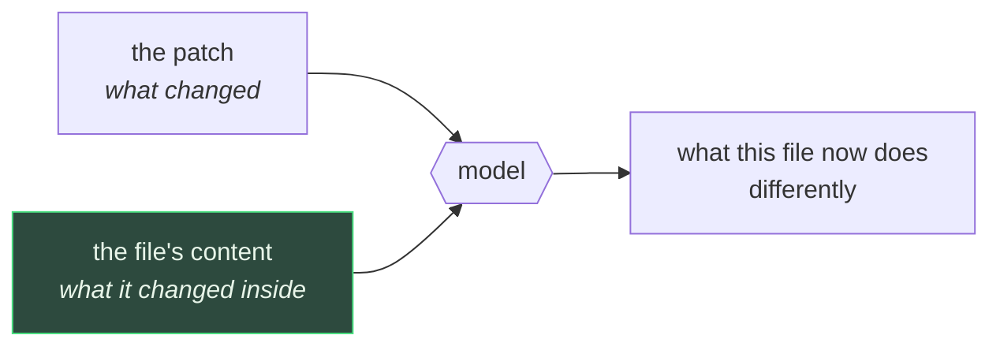

# Change explanation

Explains one file's pending diff — read **against the file it changes**, not just the `+`/`-` lines.

> Shared plumbing — transport, events, cancellation, errors, settings — lives in the
> [AI system overview](./README.md). This page covers only what is specific to this feature.

|                 |                                                                                                                                                                                                                         |
| --------------- | ----------------------------------------------------------------------------------------------------------------------------------------------------------------------------------------------------------------------- |
| **Descriptor**  | [`changeExplanationFeature`](../../packages/ai/src/features/changeExplanation.ts)                                                                                                                                       |
| **Kind**        | streaming markdown                                                                                                                                                                                                      |
| **Temperature** | 0.2 — describing code that already exists wants reproducibility, not latitude                                                                                                                                           |
| **Input**       | one file's patch + its current content (no `get_ai_context` call)                                                                                                                                                       |
| **Budgets**     | one window-derived pool, split between the patch and the file content — the patch is served first and floors at two thirds                                                                                              |
| **UI**          | [`ChangeExplanationPanel`](../../apps/desktop/src/components/git-graph/components/ChangeExplanationPanel.tsx) above the diff editor, via [`useChangeExplanation`](../../apps/desktop/src/hooks/useChangeExplanation.ts) |

---

## What the user sees

Open a working-copy file's diff. A slim bar sits above the editor with an **Explain** button; press
it and a short markdown answer streams in: one bold summary sentence, 2–5 bullets tying each change
to the file's role, and — only when warranted — a `⚠️` line.

Nothing runs until you ask. A diff view that fired a generation on every file it opened would keep a
local model permanently busy for changes nobody wanted explained.

Scoped to **working-copy** files: "explain the changes in progress" is a question about work you are
still shaping, not about a commit that already has a message. The panel is absent on a historic
version, and behind the AI master switch.

---

## The context is the point

Every other diff tool can show you what changed. The reason this feature exists is the _second_
input: the file's current content goes into the prompt alongside the patch, and the instruction is
explicit that narrating the lines is not the job —

> explain what the change does to this file's behavior and role, not what the +/- lines literally say
> (the developer is already looking at them).

When the content isn't available — a deleted or binary file — the prompt **says so explicitly** and
tells the model not to speculate about the surrounding code. Silence there made it invent the context
it assumed it should have been given.

## The ⚠️ line

The instruction allows one closing warning line, and only for things the patch actually shows: left-in
debug output, a removed guard, a hardcoded credential, a signature change with callers unvisited. It
is paired with an explicit prohibition on inventing a concern to fill the slot, and with
_"this is an explanation, not a review"_ — no praise, no suggested rewrites.

---

## Rebuilding the patch

The backend hands the frontend structured hunks (great for rendering, useless as a prompt), so
[`formatUnifiedPatch`](../../apps/desktop/src/lib/formatUnifiedPatch.ts) renders a `GitDiffFile` back
into real `git diff` text — the format every model has seen millions of times — rather than fetching
the same diff a second time in raw form. It is the inverse of the existing `parseUnifiedDiff`, and is
round-trip tested against it.

`/dev/null` is used for the missing side of an added or deleted file, and the `\ No newline at end of
file` marker is re-prefixed, so the output is a patch `git apply` would recognize.

---

## Limitations

Beyond the [shared ones](./README.md#known-limitations):

| Limitation                               | Note                                                                                                                                                                                                                                                                                                                                                                                              |
| ---------------------------------------- | ------------------------------------------------------------------------------------------------------------------------------------------------------------------------------------------------------------------------------------------------------------------------------------------------------------------------------------------------------------------------------------------------- |
| **One file at a time**                   | Deliberate, but it means a change spanning five files needs five runs and no answer covers the whole. The WIP row's "explain working changes" item — still disabled — is the missing counterpart                                                                                                                                                                                                  |
| **Working copy only**                    | The same panel would work verbatim on a commit's file diff; it's one condition in `DiffViewCenter` if that's wanted                                                                                                                                                                                                                                                                               |
| **The file's content is cut head-first** | For a very long file the model sees imports and top-level declarations and may miss the region the change is actually in. This is why the instruction's absence-of-evidence rule is sharper here than anywhere else: the prompt has just promised the model the surrounding file, so "this function is never called" is a conclusion it will otherwise draw from a window that simply ended early |
| **No cross-file awareness**              | The model is told not to speculate about callers elsewhere, so a signature change is described locally — accurate, but narrower than a review                                                                                                                                                                                                                                                     |

## Tests

| Test                                                                                                                        | Covers                                                                                                                                                                                                                                                                                                                                                                          |
| --------------------------------------------------------------------------------------------------------------------------- | ------------------------------------------------------------------------------------------------------------------------------------------------------------------------------------------------------------------------------------------------------------------------------------------------------------------------------------------------------------------------------- |
| [`changeExplanation.test.ts`](../../packages/ai/src/features/changeExplanation.test.ts)                                     | prompt shape, missing-content wording, language, the shared two-part budget (fits every window, patch served before content, surplus handed to the content when the patch is small, no-content note when the window leaves no room), and coverage — which is computed per _file_ here rather than by re-parsing headers, and counts a trimmed file content as a partial reading |
| [`formatUnifiedPatch.test.ts`](../../apps/desktop/src/lib/formatUnifiedPatch.test.ts)                                       | header forms, added/deleted/renamed, no-newline marker, round trip                                                                                                                                                                                                                                                                                                              |
| [`useChangeExplanation.test.ts`](../../apps/desktop/src/hooks/useChangeExplanation.test.ts)                                 | input assembly, streaming, empty-patch refusal                                                                                                                                                                                                                                                                                                                                  |
| [`ChangeExplanationPanel.test.tsx`](../../apps/desktop/src/components/git-graph/components/ChangeExplanationPanel.test.tsx) | collapsed/streaming/done/error states, stale-file reset                                                                                                                                                                                                                                                                                                                         |
| [`DiffViewCenter.test.tsx`](../../apps/desktop/src/components/diff-viewer/DiffViewCenter.test.tsx)                            | shown for WIP diffs, absent for commits and other tabs                                                                                                                                                                                                                                                                                                                          |
