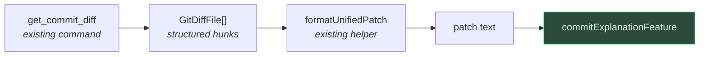

# Commit explanation

Explains what a single commit actually does — beyond what its message claims.

> Shared plumbing — transport, events, cancellation, errors, settings — lives in the
> [AI system overview](./README.md). This page covers only what is specific to this feature.

| | |
| --- | --- |
| **Descriptor** | [`commitExplanationFeature`](../../packages/ai/src/features/commitExplanation.ts) |
| **Kind** | streaming markdown |
| **Temperature** | 0.2 |
| **Input** | `get_commit_diff` (the commit vs its first parent) + the commit's own message |
| **Diff budget** | 8000 chars |
| **UI** | [`CommitExplanationPanel`](../../apps/desktop/src/components/git-graph/CommitExplanationPanel.tsx) — right panel — via [`useCommitExplanation`](../../apps/desktop/src/hooks/useCommitExplanation.ts) |
| **Memory** | [`aiExplanation.store`](../../apps/desktop/src/stores/aiExplanation.store.ts), persisted per repo + commit |

---

## Why it exists

The branch summary answers *"what is this branch about?"*. It was, for a while, the only explain
action on a commit's right-click menu — and on a commit carrying no branch label, the menu falls
back to the **current** branch. So right-clicking an old unrelated commit offered to explain whatever
branch you happened to be standing on. That is a reasonable rule for pull/push/merge (they *are*
relative to HEAD); for "explain", it answers a question nobody asked.

This feature answers the one that was asked: **what does this commit, the one I just clicked, do?**

Both now sit in the commit menu, scoped differently:

| Menu item | Scope | Shown when |
| --------- | ----- | ---------- |
| *Explain this commit (LLM)* | the clicked commit vs its parent | any single commit |
| *Explain branch changes (LLM)* | the whole branch vs its base | the commit carries a branch (or from the sidebar) |

The commit item is absent from the multi-selection layout, where "this commit" is ambiguous.

---

## What the user sees

Right-click a commit → **Explain this commit (LLM)**. The right panel opens on that commit and starts
generating — unless a summary is already remembered, in which case that one is shown immediately.
Same panel chrome, memory and regenerate button as the [branch explanation](./branch-explanation.md);
they share
[`ExplanationPanelShell`](../../apps/desktop/src/components/git-graph/components/ExplanationPanelShell.tsx),
which owns that auto-start rule for both.

The item sits directly beside *Explain branch changes (LLM)* when the commit carries a branch — the
two answer neighbouring questions and belong together — but stays at the **top level** of the menu
rather than inside a per-branch submenu: it is commit-scoped, and nested it would appear once per
branch, every copy meaning the same thing.

The header always states what the diff was taken against, because it is not always the obvious
thing:

| Commit | Header says |
| ------ | ----------- |
| ordinary | *compared to its parent commit* |
| merge | *merge commit — compared to its first parent* |
| root | *root commit — compared to an empty tree* |

---

## Not paraphrasing the message

The distinguishing constraint of this feature. A commit already carries a message, so repeating it
back adds nothing — the instruction says so outright:

> The commit's own message is given to you. Do NOT paraphrase it back — the reader can see it.

Its value is highest exactly where the message is worst: a terse subject, a squashed branch, an old
`fix stuff`. So the model is also told to flag the mismatch when there is one:

> If the diff plainly does something other than what the message claims, say so in one short
> sentence.

The message is still *in* the prompt — you cannot notice a mismatch without it — it is just not the
answer.

---

## No backend change

This is the cheapest feature in the app to add, and worth noting as a pattern:

`get_commit_diff` already handles the awkward cases — first parent for a merge, the empty tree for a
root commit — and [`formatUnifiedPatch`](../../apps/desktop/src/lib/formatUnifiedPatch.ts), written
for the [change explanation](./change-explanation.md), turns those hunks back into patch text. So no
Rust, no new command, no `get_ai_context` scope.

The stats sent with the prompt (`filesChanged`, `insertions`, `deletions`) come from the same
response rather than being recounted.

---

## Limitations

Beyond the [shared ones](./README.md#known-limitations):

| Limitation | Note |
| ---------- | ---- |
| **A merge is read against its first parent** | Which is what `git show` does too, but it means the diff shows everything the merge brought in, not what its author resolved by hand. The prompt says so explicitly; the panel says so in its header |
| **No surrounding context** | Unlike the [change explanation](./change-explanation.md), which sends the file's current content alongside the patch, this sends the patch alone. A commit spans files, and sending all of them whole would blow the budget |
| **8000-char diff budget** | A large commit is explained from its first files — the same blind truncation every diff-based feature has |
| **Nothing links it to the branch summary** | Explaining ten commits one by one is ten runs and ten separate answers; there is no "explain these 3 selected commits" |
| **Memory never expires** | A commit is immutable, so the answer stays valid — but a *poor* answer also persists until regenerated or deleted |

## Tests

| Test | Covers |
| ---- | ------ |
| [`commitExplanation.test.ts`](../../packages/ai/src/features/commitExplanation.test.ts) | prompt shape, body handling, merge warning, truncation, language |
| [`useCommitExplanation.test.ts`](../../apps/desktop/src/hooks/useCommitExplanation.test.ts) | diff → patch, metadata + stats, merge flag, empty-diff refusal, memory, no key collision with a branch |
| [`CommitExplanationPanel.test.tsx`](../../apps/desktop/src/components/git-graph/CommitExplanationPanel.test.tsx) | header per commit type, auto-start on open, no regeneration over a remembered summary, error decoding |
| [`graphContextMenus.test.ts`](../../apps/desktop/src/lib/graphContextMenus.test.ts) | the menu item's action, AI-disabled state, absence in multi-selection, adjacency to the branch item |
| [`aiExplanation.store.test.ts`](../../apps/desktop/src/stores/aiExplanation.store.test.ts) | keying by kind, isolation, clear |
