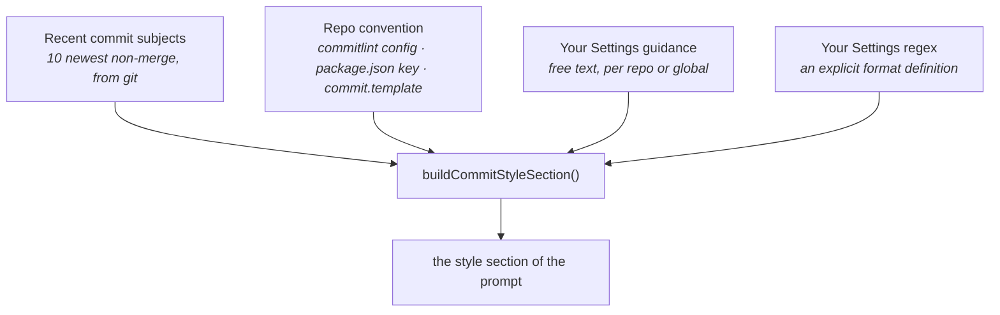

# Commit message

Writes the commit message for the currently **staged** changes, streaming it into the message field.

> Shared plumbing — transport, events, cancellation, errors, settings — lives in the
> [AI system overview](./README.md). This page covers only what is specific to this feature.

| | |
| --- | --- |
| **Descriptor** | [`commitMessageFeature`](../../packages/ai/src/features/commitMessage.ts) |
| **Kind** | streaming |
| **Temperature** | 0.3 — the lowest of the prose features; a commit subject is a near-mechanical summary |
| **Context scope** | `staged` (index vs HEAD) |
| **Diff budget** | derived from the model's context window, spent per file — see [Known limitations](./README.md#known-limitations) #3 and the shared [`diffCoverage`](../../packages/ai/src/features/diffCoverage.ts) |
| **UI** | ✨ in [`WipStagingPanel`](../../apps/desktop/src/components/git-graph/components/WipStagingPanel.tsx) via [`useWipCommitPanel`](../../apps/desktop/src/hooks/useWipCommitPanel.ts) → [`useAiGeneration`](../../apps/desktop/src/hooks/useAiGeneration.ts) |

---

## What the user sees

Stage some files, click ✨ next to the commit message box, and the message types itself in. It stays
editable — the model writes a draft, you commit it. If nothing is staged the feature refuses up
front with "No staged changes" rather than asking the model to describe an empty diff.

After the stream ends, the result is checked against the project's convention and any problems are
shown as a **non-blocking warning**. You can always commit anyway: the primary guarantee is
instructing the model well, not policing its output.

Above that warning sits the shared
[`CoverageNotice`](../../apps/desktop/src/components/git-graph/components/CoverageNotice.tsx), saying
how much of the staged change the message was actually written from — silent on the common case where
everything was read. It is worth showing *here* for a reason none of the other panels have: this text
is about to be written into the repository's history under your name, permanently, and a subject
scoped to the six files that fitted looks exactly like a subject someone chose. It appears as the
tokens arrive rather than at the end, because a caption that shows up after you have read the subject
is a caption you did not get.

Batch mode leaves the classic message box untouched, so the notice is gated on that box having text —
it never captions a message it did not describe.

---

## Matching *this* project's style

The interesting part of this feature isn't "write a commit message" — it's "write one that looks
like it belongs in this repo". A project may enforce Conventional Commits via commitlint, may follow
them loosely by habit, or may have its own free-form style. Guessing wrong is worse than not
guessing.

So the prompt is assembled from four sources, in increasing order of authority:



`A` and `B` come from Rust (`ai_context.rs` + [`ai_convention.rs`](../../apps/desktop/src-tauri/src/services/ai_convention.rs));
`C` and `D` are frontend-only, read from `useEffectiveRepoSettings` and merged into the context
before the package builds the prompt.

The same section feeds [file grouping](./file-grouping.md) — one project style, two features.

---

## The prompt

**System** — `COMMIT_MESSAGE_INSTRUCTION`: Conventional Commits, `<type>(<scope>): <description>`,
imperative mood, lower-case, no trailing period, ≤72 chars, and a body **only** when the change needs
rationale the subject cannot carry.

**User** — repo/branch header, a scope hint, the style section, then the diff:

```
Repository: git-manager (branch: feat/login)
Suggested scope: apps

<style section: convention, recent commits, your guidance>

Analyze the following Git diff and generate a commit message:

--- DIFF ---
…
--- END DIFF ---
```

The **scope hint** is a deliberately timid heuristic ([`detectScope`](../../packages/ai/src/features/commitMessage.ts)):
if every changed file shares a top-level directory, that's a reasonable scope; if they span several,
the hint is omitted entirely rather than forcing a misleading one.

---

## Validation

`validateCommitSubject(message, ctx)` ([commitConvention.ts](../../packages/ai/src/features/commitConvention.ts))
runs after the stream and returns a list of problems, never a hard failure. Its logic mirrors the
prompt's authority order:

- A **user regex** is an explicit format definition — it replaces conventional inference entirely.
- Otherwise, the repo is treated as conventional if commitlint declares types **or** if the recent
  history looks conventional (`isConventionalHistory`). Only then is `<type>(<scope>): …` enforced,
  against commitlint's own type list when it has one.
- A repo with no convention and free-form history gets no format complaints at all.

---

## Limitations

Beyond the [shared ones](./README.md#known-limitations):

| Limitation | Note |
| ---------- | ---- |
| A large staged changeset is still read partially | The budget follows the window now rather than a flat 4000 characters, and spends itself on source before lockfiles — but a huge staged change still exceeds a small window. The omitted paths are named in the prompt and the instruction forbids scoping the subject to only what was read, which keeps `fix(ui)` off a change that also rewrote the backend. It remains true that staging deliberately gives better messages than "stage everything then generate" |
| ~~`useAiGeneration` predates `useAiStream`~~ | **Fixed.** It now runs on the shared hook, which grew an `onToken` option for callers that stream into their own input. Both bugs the fork carried — listeners leaking past unmount, stacking across runs — are gone |
| Only the **staged** diff is seen | By design: it describes what you are about to commit. Unstaged work is invisible, which is correct but occasionally surprising |
| ~~Coverage was computed but never shown~~ | **Fixed.** `assessCommitMessageCoverage` was exported and unused; `useAiGeneration` now exposes it and the WIP panel renders it under the message box, before you commit |

## Tests

| Test | Covers |
| ---- | ------ |
| [`commitMessage.test.ts`](../../packages/ai/src/features/commitMessage.test.ts) | prompt assembly, scope detection, window-sized budget (fits every window, a long commit convention paid out of the diff, code before noise, omitted paths named before the diff), coverage, and the instruction's committed-output rules |
| [`commitConvention.test.ts`](../../packages/ai/src/features/commitConvention.test.ts) | commitlint parsing, conventional-history inference, validation |
| [`useAiGeneration.test.ts`](../../apps/desktop/src/hooks/useAiGeneration.test.ts) | streaming, empty-staged refusal, validation wiring, coverage (reported as tokens arrive, cleared on a new run), per-request cancel, and what it inherits from `useAiStream` (unmount cleanup, no listener stacking, another generation's events ignored, no write-back of an empty or cancelled answer) |
| [`WipStagingPanel.test.tsx`](../../apps/desktop/src/components/git-graph/components/WipStagingPanel.test.tsx) | the coverage line under the message box: shown when files were left out, silent when everything was read, absent when the box is empty |
| [`ai.api.test.ts`](../../apps/desktop/src/api/ai.api.test.ts) | the right instruction and temperature reach the transport |
