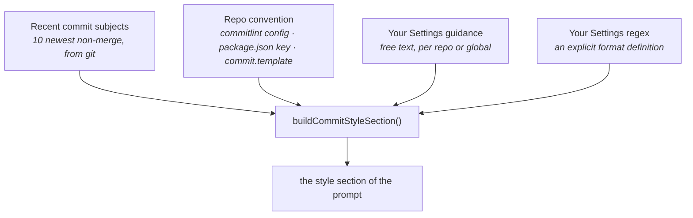

# Commit message

Writes the commit message for the currently **staged** changes into the message field, as
grammar-constrained JSON.

> Shared plumbing — transport, events, cancellation, errors, settings — lives in the
> [AI system overview](./README.md). This page covers only what is specific to this feature.

|                   |                                                                                                                                                                                                                                                                    |
| ----------------- | ------------------------------------------------------------------------------------------------------------------------------------------------------------------------------------------------------------------------------------------------------------------ |
| **Descriptor**    | [`summaryCommitMessageFeature`](../../packages/ai/src/features/summaryCommitMessage.ts), driven by [`composeCommitMessageFromSummaries`](../../packages/ai/src/features/composeCommitMessage.ts)                                                                   |
| **Kind**          | completion + JSON schema (`COMMIT_MESSAGE_SCHEMA` → `{ subject, body }`)                                                                                                                                                                                           |
| **Temperature**   | 0.3 — the lowest of the prose features; a commit subject is a near-mechanical summary                                                                                                                                                                              |
| **Context scope** | `staged` (index vs HEAD)                                                                                                                                                                                                                                           |
| **Diff budget**   | derived from the model's context window, spent per file — see [Known limitations](./README.md#known-limitations) #3 and the shared [`diffCoverage`](../../packages/ai/src/features/diffCoverage.ts)                                                                |
| **UI**            | ✨ in [`WipStagingPanel`](../../apps/desktop/src/features/graph/components/WipStagingPanel.tsx) via [`useWipCommitPanel`](../../apps/desktop/src/features/graph/hooks/useWipCommitPanel.ts) → [`useAiGeneration`](../../apps/desktop/src/hooks/useAiGeneration.ts) |

---

## What the user sees

Stage some files, click ✨ next to the commit message box, and the message appears. It stays
editable — the model writes a draft, you commit it. If nothing is staged the feature refuses up
front with "No staged changes" rather than asking the model to describe an empty diff.

The message arrives whole rather than token by token — see [Why this is not a
stream](#why-this-is-not-a-stream). In exchange it arrives in a second or two, so there is no longer
a wait long enough to need filling.

Once it lands, the result is checked against the project's convention and any problems are shown as
a **non-blocking warning**. You can always commit anyway: the primary guarantee is instructing the
model well, not policing its output.

Above that warning sits the shared
[`CoverageNotice`](../../apps/desktop/src/components/common/CoverageNotice.tsx), saying
how much of the staged change the message was actually written from — silent on the common case where
everything was read. It is worth showing _here_ for a reason none of the other panels have: this text
is about to be written into the repository's history under your name, permanently, and a subject
scoped to the six files that fitted looks exactly like a subject someone chose. It is computed from
the same input the prompt is built from and shown _before_ the request, because a caption that shows
up after you have read the subject is a caption you did not get.

Batch mode leaves the classic message box untouched, so the notice is gated on that box having text —
it never captions a message it did not describe.

---

## Matching _this_ project's style

The interesting part of this feature isn't "write a commit message" — it's "write one that looks
like it belongs in this repo". A project may enforce Conventional Commits via commitlint, may follow
them loosely by habit, or may have its own free-form style. Guessing wrong is worse than not
guessing.

So the prompt is assembled from four sources, in increasing order of authority:



`A` and `B` come from Rust (`ai_context.rs` + [`ai_convention.rs`](../../apps/desktop/src-tauri/src/services/ai_convention.rs));
`C` and `D` are frontend-only, read from `useEffectiveRepoSettings` and merged into the context
before the package builds the prompt.

The same section feeds [file grouping](./file-grouping.md) — one project style, two features.

---

## Why this is not a stream

This feature streamed its answer for most of its life, and that is what once put

```
Thinking Process:

1.  **Analyze the Request:**
    *   Role: Expert software engineer writing a single Git commit message…
```

into a user's commit box, 2222 characters of it.

The chain, measured against a local Qwen 35B-A3B served by omlx:

1. Asked for **prose**, a reasoning model deliberates first — 2255 tokens before writing anything.
2. `max_tokens` is [`RESERVED_OUTPUT_TOKENS`](../../packages/ai/src/promptSize.ts) (600), the room the
   prompt held back for the answer. That constant only ever reasoned about how long an _answer_ is;
   nobody had considered a model that generates thousands of tokens before starting one.
3. So the cap truncates the model **mid-reasoning**. The provider never sees the end of the reasoning
   block, gives up separating it into `reasoning_content`, and flushes the partial thinking into
   `content` as well.
4. `content` is exactly what [`ai_openai_compatible.rs`](../../apps/desktop/src-tauri/src/services/ai_openai_compatible.rs)
   forwards as `ai:token`, so it streamed straight into the message input.

The same defect shows a second face on Ollama: `qwen3:8b` and `gemma4:12b-mlx` keep the separation but
hit `finish_reason: length` with **empty** `content` — the ✨ button silently produces nothing.

**Suppressing the thinking is not a reliable fix.** `chat_template_kwargs: {enable_thinking: false}`
is ignored by some servers ([LM Studio #1990](https://github.com/lmstudio-ai/lmstudio-bug-tracker/issues/1990))
and Qwen 3.5+ dropped the `/no_think` soft switch, so it cannot be relied on across the presets we ship.

**Constraining the answer is.** Under `COMMIT_MESSAGE_SCHEMA` the grammar obliges the first token to be
`{`, so there is no reasoning phase to leak:

| request             | completion tokens | `finish_reason` | what reaches the box       |
| ------------------- | ----------------- | --------------- | -------------------------- |
| prose, 600 cap      | 600 (exhausted)   | `length`        | 2222 chars of deliberation |
| prose, 4000 cap     | 2255              | `stop`          | the message (26 s later)   |
| **schema, 600 cap** | **13–101**        | `stop`          | **the message (~1 s)**     |

That also retires the output budget as something to tune: an answer that never approaches the cap
cannot be truncated by it. The cost is the token-by-token fill of the message box, which is worth
little when the whole answer takes about a second.

The other streaming features (explanations, PR description, code review) keep streaming — their
answers are prose by nature, and they are long enough that watching them arrive is the point.

---

## The prompt

**System** — `COMMIT_MESSAGE_INSTRUCTION`: answer as `{ subject, body }`; Conventional Commits,
`<type>(<scope>): <description>`, imperative mood, lower-case, no trailing period, ≤72 chars, and a
body **only** when the change needs rationale the subject cannot carry (`""` otherwise).

`parseCommitMessage` reads the object back and `formatCommitMessage` flattens it to the
`subject\n\nbody` form git wants. The parser tolerates a ```json fence, and falls back to reading the
raw text as the message when a provider ignores `response_format`— which is what this feature did
for its whole streaming life. An **empty** answer is the one thing it refuses, rather than quietly
committing`''`.

**User** — repo/branch header, a scope hint, the style section, then the diff:

```
Repository: git-manager (branch: feat/login)
Suggested scope: apps

<style section: convention, recent commits, your guidance>

Analyze the following Git diff and generate a commit message:

--- DIFF ---
…
--- END DIFF ---
```

The **scope hint** is a deliberately timid heuristic ([`detectScope`](../../packages/ai/src/features/commitMessage.ts)):
if every changed file shares a top-level directory, that's a reasonable scope; if they span several,
the hint is omitted entirely rather than forcing a misleading one.

---

## Validation

`validateCommitSubject(message, ctx)` ([commitConvention.ts](../../packages/ai/src/features/commitConvention.ts))
runs on the finished message and returns a list of problems, never a hard failure. Its logic mirrors the
prompt's authority order:

- A **user regex** is an explicit format definition — it replaces conventional inference entirely.
- Otherwise, the repo is treated as conventional if commitlint declares types **or** if the recent
  history looks conventional (`isConventionalHistory`). Only then is `<type>(<scope>): …` enforced,
  against commitlint's own type list when it has one.
- A repo with no convention and free-form history gets no format complaints at all.

**The length bar adapts too** (`inferHeaderMaxLength`), and for the same reason. 72 is the
conventional default, but hardcoding it made the validator stricter than the project it was
validating — git-manager's own history has no commitlint config, unmistakably conventional subjects,
and 16 of the last 50 over 72 characters (longest: 95). Every generated message of ordinary length
drew a warning, while the prompt was in the same breath telling the model to "match their style,
casing, prefixes, tense and **length**". The model was obeying the instruction and being flagged for
it.

So the ceiling is read off the history: one long subject is an outlier and changes nothing, a fifth
of them is a habit and the longest recent subject becomes the bar. The default is a floor, never a
ceiling. An explicit commitlint `header-max-length` still wins over both. Crucially the **same
number goes into the prompt** (`buildRecentCommitsSection` states it outright), so the model is no
longer told one limit and judged by another. On git-manager that moved the observed warning rate
from 7-in-12 to **0-in-8**.

---

## Two-phase, always

The message is written from **per-file summaries** rather than from a budgeted diff — [`composeCommitMessageFromSummaries`](../../packages/ai/src/features/composeCommitMessage.ts)
drives [`fileSummaryFeature`](../../packages/ai/src/features/fileSummary.ts) once per staged file,
then [`summaryCommitMessageFeature`](../../packages/ai/src/features/summaryCommitMessage.ts) once
over the results.

This feature's version of the truncation problem is the one that lasts. Given a staged change too
large for the window, the single prompt read whichever files sorted first and wrote a subject about
_those_ — so a change that also rewrote the backend got committed as `fix(ui): …`, permanently, in
the repository's history, under the user's name, looking deliberate. The instruction told it to
scope the subject over what it had not read, which is asking a model to describe something it was
never shown.

The map phase is shared with the commit planner ([`summarizeFiles`](../../packages/ai/src/features/summarizeFiles.ts)),
including its progress and cancellation contract; the panel shows a per-file count under the message
box, because one call per file runs for a while and the Stop button alone does not say what it is
waiting on. Closing or stopping cancels the map phase **including the call in flight**: every
per-file call is dispatched under a request id the run tracks, and `ai_complete` takes one now (see
[Cancellation](./README.md#cancellation)). The single composing call that follows is still only
abandoned rather than called off — it is one request, it starts after the phase the user is watching
a bar for, and it answers in a second or two.

Unlike the commit _plan_, the answer's length is not a property of the question: one message is one
message whether it covers 12 files or 200, so the reduce call keeps the ordinary prose reserve and
is cheap whatever the changeset size. All the cost is in the map phase, and it is paid on every change: three
calls where there used to be one on a two-file commit. A threshold that kept the single prompt below
a file count was tried and removed — the same button doing two different things depending on an
invisible number is not something a user (or a bug report) can reason about. The way to buy the
latency back is caching summaries by `(path, content hash)`, which is not built yet.

Diff coverage is not reported on this path: it measures how much of the diff the _single_ prompt
could carry, and here every file is read whole in its own prompt.

---

## Limitations

Beyond the [shared ones](./README.md#known-limitations):

| Limitation                                                       | Note                                                                                                                                                                                                                                                                                                                                                                                                                                                                                                   |
| ---------------------------------------------------------------- | ------------------------------------------------------------------------------------------------------------------------------------------------------------------------------------------------------------------------------------------------------------------------------------------------------------------------------------------------------------------------------------------------------------------------------------------------------------------------------------------------------ |
| A large staged changeset is still read partially                 | The budget follows the window now rather than a flat 4000 characters, and spends itself on source before lockfiles — but a huge staged change still exceeds a small window. The omitted paths are named in the prompt and the instruction forbids scoping the subject to only what was read, which keeps `fix(ui)` off a change that also rewrote the backend. It remains true that staging deliberately gives better messages than "stage everything then generate"                                   |
| ~~A reasoning model wrote its deliberation into the commit box~~ | **Fixed.** The answer is grammar-constrained JSON, so there is no reasoning phase to leak — see [Why this is not a stream](#why-this-is-not-a-stream)                                                                                                                                                                                                                                                                                                                                                  |
| "Stop" abandons the **composing** call rather than cancelling it | `ai_complete` has a cancellation channel now, and the map phase uses it — stopping calls off the per-file summary in flight. The one reduce call that follows is still only abandoned: it is dispatched with an id nothing holds on to, so clicking stop leaves the message box alone without the provider being told. The window in which this matters is a second or two, which is why it was left                                                                                                   |
| The subject length cannot be _guaranteed_                        | Only steered. A JSON-schema `maxLength` was measured and rejected: omlx enforces it by forbidding the next token, so the model does not shorten its wording, it gets cut off mid-word (`…to grammar-constrained JS`, `…with JSON schema, d`). A mangled subject is committed as permanently as a long one and is worse to read. Prompt wording alone barely moved the rate (7/12 → 7/12 over 72 across 12 samples); what fixed it was making the bar match the project (see [Validation](#validation)) |
| A model can copy a recent subject verbatim                       | The style section says "examples of FORM ONLY, never reuse one verbatim", and on a repo with real history the model obeys. On a scratch repo whose entire history is `test commit PR` / `Initial commit`, a small model still sometimes echoes one back — there is little else to imitate                                                                                                                                                                                                              |
| Only the **staged** diff is seen                                 | By design: it describes what you are about to commit. Unstaged work is invisible, which is correct but occasionally surprising                                                                                                                                                                                                                                                                                                                                                                         |
| ~~Coverage was computed but never shown~~                        | **Fixed.** `assessCommitMessageCoverage` was exported and unused; `useAiGeneration` now exposes it and the WIP panel renders it under the message box, before you commit                                                                                                                                                                                                                                                                                                                               |

## Tests

| Test                                                                                                    | Covers                                                                                                                                                                                                                                                                                                                                   |
| ------------------------------------------------------------------------------------------------------- | ---------------------------------------------------------------------------------------------------------------------------------------------------------------------------------------------------------------------------------------------------------------------------------------------------------------------------------------- |
| [`commitMessage.test.ts`](../../packages/ai/src/features/commitMessage.test.ts)                         | prompt assembly, scope detection, window-sized budget (fits every window, a long commit convention paid out of the diff, code before noise, omitted paths named before the diff), coverage, the instruction's committed-output rules, and `parseCommitMessage`/`formatCommitMessage` (JSON, fenced JSON, prose fallback, empty rejected) |
| [`commitConvention.test.ts`](../../packages/ai/src/features/commitConvention.test.ts)                   | commitlint parsing, conventional-history inference, validation, and the adaptive length bar (`inferHeaderMaxLength`: outlier vs habit, never tightening below the default, commitlint overriding it, and the prompt stating the same number)                                                                                             |
| [`useAiGeneration.test.ts`](../../apps/desktop/src/hooks/useAiGeneration.test.ts)                       | the finished message handed back whole, subject+body joined by a blank line, empty-staged refusal, validation wiring, coverage (assessed before the request, cleared on a new run), and cancelling (no write-back, no error reported for a request that failed after being abandoned)                                                    |
| [`WipStagingPanel.test.tsx`](../../apps/desktop/src/features/graph/components/WipStagingPanel.test.tsx) | the coverage line under the message box: shown when files were left out, silent when everything was read, absent when the box is empty                                                                                                                                                                                                   |
| [`ai.api.test.ts`](../../apps/desktop/src/api/ai.api.test.ts)                                           | the right instruction, temperature and **schema** reach the transport, and the parsed draft comes back                                                                                                                                                                                                                                   |
