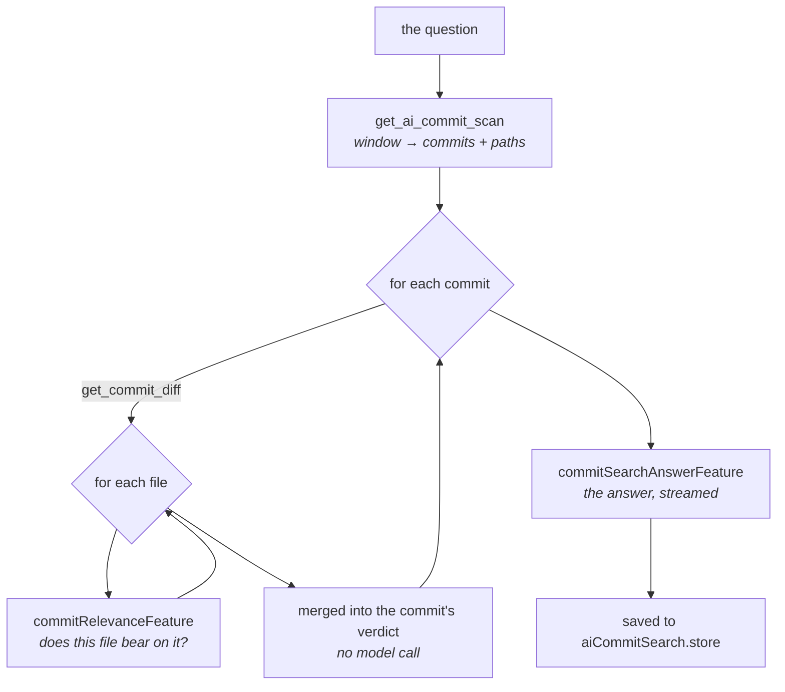

# Commit search

Ask a question about what happened in a repository lately — _"has the button component changed
recently?"_ — and get an answer read out of the actual commits, with the commits it came from.

> Shared plumbing — transport, events, cancellation, errors, settings — lives in the
> [AI system overview](./README.md). This page covers only what is specific to this feature.

|                 |                                                                                                                                                                                                                                                                                                                                                                                                                                                                                                           |
| --------------- | --------------------------------------------------------------------------------------------------------------------------------------------------------------------------------------------------------------------------------------------------------------------------------------------------------------------------------------------------------------------------------------------------------------------------------------------------------------------------------------------------------- |
| **Descriptors** | [`commitRelevanceFeature`](../../packages/ai/src/features/commitRelevance.ts) (map) + [`commitSearchAnswerFeature`](../../packages/ai/src/features/commitSearchAnswer.ts) (reduce), sequenced by [`scanCommits`](../../packages/ai/src/features/scanCommits.ts) — plus, in the quick mode, [`commitQuickScanFeature`](../../packages/ai/src/features/commitQuickScan.ts) narrowing the commits and [`commitFileScanFeature`](../../packages/ai/src/features/commitFileScan.ts) narrowing each one's files |
| **Kind**        | completion + JSON schema per **file**, merged per commit, then streaming markdown for the answer                                                                                                                                                                                                                                                                                                                                                                                                          |
| **Temperature** | 0.1 per commit, 0.2 for the answer                                                                                                                                                                                                                                                                                                                                                                                                                                                                        |
| **Input**       | `get_ai_commit_scan` (the newest N commits, full oid + touched paths) then `get_commit_diff` per commit                                                                                                                                                                                                                                                                                                                                                                                                   |
| **Diff budget** | per **file**: each prompt carries one file's slice of one commit's patch, so nothing that has to fit is something the user chose the size of                                                                                                                                                                                                                                                                                                                                                              |
| **UI**          | [`AiCommitSearchPanel`](../../apps/desktop/src/features/graph/components/AiCommitSearchPanel.tsx) — right panel — via [`useAiCommitSearch`](../../apps/desktop/src/hooks/useAiCommitSearch.ts), opened from [`AiMenu`](../../apps/desktop/src/components/action-toolbar/AiMenu.tsx) or ⇧⌘F                                                                                                                                                                                                                |
| **Memory**      | [`aiCommitSearch.store`](../../apps/desktop/src/stores/aiCommitSearch.store.ts), persisted per repo, answer **and** matches                                                                                                                                                                                                                                                                                                                                                                               |

---

## Why it exists

`git log --grep` searches what people _wrote_ about their changes. That is a different question from
what they _did_. A commit named `fix: review feedback` may be the one that rewrote the button's
loading state, and no text search will ever find it; conversely `refactor(ui): button` may not have
touched behaviour at all.

The other AI features all take a subject you already have — this branch, this commit, this file — and
describe it. This one is the inverse: you have a question and no idea where the answer is. Finding
the subject _is_ the work.

### Not the same thing as summary search

[Summary search](./summary-search.md) also answers a question, and the two are easy to confuse. They
read different corpora and fail differently:

|          | Summary search                                             | Commit search                                       |
| -------- | ---------------------------------------------------------- | --------------------------------------------------- |
| Reads    | the archived daily briefings — prose the app wrote earlier | the commits themselves, patch included              |
| Cost     | one call over a lexically pre-filtered handful of days     | one call **per file of every commit** in the window |
| Answers  | "what was I doing in June?"                                | "did _this specific thing_ change, and where?"      |
| Blind to | anything no briefing happened to mention                   | anything outside the window or off HEAD             |

Ask the archive when you want the shape of a period; ask the commits when you need a sha to open.

---

## Reading commit by commit, and file by file

The scan runs **one model call per file of every commit**, always, whatever the sizes involved.

The tempting alternative — put a month of diffs in one prompt — fails in a way that is worse here
than anywhere else in the app. A window holds a handful of commits' patches, so most of the month
would arrive as a bare subject line, and the model would answer from whichever commits happened to
fit. That does not produce a partial answer. It produces **"no, the button never changed"** when the
commit that changed it was the one left out — a confident, wrong answer about the user's own
history, indistinguishable from a correct one.

The same failure repeats one level down, which is why one prompt per commit was not enough either:
a commit's own patch can outgrow a window just as a month of them can, and a verdict read off eight
per cent of a commit is the same confident wrong answer about a smaller thing.

So nothing that has to fit is something the user chose the size of: the question meets one **file**
at a time, files merge into a commit's verdict, verdicts merge into the answer. It is the same
map/reduce as [file grouping](./file-grouping.md) and the explanations, run twice over.

### Why one prompt per commit was not enough

The numbers, on this repository: a feature commit runs to 130 000 characters across 25 files. That
fits a 128k window comfortably and the 4096-token default most machines get from Ollama not at all —
there the diff's allowance comes to about 10 000 characters. **Eight per cent of the commit.**

Each file is judged by the same `commitRelevanceFeature` — same instruction, same schema, same
acceptance gates, so a file-level verdict cannot get in on easier terms — with the commit's own
message travelling along, so the model still knows what the change was _for_ while looking at one
file of it.

It runs **whatever the commit's size**, exactly as [the file map phase](./file-grouping.md) does and
for the same reason: a threshold would make one button mean two behaviours depending on a number
nobody can see, so a bad verdict could not be reasoned about without first working out which path
produced it. One way, always. The cost is calls on small commits, and it is paid deliberately.

**The merge spends no call.** A commit is relevant when any of its files is; the paths are the ones
those files named; the finding is their findings, run together as sentences. A further model call
would rewrite text that is already specific and already grounded in a diff.

**Any file failing fails the commit.** A partial read would let "not found in this commit" mean "not
found in the eleven files that happened to answer" — the silent gap this whole design exists to
prevent — so the commit is recorded as unread instead, with its cause.

### The cost, and why it is on screen — in files

The commit count is what the user asks for, and it is **not** what the run costs. One call per file
means ten commits over twenty files each is two hundred calls, so the panel counts files as it goes,
beside the commit progress, and the finished run reports the total. A bar that has barely moved after
two minutes reads as busy rather than stuck only if the number underneath it is the one that is
actually moving. The saved run keeps that total too: months later, "42 commits" says nothing about
what the answer cost to produce.

The commit count is still the control — next to the button, with a line saying what it costs, rather
than a constant buried in the code. The backend clamps it (default 60, ceiling 500) so a mistyped
value cannot turn one search into thousands of calls.

Cancellation is checked **between** commits, not within one: the completion transport takes no
request id, so a commit's remaining files are abandoned but the call in flight finishes and its
result is discarded. Acceptable only because each call is small — which is itself the consequence of
reading one file at a time. Raising _Calls in flight_ multiplies that waste by however many calls
were in flight.

---

## Two searches behind one box

The panel offers a **Quick search** tick-box. It does not change what reading a file means — both
modes judge a file on its diff, with the same call — it changes **how much gets opened**:

|                  | Deep (default)             | Quick                                                      |
| ---------------- | -------------------------- | ---------------------------------------------------------- |
| Picks commits by | nothing, it reads them all | one call over every commit's message                       |
| Picks files by   | nothing, it reads them all | one call per shortlisted commit, over its paths            |
| Calls            | 1 per file of every commit | 1 + 1 per shortlisted commit + 1 per kept file             |
| Verdicts rest on | the code                   | the code                                                   |
| Misses           | nothing in the window      | any commit or file the messages and paths never pointed at |

**Two narrowings, not one.** Shortlisting commits alone was not enough and the numbers say why: a
measured run on this repository shortlisted 13 commits and still spent **94 calls** opening their
files — one commit cost 34 by itself, because a feature commit here touches thirty files. Picking
five such commits out of sixty saves almost nothing. So the paths get their own pass, and 34 reads
become one call plus the three or four it keeps.

The example at the top of this page is what separates the modes: a commit named `fix: review
feedback` that rewrote the button's loading state is found by the deep read and never shortlisted by
the quick one. A commit the shortlist _does_ pick is opened and judged exactly as the deep search
would judge it, and can be rejected there.

### The narrowings lean the other way on purpose

The passes have opposite cost asymmetries, and their instructions say so:

- For the **verdict**, a false positive is the expensive mistake. It puts a wrong claim about the
  user's own history in front of them, sourced to a commit they will go and open. Its instruction
  says _the default answer is false_.
- For both **narrowings**, a false positive costs one read that then rejects it, while a false
  negative removes it from the answer for good. Both say _when in doubt, include it_ — with the
  counterweight that returning everything would defeat the point, so a message or a path giving no
  indication at all is not a candidate.

The commit shortlist's `reason` field is never shown and never reaches the answer. It exists as a
gate, the way `evidence` does one level down: an entry the model cannot justify in a sentence is a
guess, and here a guess costs a full read.

**A narrowing that fails opens everything.** If the file pass throws, that commit is read whole
rather than skipped: degrading into the slow behaviour is recoverable, degrading into a commit nobody
looked at is the exact silence this design exists to prevent.

Default is deep, because what the quick mode skips it skips permanently — and someone who has never
chosen should get the complete answer rather than the fast one. The run is stamped `mode`, so the
panel says which one produced an answer and the saved entry still says so months later, when the only
thing anyone will remember is that they once searched and found nothing.

---

## Three kinds of "no"

The feature's honesty rests on never collapsing these:

| Situation                                      | What is recorded                                                       | Why it matters                             |
| ---------------------------------------------- | ---------------------------------------------------------------------- | ------------------------------------------ |
| commit read, judged irrelevant                 | a negative verdict                                                     | genuine evidence of absence                |
| commit could not be read (diff or call failed) | `failed: true` **and a cause**, excluded from the answer's denominator | a provider hiccup must not become evidence |
| history holds commits older than the ones read | `truncated`, stated in the prompt **and** the panel                    | "not found" means "not in what was read"   |

The answer's instruction requires a negative answer to state what was actually searched, and the
panel shows both caveats above the commit list. The model's `scanned` count is commits _read_ —
failures are subtracted before the prompt is built.

### Unread commits are named, not counted

The panel used to say _"N commits could not be read"_ and stop. True, alarming, and impossible to act
on: it did not say which commits were missing from the answer, and it collapsed four problems with
four different fixes into one number. `ScanFailure` keeps them apart:

| Cause        | What actually happened                                                                                                                                | What the user does                               |
| ------------ | ----------------------------------------------------------------------------------------------------------------------------------------------------- | ------------------------------------------------ |
| `unreadable` | the provider answered in a shape the app cannot read                                                                                                  | change model — it will do this on _every_ commit |
| `timeout`    | the model ran past the request budget. **The most likely one**: a real run lost six of ten commits this way, every one at exactly the configured 30 s | raise the timeout, or pick a faster model        |
| `call`       | the provider never answered at all                                                                                                                    | start it                                         |
| `diff`       | the commit's patch would not load from the repository                                                                                                 | look at that commit                              |

[`CommitSearchUnreadList`](../../apps/desktop/src/features/graph/components/CommitSearchUnreadList.tsx)
states each cause once — a run where twenty commits failed identically is one problem, not twenty —
and lists the commits as chips that open in the graph, because reading the three the model dropped is
usually faster than running the search again. A saved run keeps the count and the cause but not the
commits: which ones failed is only actionable while they are on screen, while _why_ is what makes the
caveat readable months later.

---

## What the model may and may not say

Per commit ([`commitRelevanceFeature`](../../packages/ai/src/features/commitRelevance.ts)), a strict
JSON verdict of five fields **in this order**: `subject`, `evidence`, `relevant`, `finding`, `files`.

### The order is the feature

The first version asked for `relevant` first, and it did not work. Against a real question — _"has
the button component changed?"_ — a local model came back with `relevant: true` and a finding that
was simply a **summary of the commit**: "introduces a two-phase approach for planning commits…". It
had never considered the button; it had described what was in front of it and marked it relevant.

A model fills the fields as it writes them, so with `relevant` first the decision existed before any
justification for it did. Now it must write:

- `subject` — the thing the **question** asks about, copied from the question. This is the anchor;
  without it the diff is the only thing in the model's recent attention.
- `evidence` — one concrete element **of this diff** that changes that thing. Empty when there is
  none, and _the parser enforces that an empty one means not relevant_. This is the gate.

So a match now costs the model a specific claim it has to point at, instead of a boolean it can
default to.

The instruction backs this with a rule that names the observed failure directly: a question about a
button is not answered by a commit adding a menu entry, an icon, a panel or a dialog — those are all
components, and none of them is the button. And: _if what you are about to write reads like a summary
of the commit, the verdict is false._

### The rest of the contract

- **The paths are checked.** The model is told to copy them from the list it was given; `scanCommits`
  then intersects its answer with the commit's real file list. The panel turns those paths into
  labels beside a clickable commit, so an invented one would be a link to nothing.
- **A "relevant" verdict with an empty finding is rejected** by the parser. It would put a commit in
  the answer that the model could not describe — which reads as an unexplained accusation.
- **`none`, `n/a`, `aucune` count as empty evidence.** They are how a model writes an empty field
  when a schema forbids omitting it, and taking them literally would reopen the gate.
- **A failed call throws** `CommitVerdictUnreadable` rather than degrading to a clean "no", so the
  caller can record the commit as unread _and say why_.

### Prose is accepted, on the same terms

Ollama's OpenAI-compatible endpoint silently ignores `response_format` for some models: what comes
back is `relevant: true\nfinding: …\nfiles:\n- a`, which a JSON-only parser rejects outright. That
did not degrade the search, it made **every** commit unreadable — a wall of failures, and a feature
that appeared broken rather than mismatched.

The parser therefore falls back to reading labelled prose, and then applies the _same_ acceptance
rules, so a prose answer never gets in on easier terms than a JSON one.

### Room for the answer

`COMMIT_RELEVANCE_OUTPUT_TOKENS` is 512, raised from 320 after watching a model spend the whole
budget and return an **empty** string: `subject` and `evidence` are paid for before `finding` starts,
and a French finding with two paths after it did not fit in what was left. A truncated answer is not
a degraded verdict here — it is a commit recorded as unread.

For the answer ([`commitSearchAnswerFeature`](../../packages/ai/src/features/commitSearchAnswer.ts)),
streamed markdown: a bold yes/no opening, one bullet per commit with its short sha, and a closing
line. Every commit that was found must appear — the reduce step is not allowed to merge two commits
into one bullet and lose a sha, because the sha is what the user clicks.

---

## What the user sees

The toolbar's **AI menu** → _Search history with a question_, or ⇧⌘F, opens the right panel. It sits
in that menu rather than beside the ⌘F search it resembles: the two look alike and behave nothing
alike — milliseconds over commit subjects versus minutes over every commit's diff — and the AI menu
is where the actions that spend a model run live. Both routes clear the centre slot's other
claimants first, so the panel never opens behind a diff.

The panel holds the question, **one** bound — how many commits to read — a progress bar naming how
many have been read, the streamed answer, and the commits behind it.

There used to be a time window beside the count, and it was redundant. The scan stops at whichever
bound it meets first, so exactly one ever binds; and since every commit read costs a model call, the
count is the one that _must_. A window could therefore only ever return fewer commits than were asked
for — and its one visible effect was a "the period held more commits than were read" warning that
fired precisely when the window had done nothing. The span actually covered is now _reported_ instead
of asked for, both to the user and in the answer's prompt, which also fixes a quieter bug: the model
used to be told "10 commits, since <a month ago>" when those ten commits spanned three days. **Each match row
selects that commit in the graph**, where its diff opens the way it always does — an answer you
cannot verify is a claim, and the follow-up question is always "show me".

### Saved searches

Every finished run is kept per repository (20 most recent), with its answer _and_ its matches: the
question, when it ran, how many commits were read, how many matched, and which model answered.
Reopening one restores the answer and the clickable commit list without spending another minute of
model time. The model name is on screen because it changes how much an old answer is worth.

---

## Limits

- **Merge commits are skipped.** Their generated subject describes no authored work, and their
  first-parent diff restates changes the branch's own commits already carry — reporting both would
  count one change twice.
- **The window walks HEAD only.** A change that lives on an unmerged branch is not in the answer.
- **Files listed per commit are capped** (60) so a lockfile-regeneration commit cannot dwarf the
  payload; the commit is still read, its path list is just cut.
- **The scan is sequential by default**, like every other map phase here, and widened only by the
  _Calls in flight_ setting — see [the AI overview](./README.md#reading-several-at-once) for what
  raising it buys and what it costs.
- **A single file bigger than the window is still trimmed.** Reading file by file removes the commit
  as the unit that has to fit; it cannot remove the file. This is the one place left where the model
  may be shown part of something — and the instruction holds there too: _a file you cannot see is not
  evidence_, so the failure is an omission, never an invented match.
