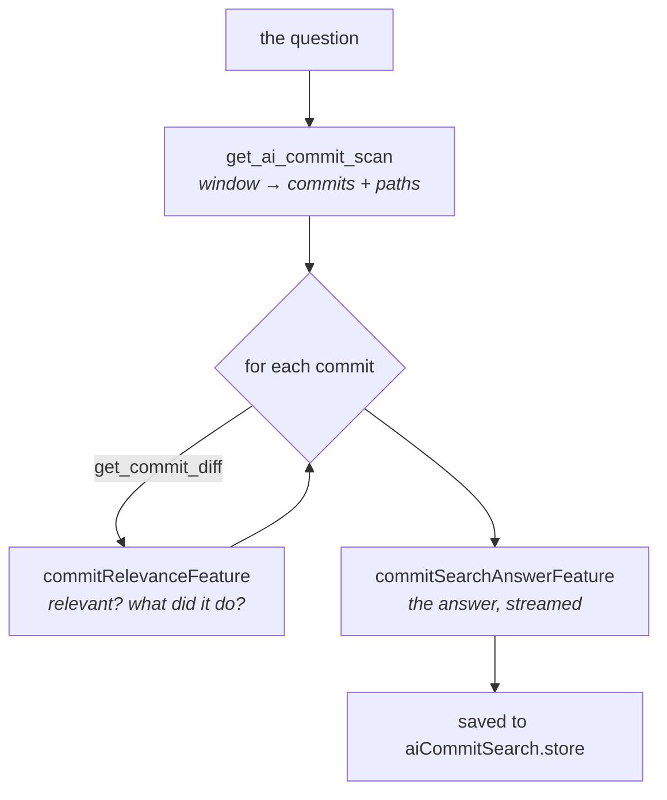

# Commit search

Ask a question about what happened in a repository lately — *"has the button component changed
recently?"* — and get an answer read out of the actual commits, with the commits it came from.

> Shared plumbing — transport, events, cancellation, errors, settings — lives in the
> [AI system overview](./README.md). This page covers only what is specific to this feature.

| | |
| --- | --- |
| **Descriptors** | [`commitRelevanceFeature`](../../packages/ai/src/features/commitRelevance.ts) (map) + [`commitSearchAnswerFeature`](../../packages/ai/src/features/commitSearchAnswer.ts) (reduce), sequenced by [`scanCommits`](../../packages/ai/src/features/scanCommits.ts) |
| **Kind** | completion + JSON schema per commit, then streaming markdown for the answer |
| **Temperature** | 0.1 per commit, 0.2 for the answer |
| **Input** | `get_ai_commit_scan` (the window's commits, full oid + touched paths) then `get_commit_diff` per commit |
| **Diff budget** | per commit: each prompt carries exactly one commit's patch, budgeted against the declared window |
| **UI** | [`AiCommitSearchPanel`](../../apps/desktop/src/components/git-graph/AiCommitSearchPanel.tsx) — right panel — via [`useAiCommitSearch`](../../apps/desktop/src/hooks/useAiCommitSearch.ts), opened from [`AiMenu`](../../apps/desktop/src/components/action-toolbar/AiMenu.tsx) or ⇧⌘F |
| **Memory** | [`aiCommitSearch.store`](../../apps/desktop/src/stores/aiCommitSearch.store.ts), persisted per repo, answer **and** matches |

---

## Why it exists

`git log --grep` searches what people *wrote* about their changes. That is a different question from
what they *did*. A commit named `fix: review feedback` may be the one that rewrote the button's
loading state, and no text search will ever find it; conversely `refactor(ui): button` may not have
touched behaviour at all.

The other AI features all take a subject you already have — this branch, this commit, this file — and
describe it. This one is the inverse: you have a question and no idea where the answer is. Finding
the subject *is* the work.

### Not the same thing as summary search

[Summary search](./summary-search.md) also answers a question, and the two are easy to confuse. They
read different corpora and fail differently:

| | Summary search | Commit search |
| --- | --- | --- |
| Reads | the archived daily briefings — prose the app wrote earlier | the commits themselves, patch included |
| Cost | one call over a lexically pre-filtered handful of days | one call **per commit** in the window |
| Answers | "what was I doing in June?" | "did *this specific thing* change, and where?" |
| Blind to | anything no briefing happened to mention | anything outside the window or off HEAD |

Ask the archive when you want the shape of a period; ask the commits when you need a sha to open.

---

## Reading commit by commit

The scan runs **one model call per commit**, always, whatever the window holds.

The tempting alternative — put a month of diffs in one prompt — fails in a way that is worse here
than anywhere else in the app. A window holds a handful of commits' patches, so most of the month
would arrive as a bare subject line, and the model would answer from whichever commits happened to
fit. That does not produce a partial answer. It produces **"no, the button never changed"** when the
commit that changed it was the one left out — a confident, wrong answer about the user's own
history, indistinguishable from a correct one.

So each commit gets its own prompt carrying its own patch, and the window stops being the limit. It
is the same map/reduce as [file grouping](./file-grouping.md) and the explanations, one level up:
`summarizeFiles` reads a changeset file by file, `scanCommits` reads history commit by commit.

### The cost, and why it is on screen

One call per commit means the commit count *is* the wait: on a local model, sixty commits is
minutes, not seconds. That number is therefore a control in the panel — next to the button, with a
line saying what it costs — rather than a constant buried in the code. The backend clamps it
(default 60, ceiling 500) so a mistyped value cannot turn one search into thousands of calls.

Cancellation is checked **between** commits, not within one: the completion transport takes no
request id, so a call already in flight finishes and its result is discarded. Acceptable only
because each call is small — which is itself a consequence of reading one commit at a time.

---

## Three kinds of "no"

The feature's honesty rests on never collapsing these:

| Situation | What is recorded | Why it matters |
| --------- | ---------------- | -------------- |
| commit read, judged irrelevant | a negative verdict | genuine evidence of absence |
| commit could not be read (diff or call failed) | `failed: true`, excluded from the answer's denominator | a provider hiccup must not become evidence |
| window held more commits than were read | `truncated`, stated in the prompt **and** the panel | "not found" means "not in what was read" |

The answer's instruction requires a negative answer to state what was actually searched, and the
panel shows both caveats above the commit list. The model's `scanned` count is commits *read* —
failures are subtracted before the prompt is built.

---

## What the model may and may not say

Per commit ([`commitRelevanceFeature`](../../packages/ai/src/features/commitRelevance.ts)), a strict
JSON verdict: `relevant`, `finding` (one or two sentences, in the user's language), `files`.

- **The paths are checked.** The model is told to copy them from the list it was given; `scanCommits`
  then intersects its answer with the commit's real file list. The panel turns those paths into
  labels beside a clickable commit, so an invented one would be a link to nothing.
- **A "relevant" verdict with an empty finding is rejected** by the parser. It would put a commit in
  the answer that the model could not describe — which reads as an unexplained accusation.
- **A failed call throws** rather than degrading to a clean "no", so the caller can record the commit
  as unread. This is the difference between the second and the first row of the table above.

For the answer ([`commitSearchAnswerFeature`](../../packages/ai/src/features/commitSearchAnswer.ts)),
streamed markdown: a bold yes/no opening, one bullet per commit with its short sha, and a closing
line. Every commit that was found must appear — the reduce step is not allowed to merge two commits
into one bullet and lose a sha, because the sha is what the user clicks.

---

## What the user sees

The toolbar's **AI menu** → *Search history with a question*, or ⇧⌘F, opens the right panel. It sits
in that menu rather than beside the ⌘F search it resembles: the two look alike and behave nothing
alike — milliseconds over commit subjects versus minutes over every commit's diff — and the AI menu
is where the actions that spend a model run live. Both routes clear the centre slot's other
claimants first, so the panel never opens behind a diff.

The panel holds the question, the window (7 / 30 / 90 days), the commit budget, a progress bar naming
how many commits have been read, the streamed answer, and the commits behind it. **Each match row
selects that commit in the graph**, where its diff opens the way it always does — an answer you
cannot verify is a claim, and the follow-up question is always "show me".

### Saved searches

Every finished run is kept per repository (20 most recent), with its answer *and* its matches: the
question, when it ran, how many commits were read, how many matched, and which model answered.
Reopening one restores the answer and the clickable commit list without spending another minute of
model time. The model name is on screen because it changes how much an old answer is worth.

---

## Limits

- **Merge commits are skipped.** Their generated subject describes no authored work, and their
  first-parent diff restates changes the branch's own commits already carry — reporting both would
  count one change twice.
- **The window walks HEAD only.** A change that lives on an unmerged branch is not in the answer.
- **Files listed per commit are capped** (60) so a lockfile-regeneration commit cannot dwarf the
  payload; the commit is still read, its path list is just cut.
- **The scan is sequential**, like every other map phase here: the provider is normally one local
  model, so concurrent requests queue behind the same weights while splitting its context.
