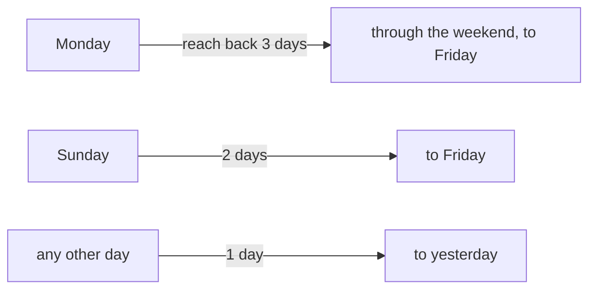

# Daily summary

A short stand-up briefing per repository: what got done in the last working day, and what to pick up
next. The one AI feature that runs **without being asked** — once each morning.

> Shared plumbing — transport, events, cancellation, errors, settings — lives in the
> [AI system overview](./README.md). This page covers only what is specific to this feature.

| | |
| --- | --- |
| **Descriptor** | [`dailySummaryFeature`](../../packages/ai/src/features/dailySummary.ts) |
| **Kind** | completion + JSON schema → `DailySummary` |
| **Temperature** | 0.3 |
| **Context** | `get_ai_activity` — **not** `get_ai_context`; this one looks backwards in time, not at a diff |
| **UI** | ✨ per project on the dashboard → [`DailySummaryPanel`](../../apps/desktop/src/app/dashboard/components/DailySummaryPanel.tsx), plus the morning auto-run |

---

## What the user sees

Three fields, rendered as a small panel on a dashboard project:

- **headline** — one plain sentence recapping the period;
- **yesterday** — 2–6 bullets of what was actually accomplished;
- **today** — 2–5 concrete next steps.

A green dot marks a project whose briefing is fresh. Clicking ✨ regenerates on demand.

---

## What counts as "yesterday"

The fiddly part, kept pure and unit-tested in
[`dailySummaryWindow.ts`](../../apps/desktop/src/lib/dailySummaryWindow.ts) — no React, no Tauri.

The point of the weekend rule: a fresh week must not open with an empty briefing. `hoursForSummaryWindow()`
converts that to hours, which is what the backend takes — the frontend owns the calendar because it
knows the local clock; Rust stays a pure git query.

A stored summary is **stale** once it wasn't generated on the current local day. That single
predicate drives both the "regenerate?" hint and the morning auto-run.

## The morning auto-run

[`useMorningSummaries`](../../apps/desktop/src/hooks/useMorningSummaries.ts) regenerates stale
briefings the first time the launchpad mounts in a session. It is careful in three ways, and each is
deliberate:

- **Sequential, not parallel** — a local LLM shouldn't take a burst of simultaneous requests.
- **Once per path per session**, success *or* failure — no retry loops against a misconfigured
  provider.
- **A failing project doesn't block the others**; you can retry it by hand from the panel.

It only runs over a bounded set (open tabs + favourites), never every discovered repo, and it obeys
both the AI master switch and its own `dailySummary.autoGenerate` setting.

---

## The context

`get_ai_activity` ([ai_activity.rs](../../apps/desktop/src-tauri/src/services/ai_activity.rs))
walks HEAD's history newest-first and collects:

| | |
| --- | --- |
| **commits** | non-merge commits whose **author time** falls in the window, with subject, body, and `filesChanged/insertions/deletions`. Capped at 50 — newest win, and `truncated: true` tells the prompt it saw a sample |
| **pending** | a light snapshot of uncommitted work (path + status), so "today" can be grounded in what's in flight |

Merge commits are skipped: their auto-generated subjects don't describe authored work.

---

## The prompt

**System** — `DAILY_SUMMARY_INSTRUCTION`, which is mostly about restraint: group related commits into
one outcome-focused bullet rather than restating each; describe impact, not hashes; **never invent
work that has no basis in the data**; and if the window holds no commits, say so plainly and leave
`yesterday` empty rather than padding it.

**User** — the commits (with stats and bodies), the pending files, a note when the window was
truncated, and the target language.

`DAILY_SUMMARY_SCHEMA` constrains the output to `{ headline, yesterday[], today[] }`.
`parseDailySummary` tolerates prose or fences around the JSON, coerces the lists to clean non-empty
strings, and throws only when *all three* fields are empty.

## Language

This is the one feature whose output is pure prose the user reads in their own language, so the UI
language is injected into the prompt (`Write the entire briefing in French.`). It's a frontend
concern — Rust never sees it.

---

## Limitations

Beyond the [shared ones](./README.md#known-limitations):

| Limitation | Note |
| ---------- | ---- |
| **Not filtered by author** | It reports every non-merge commit in the window, including teammates' commits pulled in. On an active shared branch, "what *I* did yesterday" is diluted |
| **HEAD only** | Work done on another branch in the window is invisible unless it's an ancestor of HEAD |
| **Commit messages are the evidence, not diffs** | A briefing built on vague commit subjects will itself be vague — the feature is only as good as the history it reads |
| **50-commit cap** | A very busy window is summarized from a sample; the prompt is told, but the result is still partial |

## Tests

| Test | Covers |
| ---- | ------ |
| [`dailySummary.test.ts`](../../packages/ai/src/features/dailySummary.test.ts) | prompt shape, language, empty-window wording, parse tolerance |
| [`dailySummaryWindow.test.ts`](../../apps/desktop/src/lib/dailySummaryWindow.test.ts) | the weekend rule and staleness |
| [`generateDailySummary.test.ts`](../../apps/desktop/src/lib/generateDailySummary.test.ts) | end-to-end orchestration + store write |
| [`useMorningSummaries.test.ts`](../../apps/desktop/src/hooks/useMorningSummaries.test.ts) | sequential run, once-per-session, failure isolation |
| [`DailySummaryPanel.test.tsx`](../../apps/desktop/src/app/dashboard/components/DailySummaryPanel.test.tsx) | rendering and the regenerate action |
