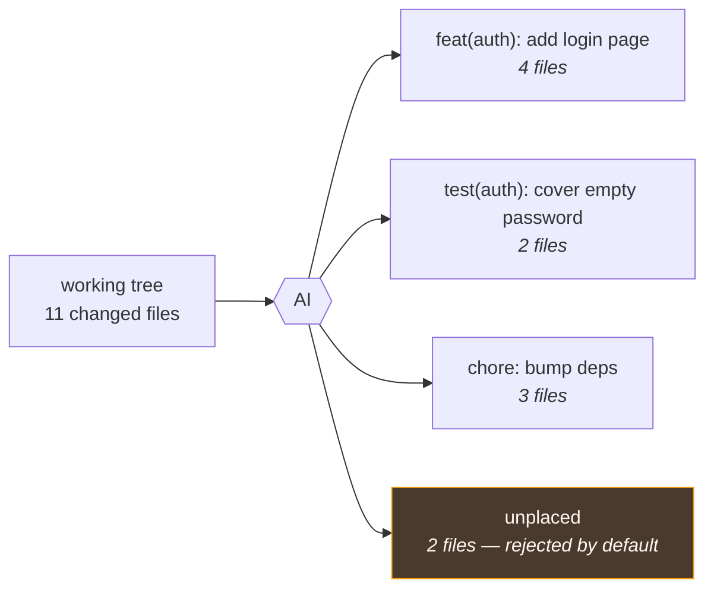
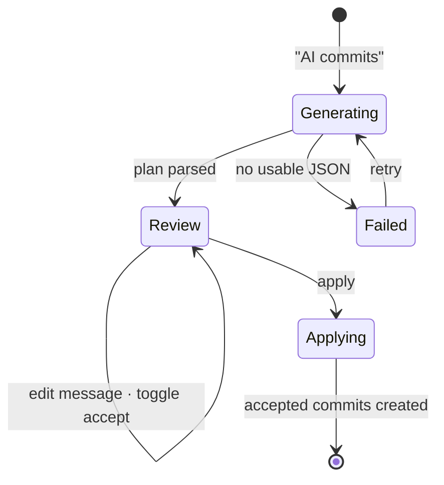

# File grouping

Takes everything uncommitted and proposes a plan of **atomic commits** — which files belong together
and what each commit should say — on a review screen where you accept, edit or reject each one.

> Shared plumbing — transport, events, cancellation, errors, settings — lives in the
> [AI system overview](./README.md). This page covers only what is specific to this feature.

| | |
| --- | --- |
| **Descriptor** | [`fileGroupingFeature`](../../packages/ai/src/features/fileGrouping.ts) |
| **Kind** | completion + JSON schema → `ProposedCommit[]` |
| **Temperature** | 0.2 — a partitioning task, not a writing one |
| **Context scope** | `working` (worktree vs HEAD, untracked included) |
| **Diff budget** | 8000 chars |
| **UI** | [`CommitBatchReviewDialog`](../../apps/desktop/src/components/git-graph/components/CommitBatchReviewDialog.tsx) via [`useCommitBatchReview`](../../apps/desktop/src/hooks/useCommitBatchReview.ts) |

---

## What the user sees

You've been heads-down and the working tree now holds three unrelated things. Instead of untangling
them by hand, this proposes the split:



Each proposal can be edited, and each is accepted or rejected individually. Nothing touches the repo
until you apply.

---

## Structured output, not prose

This is the app's clearest case for **JSON schema output**: the answer is data the app acts on, not
text a human reads. `FILE_GROUPING_SCHEMA` constrains the model to
`{ commits: [{ commitMessage, files }] }`, passed straight through to the provider's
`response_format: { type: "json_schema", strict: true }`.

The root is an **object wrapping the array**, not a bare array — several providers reject a bare-array
root under strict mode.

`parseCommitPlan` then stays deliberately forgiving, because "the provider honored the schema" is not
something you can count on across Ollama, LM Studio, vLLM and OpenAI:

- accepts the schema shape `{ commits: [...] }` **or** a bare `[...]`;
- tolerates prose or ` ```json ` fences around the JSON;
- accepts a legacy `message` key as well as `commitMessage`;
- drops non-string paths and entries with an empty message or no files;
- **throws** when nothing usable is left, so the caller shows a clear error instead of silently
  committing nothing.

---

## The prompt

**System** — `FILE_GROUPING_INSTRUCTION`, built around four named rules the model is asked to respect:
**atomicity** (one logical change per commit), **ordering** (the sequence must stay coherent when
applied), **coverage** (every file in exactly one commit, paths verbatim), **minimality** (fewest
commits that stay atomic — one commit when it really is one change).

**User** — the file list first, then the style section (shared with
[commit message](./commit-message.md)), then the diff:

```
Repository: git-manager (branch: main)

Changed files:
- src/auth/login.ts (modified)
- src/auth/login.test.ts (added)
…

<style section>

Split these files into atomic commits. Diff for context:

--- DIFF ---
…
--- END DIFF ---
```

The **file list comes before the diff** on purpose: those are the exact paths the model must
partition, and the diff is explicitly framed as context for the reasoning. A path invented or
mangled by the model is a file that silently wouldn't get committed.

---

## Applying the plan

The frontend never trusts the model's partition blindly
([`useCommitBatchReview`](../../apps/desktop/src/hooks/useCommitBatchReview.ts)):

1. Each returned path is looked up in the **real** WIP list; unknown paths are dropped.
2. A file already assigned to an earlier commit can't be claimed twice.
3. Any file the model **didn't place** is surfaced as an extra group, with an empty message and
   `accepted: false` — visible, rejected by default, so nothing is silently dropped or auto-committed.
4. Each proposal is validated with `validateCommitSubject`, recomputed on every render so it tracks
   your live edits. Non-blocking.

Applying then runs sequentially: unstage everything, then per accepted proposal stage exactly its
files and commit. Files in rejected proposals stay uncommitted.



---

## Limitations

Beyond the [shared ones](./README.md#known-limitations):

| Limitation | Note |
| ---------- | ---- |
| **Whole files only** | The unit is a file, so two unrelated changes *inside one file* cannot be split. That would need hunk-level staging, which the feature doesn't attempt |
| **Applying is not atomic** | Commits are created in a loop; a failure midway leaves the earlier commits in place. Recoverable (they're ordinary commits) but not transactional |
| **8000-char diff budget** | Exactly the case most likely to overflow it — a big messy working tree is when you reach for this feature. Beyond the budget the model partitions on the file list and a partial diff |
| **No dependency checking** | "Ordering" is a prompt rule, not a verified property; nothing checks that commit *n* actually builds without commit *n+1* |

## Tests

| Test | Covers |
| ---- | ------ |
| [`fileGrouping.test.ts`](../../packages/ai/src/features/fileGrouping.test.ts) | prompt shape, schema, and every tolerated parse variant |
| [`useCommitBatchReview.test.ts`](../../apps/desktop/src/hooks/useCommitBatchReview.test.ts) | path reconciliation, leftovers, accept/reject, sequential apply |
| [`ai.api.test.ts`](../../apps/desktop/src/api/ai.api.test.ts) | schema reaches the transport; the response parses into typed commits |
