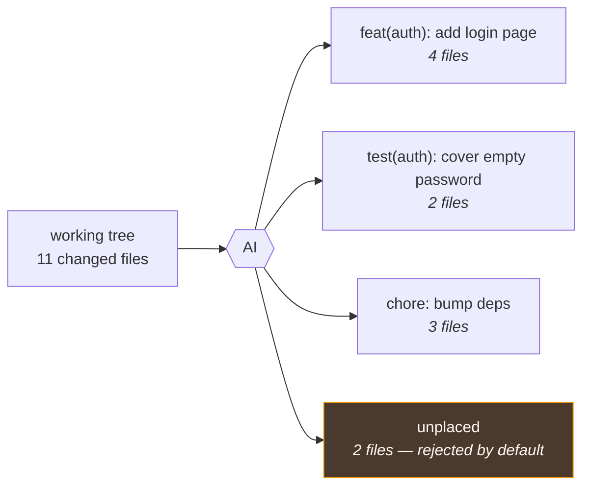
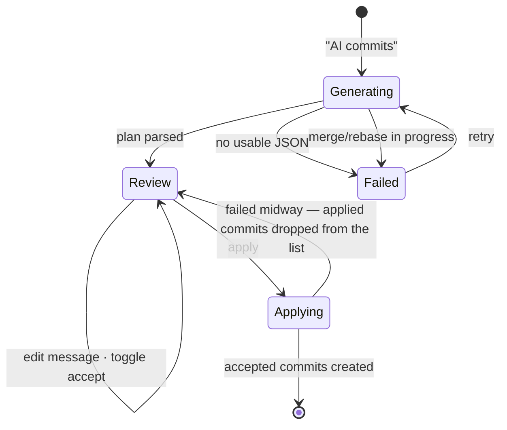
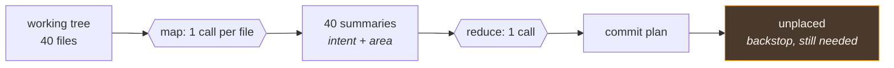

# File grouping

Takes everything uncommitted and proposes a plan of **atomic commits** — which files belong together
and what each commit should say — on a review screen where you accept, edit or reject each one.

> Shared plumbing — transport, events, cancellation, errors, settings — lives in the
> [AI system overview](./README.md). This page covers only what is specific to this feature.

| | |
| --- | --- |
| **Descriptor** | [`fileGroupingFeature`](../../packages/ai/src/features/fileGrouping.ts) |
| **Kind** | completion + JSON schema → `ProposedCommit[]` |
| **Temperature** | 0.2 — a partitioning task, not a writing one |
| **Context scope** | `working` (worktree vs HEAD, untracked included) |
| **Diff budget** | derived from the model's context window, spent per file — see [Known limitations](./README.md#known-limitations) #3 and the shared [`diffCoverage`](../../packages/ai/src/features/diffCoverage.ts) |
| **Output reserve** | `max(600, files × 24)` — the only feature whose answer length scales with its input; see [The output reserve](./README.md#the-output-reserve) |
| **UI** | [`CommitBatchReviewPanel`](../../apps/desktop/src/components/git-graph/components/CommitBatchReviewPanel.tsx) via [`useCommitBatchReview`](../../apps/desktop/src/hooks/useCommitBatchReview.ts) |

---

## What the user sees

You've been heads-down and the working tree now holds three unrelated things. Instead of untangling
them by hand, this proposes the split:



Each proposal can be edited, and each is accepted or rejected individually. Nothing touches the repo
until you apply.

---

## Structured output, not prose

This is the app's clearest case for **JSON schema output**: the answer is data the app acts on, not
text a human reads. `FILE_GROUPING_SCHEMA` constrains the model to
`{ commits: [{ commitMessage, files }] }`, passed straight through to the provider's
`response_format: { type: "json_schema", strict: true }`.

The root is an **object wrapping the array**, not a bare array — several providers reject a bare-array
root under strict mode.

`parseCommitPlan` then stays deliberately forgiving, because "the provider honored the schema" is not
something you can count on across Ollama, LM Studio, vLLM and OpenAI:

- accepts the schema shape `{ commits: [...] }` **or** a bare `[...]`;
- tolerates prose or ` ```json ` fences around the JSON;
- accepts a legacy `message` key as well as `commitMessage`;
- drops non-string paths and entries with an empty message or no files;
- **throws** when nothing usable is left, so the caller shows a clear error instead of silently
  committing nothing.

---

## The prompt

**System** — `FILE_GROUPING_INSTRUCTION`, built around four named rules the model is asked to respect:
**atomicity** (one logical change per commit), **ordering** (the sequence must stay coherent when
applied), **coverage** (every file in exactly one commit, paths verbatim), **minimality** (fewest
commits that stay atomic — one commit when it really is one change).

**User** — the file list first, then the style section (shared with
[commit message](./commit-message.md)), then the diff:

```
Repository: git-manager (branch: main)

Changed files:
- src/auth/login.ts (modified)
- src/auth/login.test.ts (added)
…

<style section>

Split these files into atomic commits. Diff for context:

--- DIFF ---
…
--- END DIFF ---
```

The **file list comes before the diff** on purpose: those are the exact paths the model must
partition, and the diff is explicitly framed as context for the reasoning. A path invented or
mangled by the model is a file that silently wouldn't get committed.

---

## Applying the plan

The frontend never trusts the model's partition blindly
([`useCommitBatchReview`](../../apps/desktop/src/hooks/useCommitBatchReview.ts)):

1. Each returned path is looked up in the **real** WIP list; unknown paths are dropped.
2. A file already assigned to an earlier commit can't be claimed twice.
   Both of those are **counted and surfaced** (`PlanReconciliation`), because they used to happen in
   silence: a proposal whose every path was invented or already taken disappeared with its message,
   and on a large changeset that reads as the feature losing commits. The files were never lost —
   step 3 catches them — but nothing said the plan on screen was smaller than the one the model
   produced. See [When the changeset is too large](#when-the-changeset-is-too-large).
3. Any file the model **didn't place** is surfaced as an extra group, with an empty message and
   `accepted: false` — visible, rejected by default, so nothing is silently dropped or auto-committed.
   It carries `kind: 'unplaced'` and the panel gives it its own name and a permanent explanation.
   That is not decoration: unticked by default means it renders greyed out with a disabled, empty
   message box, and while it was labelled "Commit N" like the rest it read as a broken proposal —
   which is how it got reported. The hint has to show *before* the tick, since prompting the tick is
   its job. `kind` lives in the data because the view's only other option is guessing from position
   and an empty message, which is wrong the moment a real proposal has its message cleared.
4. Each proposal is validated with `validateCommitSubject`, recomputed on every render so it tracks
   your live edits. Non-blocking — except an accepted group with an *empty* message, which is
   skipped rather than committed subjectless, and says so inline.

Applying then runs sequentially: unstage everything, then per accepted proposal stage exactly its
files and commit. Files in rejected proposals stay uncommitted. Because the index is rebuilt from
scratch, a staging selection you made by hand does not survive — the panel says so above the plan,
**only when there is one to lose** (`hasStagedChanges`). Shown unconditionally it warned most users
about a loss that could not happen to them, and a warning that is usually irrelevant stops being
read. It is also phrased as what you lose rather than what the app does to its index, which is the
part the reader has no reason to care about.

The review surface is a **right-hand side panel**, not a centered dialog: a plan over a busy working
tree runs to a dozen commit cards, each with its own file list, and a centered box could only show a
few. It is [`SidePanelOverlay`](../../packages/components/src/SidePanelOverlay.tsx), built on
`DialogContent position="right"` so the focus trap, Escape, `aria-modal` and the portal come from
Radix rather than from a hand-rolled overlay. The scrolling middle is `min-h-0 flex-1` and must stay
that way — the `max-h-[52vh]` it replaced could not scroll at all, because Radix's `h-full` viewport
resolves to `auto` against a max-height parent, never overflows itself, and gets clipped instead.



### Two states it refuses to write into

**A pending operation.** `apiGetPendingOperation` (backed by `services/git_repo.rs`, i.e. libgit2's
`RepositoryState`) is checked twice: before generating, so no generation is spent on a plan that
could not be applied, and again at apply time, because the repo can enter one while you read the
proposals. It covers what `get_rebase_state` does not — a merge, a cherry-pick, a revert.

The refusal belongs to the **batch** flows specifically, not to committing in general. `create_commit`
knows how to finish a merge (it reads `MERGE_HEAD` for the extra parents and clears the state
afterwards), so the ordinary Commit button is deliberately *not* guarded — refusing there would break
the normal way a merge is completed. What a batch adds is that it runs `apiUnstageAll` first, which
throws away a conflict resolution in progress during a paused rebase, and that a merge is one commit
by definition and cannot be split across a plan of several. The non-AI "Smart Batch Mode"
(`useWipCommitPanel`) refuses on the same grounds and shares the `commitDetails.pendingOperation` key.

**Its own partial failure.** Applying is not transactional and cannot be — these are real commits,
created one at a time. It is instead *re-runnable*: the proposals that landed are removed from the
list before the error is shown, so the obvious next click applies only what is left. Replaying them
would re-stage files that no longer differ from HEAD and ask libgit2 for a commit anyway, which
happily produces an empty duplicate.

---

## When the changeset is too large

Three failures compound, in this order, and they are worth telling apart because they look alike
from the outside — a plan that seems to have lost commits.

**1. The window collapses.** The file list is never budgeted away (it is the set being partitioned),
so it grows the prompt's fixed cost linearly, while the answer reserve grows with it. Measured on
this repo's own path depth, instruction included:

| Files | Prompt floor (instruction + list + reserve) | Diff budget at 4k | at 8k | at 32k |
| ----- | ------------------------------------------ | ----------------- | ----- | ------ |
| 20 | 1 846 | 6 693 chars | 18 879 | 91 992 |
| 50 | 3 072 | 3 046 | 15 232 | 88 345 |
| 100 | 5 315 | **0** | 8 559 | 81 672 |
| 200 | 9 829 | **0** | **0** | 68 243 |

At 100 files on a stock 4k window the floor *exceeds the window*: tokens drop from the start, which
is where the instruction lives, and the model no longer knows what it was asked. The `CoverageNotice`
reports the diff shortfall but not this — it is the one gap still unreported.

**2. Grouping quality degrades, and the reconciliation absorbs it.** A model juggling a long list
duplicates paths and mangles them. Each such path is dropped, and a proposal that loses all of its
paths is discarded whole. Now counted and shown — that notice is the signal that you are here.

**3. The answer truncates.** Surfaces as `parseCommitPlan` throwing "not valid JSON" rather than a
short plan, so it is the one failure that was never silent. `groupingOutputTokens` measures the
actual paths rather than assuming a per-file constant, which is what makes the cap right on a repo
with nested paths — the flat 24 tokens/file it replaced was about the cost of one deep path alone.

Past **12 files** the planner stops trying to do it in one call — see below.

---

## Two-phase planning, past 12 files



| | |
| --- | --- |
| **Map** | [`fileSummaryFeature`](../../packages/ai/src/features/fileSummary.ts) — completion + schema → `{ intent, area }`, temperature 0.1 |
| **Reduce** | [`summaryGroupingFeature`](../../packages/ai/src/features/summaryGrouping.ts) — completion, shares `FILE_GROUPING_SCHEMA` and `parseCommitPlan` with the single-shot planner |
| **Orchestration** | [`planCommitsFromSummaries`](../../packages/ai/src/features/planCommits.ts) — sequencing, progress, cancellation |
| **Threshold** | `SUMMARY_PLANNING_FILE_THRESHOLD` = 12 |

**Why it helps.** The single-shot prompt has to fit every file's diff in one window, so past a few
dozen files most of them reach the model as a bare path — and a path is not something you can group
by meaning. Here each file gets its own prompt, so the window stops being the limit and the reduce
call reasons over N short descriptions instead of a truncated diff. It also removes the prompt
contradiction described above: every file arrives described, so there is no "you have not read
these" block sitting a few lines from "every file MUST appear in exactly one commit".

**The map phase cannot mangle a path.** `FILE_SUMMARY_SCHEMA` has no path field. The caller knows
which file it sent and pairs the answer with it, so one of the two single-shot failure modes is
gone by construction.

**What it does not fix.** The reduce call still names every path in its answer, so nothing here
*guarantees* coverage — a model can drop a file from a list of summaries just as it can from a diff.
The unplaced group remains the backstop and remains necessary. This was flagged before building it,
and the tests assert the backstop still fires.

**Costs, deliberately taken.**

| | |
| --- | --- |
| **N+1 calls** | Sequential, not concurrent: the provider is normally one local model, so parallel requests queue behind the same weights while splitting its context allocation. It also keeps progress honest — `completed` counts files described, not requests sent |
| **Latency** | Minutes on a large changeset, hence the per-file progress and the threshold |
| **Cancellation is between calls** | The completion transport takes no request id, so an in-flight call runs to completion and its result is dropped. Tolerable only because each summary call is small |
| **Lossy** | Grouping quality now depends on the summaries. `area` is asked for as a *concept*, never a directory, since it is the key the reduce step groups on |
| **A failed summary keeps its file** | Recorded with empty fields; the reduce instruction has a rule for placing it from its path. Losing a file here would be the exact failure the whole path exists to avoid |

---

## Limitations

Beyond the [shared ones](./README.md#known-limitations):

| Limitation | Note |
| ---------- | ---- |
| **Whole files only** | The unit is a file, so two unrelated changes *inside one file* cannot be split. That would need hunk-level staging, which the feature doesn't attempt |
| **Applying is not atomic** | Commits are created in a loop; a failure midway leaves the earlier commits in place. Recoverable (they're ordinary commits) and safe to retry (see above), but not transactional |
| **Git hooks never run** | App-wide, not specific to this feature: every commit goes through libgit2 (`repo.commit`), which does not execute hooks. So a `pre-commit` (husky, lint-staged, prettier) cannot *fail* the batch — but it also does not *run*, and `commit-msg`/commitlint never sees the generated messages. On a repo with a formatting hook, a batch lands unformatted and CI is where you find out. `validateCommitSubject` is the substitute for the message half, and it is non-blocking |
| **A big tree is grouped from a partial diff** | Exactly the case most likely to hit the budget. The file list is never budgeted away — it is the set being partitioned, so cutting it would not shorten the answer but corrupt it — and the instruction requires every unread file to still be placed, from its path. So what a small window costs is *grouping quality* (a test placed beside its module by name rather than by content), not coverage; the leftovers pass in `useCommitBatchReview` catches anything the model still drops |
| **No dependency checking** | "Ordering" is a prompt rule, not a verified property; nothing checks that commit *n* actually builds without commit *n+1* |
| **The answer cap is an estimate too** | `groupingOutputTokens` allows 24 tokens per changed file, which covers a long nested path with its JSON quoting and separator. It is generous rather than exact — a real tokenizer is model-specific — and the error is asymmetric on purpose: too high spends window on room nobody uses, too low truncates the JSON mid-array and `parseCommitPlan` throws |

## Tests

| Test | Covers |
| ---- | ------ |
| [`fileGrouping.test.ts`](../../packages/ai/src/features/fileGrouping.test.ts) | prompt shape, schema, every tolerated parse variant, window-sized budget (fits every window, the complete file list survives the smallest one, code before noise), coverage, the answer reserve growing with the changeset and matching what the prompt held back, and the instruction's rule that an unread file must still be placed |
| [`useCommitBatchReview.test.ts`](../../apps/desktop/src/hooks/useCommitBatchReview.test.ts) | path reconciliation, leftovers, accept/reject, sequential apply, the pending-operation refusal on both generate and apply, a partial failure dropping what landed so a retry doesn't duplicate it, and an accepted-but-empty group being skipped |
| [`CommitBatchReviewPanel.test.tsx`](../../apps/desktop/src/components/git-graph/components/CommitBatchReviewPanel.test.tsx) | render/loading/error states, accept + edit callbacks, the staging-reset notice, the empty-message hint replacing the convention warning, and that the scroll pane is flex-sized rather than max-height |
| [`SidePanelOverlay.test.tsx`](../../packages/components/src/SidePanelOverlay.test.tsx) | open/closed, children + resize handle, dialog role with an accessible name that takes focus, Escape, viewport-fraction width |
| [`fileSummary.test.ts`](../../packages/ai/src/features/fileSummary.test.ts) | prompt shape, that one file always fits a 4k window, the schema having no path field, every tolerated parse variant, and a flat answer reserve |
| [`summaryGrouping.test.ts`](../../packages/ai/src/features/summaryGrouping.test.ts) | prompt shape and file count stated twice, the absence of a not-included block, and the degrade order (intents before areas, paths never) |
| [`planCommits.test.ts`](../../packages/ai/src/features/planCommits.test.ts) | the threshold, per-file diff slicing, a failed summary keeping its file, the progress sequence, cancellation between calls, and style context passed through |
| [`git_repo.rs`](../../apps/desktop/src-tauri/src/services/git_repo.rs) | `get_pending_operation` on a clean repo and on an interrupted merge |
| [`git_commit.rs`](../../apps/desktop/src-tauri/src/services/git_commit.rs) | `create_commit` keeping one parent normally, taking `MERGE_HEAD` as a second parent and clearing the merge state, leaving another operation's state files alone, and tolerating a malformed `MERGE_HEAD` |
| [`useWipCommitPanel.test.ts`](../../apps/desktop/src/hooks/useWipCommitPanel.test.ts) | the same refusal on the non-AI batch mode (per group and once for the whole run), and the ordinary Commit button still committing during a merge |
| [`ai.api.test.ts`](../../apps/desktop/src/api/ai.api.test.ts) | schema reaches the transport; the response parses into typed commits |
