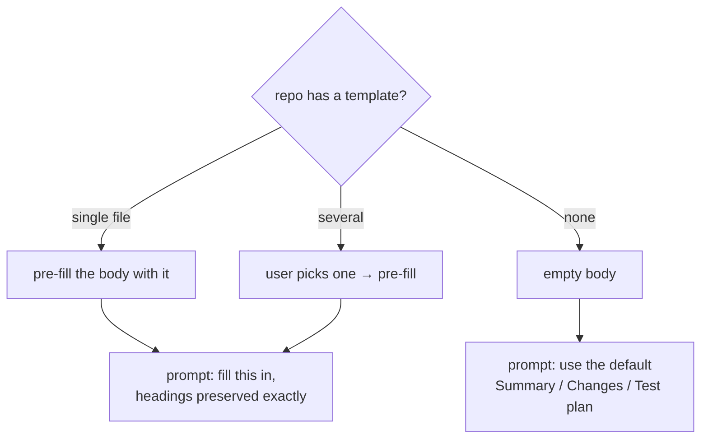

# PR description

Writes the body of a pull request from everything a branch changes, filling in the repo's PR template
when it has one.

> Shared plumbing — transport, events, cancellation, errors, settings — lives in the
> [AI system overview](./README.md). This page covers only what is specific to this feature.

|                   |                                                                                                                                                                                                                                                                                     |
| ----------------- | ----------------------------------------------------------------------------------------------------------------------------------------------------------------------------------------------------------------------------------------------------------------------------------- |
| **Descriptor**    | [`summaryPrDescriptionFeature`](../../packages/ai/src/features/summaryPrDescription.ts), fed by [`summarizeFiles`](../../packages/ai/src/features/summarizeFiles.ts)                                                                                                                |
| **Kind**          | streaming markdown                                                                                                                                                                                                                                                                  |
| **Temperature**   | 0.4 — the highest of any feature; see below                                                                                                                                                                                                                                         |
| **Context scope** | `range` — `merge-base(base, HEAD)..HEAD`                                                                                                                                                                                                                                            |
| **Diff budget**   | none at this level: every file is read whole, in its own prompt, by the map phase                                                                                                                                                                                                   |
| **UI**            | [`PrComposerExpander`](../../apps/desktop/src/components/git-graph/pr/PrComposerExpander.tsx) and [`PrCreateForm`](../../apps/desktop/src/components/git-graph/pr/PrCreateForm.tsx), via [`usePrDescriptionGeneration`](../../apps/desktop/src/hooks/usePrDescriptionGeneration.ts) |

---

## What the user sees

Two entry points, same machinery:

| Entry point                                         | Where                    | Head → base                                  |
| --------------------------------------------------- | ------------------------ | -------------------------------------------- |
| **Ship-from-here composer** (`pr-composer-ai-fill`) | after the commit is made | current branch → base picked in the composer |
| **PR create form** (`pr-create-ai`)                 | from the sidebar         | selected head → selected base                |

Both show a ✨ next to the description field, both are hidden when the AI master switch is off, and
both are disabled until a base branch is known — without a base there is no range to diff, so there
is nothing to describe.

Pressing it asks for confirmation if the body already has text (the generation overwrites it), clears
the field, and streams the answer in. The result stays **editable**: the model writes a draft, you
ship it.

A failed generation is reported under the description field (`pr-composer-ai-error` /
`pr-create-ai-error`), decoded through `aiErrorMessage`. Note this is a **different** error from the
one at the bottom of the form — that one is the publish/create failure. Two independent things can go
wrong, so they are reported separately.

---

## The PR template

The input that shapes this feature. [`pr_template.rs`](../../apps/desktop/src-tauri/src/services/pr_template.rs)
resolves templates with GitHub's own rules — repo root, `.github/` or `docs/`; a single
`PULL_REQUEST_TEMPLATE.md` (any case, `.md`/`.txt`/no extension), or a `PULL_REQUEST_TEMPLATE/`
directory of several. It only _locates and reads_ the text; what to do with it is a frontend
decision.



The instruction is emphatic that the template wins:

> keep every heading and structural element exactly as given, replacing only the placeholder/prompt
> text under each … Leave a section briefly noted as not applicable rather than deleting its heading.
> Do not add headings the template does not have.

A whitespace-only template counts as no template. The body is pre-filled with the raw template before
any AI runs, so the feature is optional decoration on a flow that works fine without it.

---

## The prompt

**System** — `PR_DESCRIPTION_INSTRUCTION`: markdown only, no title line, grounded in the actual diff
and commit list, short bullets over paragraphs, summarize intent rather than restating the diff.

**User**:

```
Repository: git-manager
Branch: feat/login → base: main

Commits in this pull request (newest first):
- feat: add login page
- fix: handle empty password

--- DIFF (base..HEAD) ---
diff --git a/src/auth/login.ts b/src/auth/login.ts
@@ -1,4 +1,9 @@
…
--- END DIFF ---

Fill in the following pull-request template, preserving its headings and structure exactly:

--- TEMPLATE ---
## Summary
<!-- what and why -->
## Test plan
--- END TEMPLATE ---
```

With no template, that last block becomes a one-line instruction to use the default
Summary / Changes / Test plan structure.

**`rangeCommits` is unbounded**, unlike the 10-commit style sample the
[commit message](./commit-message.md) feature uses: a PR description that silently ignored half the
branch would be worse than none.

### Why 0.4

The highest temperature in the app, and the only one above 0.3:

| Feature            | T       | Why                                                                 |
| ------------------ | ------- | ------------------------------------------------------------------- |
| explanations       | 0.2     | describing code that already exists — reproducibility matters       |
| grouping           | 0.2     | a partitioning task, not a writing one                              |
| commit message     | 0.3     | near-mechanical summary, must stay terse and conventional           |
| **PR description** | **0.4** | prose a human edits before shipping; a little latitude reads better |

Still low enough to stay grounded in the diff. Latitude helps; invention doesn't.

---

## Limitations

Beyond the [shared ones](./README.md#known-limitations):

| Limitation                                                  | Note                                                                                                                                                                                                                                                                                                                                            |
| ----------------------------------------------------------- | ----------------------------------------------------------------------------------------------------------------------------------------------------------------------------------------------------------------------------------------------------------------------------------------------------------------------------------------------- |
| **The base branch comes from GitHub**                       | The composer pre-fills its base from `fetchRepoDefaultBranch`, which needs a token and a GitHub remote. On a non-GitHub or unauthenticated repo you must pick one manually. [Branch explanation](./branch-explanation.md) resolves its base from local refs instead — that helper would drop straight in                                        |
| **A large PR is still described partially**                 | The budget follows the window and reads source before lockfiles, and the commit + file lists keep the description's scope right whatever fits. The description itself may never mention this — it gets published on the pull request over the author's name — so the composer shows the coverage line instead, while the body is still editable |
| **HEAD only**                                               | Unlike the branch explanation, this always describes the checked-out branch — the `headRef` parameter exists, this flow doesn't use it                                                                                                                                                                                                          |
| ~~**`usePrDescriptionGeneration` predates `useAiStream`**~~ | **Fixed.** It now runs on the shared hook, which grew an `onToken` option for callers streaming into their own textarea. Both bugs the fork carried — listeners leaking past unmount, stacking across runs — are gone                                                                                                                           |
| **Nothing verifies the template was respected**             | If the model drops a heading, only the user notices                                                                                                                                                                                                                                                                                             |

## Tests

| Test                                                                                                                                                                                                          | Covers                                                                                                                                                                                                                                              |
| ------------------------------------------------------------------------------------------------------------------------------------------------------------------------------------------------------------- | --------------------------------------------------------------------------------------------------------------------------------------------------------------------------------------------------------------------------------------------------- |
| [`prDescription.test.ts`](../../packages/ai/src/features/prDescription.test.ts)                                                                                                                               | header, commit list, template vs default, whitespace template, temperature, window-sized budget (fits every window, a long template paid out of the diff yet reproduced intact, code before noise), coverage, and the published-output coverage ban |
| [`usePrDescriptionGeneration.test.ts`](../../apps/desktop/src/hooks/usePrDescriptionGeneration.test.ts)                                                                                                       | range fetch, token streaming, empty-diff refusal, and what it inherits from `useAiStream` (unmount cleanup, no listener stacking, another generation's events ignored, no write-back of an empty or cancelled draft)                                |
| [`PrComposerExpander.test.tsx`](../../apps/desktop/src/components/git-graph/pr/PrComposerExpander.test.tsx) · [`PrCreateForm.test.tsx`](../../apps/desktop/src/components/git-graph/pr/PrCreateForm.test.tsx) | AI fill wiring, generation error kept distinct from publish error                                                                                                                                                                                   |
| [`ai.api.test.ts`](../../apps/desktop/src/api/ai.api.test.ts)                                                                                                                                                 | instruction and temperature reach the transport; the run is tracked for the footer                                                                                                                                                                  |
| `ai_context.rs` (`#[cfg(test)]`)                                                                                                                                                                              | merge-base semantics, missing/unresolvable base                                                                                                                                                                                                     |
| `pr_template.rs` (`#[cfg(test)]`)                                                                                                                                                                             | template resolution rules                                                                                                                                                                                                                           |

---

## Read file by file, and kept apart from the explanations

The description is written from **per-file summaries**, never from a budgeted range diff.

This was the sharpest case of the truncation problem in the app, for two reasons. The output _leaves
the app_: a description written from a third of a branch gets published on a pull request over the
author's name, and the instruction forbids it from admitting so — which is why the coverage line
existed at all, to tell the author what the text could not. There is nothing to tell now.

And the prompt carries a **template** the model must reproduce verbatim. It was budgeted out of the
same pool as the diff, so on a small window the feature's most visible rule could be the thing that
fell out of the prompt's start. Nothing competes with the template now but a list of one-line
summaries, and a test asserts it survives beside 200 files on a 4k window.

It is a **separate feature** from `summaryExplanationFeature` rather than a fourth scope of it: a
different reader, a template contract, and a published output whose rules about what not to say are
stronger than an explanation needs. Sharing would mean one instruction carrying both sets of rules
and a scope check on half of them.
