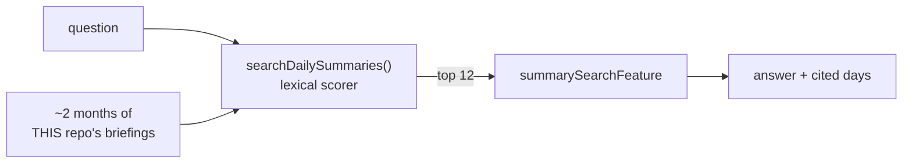

# Summary search

Ask a question about your own archive of [daily briefings](./daily-summary.md) — "when did I finish
the merge editor?", "what was I doing on git-manager in June?" — and get an answer that cites the
days it rests on.

> Shared plumbing — transport, events, cancellation, errors, settings — lives in the
> [AI system overview](./README.md). This page covers only what is specific to this feature.

|                 |                                                                                                                                                              |
| --------------- | ------------------------------------------------------------------------------------------------------------------------------------------------------------ |
| **Descriptor**  | [`summarySearchFeature`](../../packages/ai/src/features/summarySearch.ts)                                                                                    |
| **Kind**        | completion + JSON schema → `SummarySearchAnswer`                                                                                                             |
| **Temperature** | 0.1                                                                                                                                                          |
| **Context**     | none from git — the corpus is this repository's slice of the on-disk archive                                                                                 |
| **UI**          | [`SummaryAskPanel`](../../apps/desktop/src/components/daily-summaries/SummaryAskPanel.tsx), inside the repo's daily-summaries panel (_AI ▸ Daily summaries_) |

---

## Two layers, on purpose

The corpus is the repository the panel is open in, never the whole archive — the answer to "when did
I finish the merge editor?" is worthless if it can name a day from a different project.

**The question box is the only way to search the content.** There is deliberately no lexical filter
beside it: a text box over your own briefings mostly fails, because you remember what you _did_
("the merge editor") and not the words the model happened to write about it ("three-way conflict
view"). Offering both would also leave the user picking between two search affordances where one
works.

**The local scorer is demoted to a shortlister.** It never faces the user; it decides which 12 days
the model reads. That is the job lexical ranking is genuinely good at — narrowing 60 candidates —
and it costs nothing.

A **date range** survives beside the question box, because it is the one query a language model
answers unreliably ("only June", not "roughly June"), and because it is what the answer's citations
drive when you click through to a day.

### Why no embeddings

Two months of short briefings is a few hundred kilobytes. An index would cost more to keep in sync
with a folder the user can edit by hand — the markdown files are the source of truth — than a linear
scan costs to run. Lexical ranking is enough to find the right days in a corpus this size; what the
model adds is _reading_ them, not finding them.

The 12-candidate cap is what keeps this a single bounded call: the scorer has already decided which
days are plausible, and a model given the 12 best has everything a model given all 400 would use.

## The local scorer

[`searchDailySummaries.ts`](../../apps/desktop/src/lib/searchDailySummaries.ts) — pure,
dependency-free, unit-tested.

| Rule                                              | Why                                                                             |
| ------------------------------------------------- | ------------------------------------------------------------------------------- |
| **AND, not OR** — every term must match somewhere | An OR search over a personal archive returns the archive, which is not a search |
| Headline (3) > repo/date (2) > bullet (1)         | A hit in the one-line recap is a better hit than one in a detail bullet         |
| Whole-word match scores +2 over a substring       | `test` matching inside `latest` is a hit the user didn't ask for                |
| Ties break on the newer day                       | Recent work is what you're usually looking for                                  |
| An empty query returns everything, unranked       | The page opens on the full timeline; typing narrows it                          |

Matched lines come back as `snippets`. Nothing renders them today — the scorer no longer faces the
user — but they are what a future "why was this day shortlisted?" affordance would show, and they
cost one `Set` to produce.

## The prompt

**System** — `SUMMARY_SEARCH_INSTRUCTION`, which is almost entirely about not fabricating: answer
from the shortlist and nothing else; copy each `repo`/`date` **exactly** as given; and if the answer
isn't in the list, say so and return no matches rather than filling the gap with what a project like
this usually does.

**User** — the question, the target language, and the shortlisted briefings as
`## <repo> — <date>` blocks of flattened text. When even the shortlist overflows the budget,
`renderCandidates` drops from the **tail** rather than truncating: the list is ranked, so the tail is
what the scorer already judged least relevant, and a briefing cut mid-sentence is worse evidence than
one that is absent. The best match is always kept, even alone.

`parseSummarySearch` drops any match missing a `repo` or a `date` — a citation the UI can't resolve
back to a file is worse than no citation — and accepts an answer with zero matches, which is the
"not in your archive" case working correctly.

## Citations

Each match renders as a chip (`git-manager · 2026-07-21`), tooltipped with the model's own reason.
Clicking one narrows the timeline to exactly that day, which is the point: the answer is a pointer
into the archive, not a replacement for it.

---

## Limitations

Beyond the [shared ones](./README.md#known-limitations):

| Limitation                                | Note                                                                                                                        |
| ----------------------------------------- | --------------------------------------------------------------------------------------------------------------------------- |
| **Only sees what the scorer shortlisted** | A question phrased with none of the archive's words falls back to the 12 most recent days, which may not contain the answer |
| **Lexical, not semantic**                 | "auth" won't find a briefing that only ever says "login"                                                                    |
| **Bounded by retention**                  | The archive is 60 days; anything older was pruned and cannot be searched                                                    |
| **One repository at a time**              | There is no cross-project question ("what did I ship anywhere last week?") — the panel is repo-scoped by design             |
| **Only as good as the briefings**         | It reads the summaries, not the repositories — a day that produced no briefing is invisible                                 |

## Tests

| Test                                                                                                            | Covers                                                                          |
| --------------------------------------------------------------------------------------------------------------- | ------------------------------------------------------------------------------- |
| [`summarySearch.test.ts`](../../packages/ai/src/features/summarySearch.test.ts)                                 | prompt shape, tail-dropping under budget, match validation, parse tolerance     |
| [`searchDailySummaries.test.ts`](../../apps/desktop/src/lib/searchDailySummaries.test.ts)                       | AND semantics, weighting, whole-word bonus, tie-breaks, regex safety            |
| [`useSummarySearch.test.ts`](../../apps/desktop/src/features/graph/hooks/useSummarySearch.test.ts)              | question-vs-filter ranking, the candidate cap, the empty-match fallback, errors |
| [`SummaryAskPanel.test.tsx`](../../apps/desktop/src/components/daily-summaries/SummaryAskPanel.test.tsx)        | submit gating, the disabled state, answer and citation rendering                |
| [`DailySummariesPanel.test.tsx`](../../apps/desktop/src/features/graph/components/DailySummariesPanel.test.tsx) | that the model's shortlist never leaves the open repository                     |
